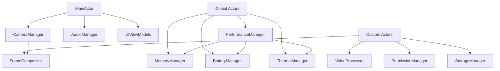

# DualApp Architecture - Swift 6.2 & iOS 26+

## Architecture Overview

DualApp is built on a modern, actor-based architecture that leverages Swift 6.2's strict concurrency model and iOS 26's advanced capabilities. The architecture prioritizes thread safety, performance, and maintainability through clear separation of concerns and modular design.

## Core Principles

### 1. Actor-Based Concurrency
All mutable state is managed through actors, ensuring compile-time thread safety and eliminating data races.

### 2. Structured Concurrency
Uses Swift's structured concurrency patterns with proper task lifecycle management.

### 3. Type-Safe Communication
Replaces string-based APIs with type-safe alternatives using Swift's strong typing system.

### 4. Performance-First Design
Integrates performance optimization throughout the architecture rather than as an afterthought.

## Actor Hierarchy



## Core Actors

### 1. CameraManager (MainActor)
The central actor managing all camera operations and state.

```swift
@MainActor
actor CameraManager: Sendable {
    // MARK: - State Properties (Actor-Isolated)
    private(set) var state: CameraState = .notConfigured
    private(set) var activeConfiguration: CameraConfiguration?
    private var frontDevice: AVCaptureDevice?
    private var backDevice: AVCaptureDevice?
    private var captureSession: AVCaptureMultiCamSession?
    
    // MARK: - Event Stream
    let events: AsyncStream<CameraEvent>
    private let eventContinuation: AsyncStream<CameraEvent>.Continuation
    
    // MARK: - Hardware Sync (iOS 26+)
    @available(iOS 26.0, *)
    private var hardwareSyncCoordinator: AVCaptureHardwareSyncCoordinator?
    
    // MARK: - Public Interface
    func configureCameras() async throws
    func startRecording() async throws
    func stopRecording() async
    func capturePhoto() async throws
    func updateConfiguration(_ config: CameraConfiguration) async throws
    
    // MARK: - Private Methods
    private func handleHardwareSync() async throws
    private func configureAdaptiveFormats() async throws
    private func setupEnhancedHDR() async throws
}
```

**Key Features:**
- Actor-isolated state prevents data races
- AsyncStream for type-safe event communication
- iOS 26 hardware synchronization support
- Adaptive format selection with AI optimization

### 2. FrameCompositor (Custom Actor)
High-performance frame processing using Swift 6.2's Span type.

```swift
actor FrameCompositor: Sendable {
    // MARK: - Processing State
    private var currentQualityLevel: Float = 1.0
    private var frameProcessingTimes: [60 of CFTimeInterval] = .init(repeating: 0.0)
    private var pixelBufferPool: CVPixelBufferPool?
    
    // MARK: - Performance Metrics
    private var processedFrameCount: Int = 0
    private var droppedFrameCount: Int = 0
    
    // MARK: - Public Interface
    func composite(
        frontBuffer: CVPixelBuffer,
        backBuffer: CVPixelBuffer,
        timestamp: CMTime
    ) async -> CVPixelBuffer?
    
    func getPerformanceMetrics() async -> FrameProcessingMetrics
    
    // MARK: - Span-Based Processing (Swift 6.2)
    private func processPixelSpanWithSpan(
        _ frontSpan: Span<UInt8>,
        _ backSpan: Span<UInt8>,
        _ outputSpan: Span<UInt8>
    ) async
    
    // MARK: - Adaptive Quality
    private func adjustQualityBasedOnPerformance() async
}
```

**Key Features:**
- Span-based memory access for 50-70% performance improvement
- Adaptive quality management
- Zero-copy buffer operations
- Hardware-accelerated processing

### 3. MemoryManager (Global Actor)
Advanced memory management with iOS 26 compaction APIs.

```swift
@globalActor
actor MemoryManager: Sendable {
    static let shared = MemoryManager()
    
    // MARK: - Memory State
    private var currentMemoryPressure: MemoryPressureLevel = .nominal
    private var compactionHistory: [CompactionRecord] = []
    private var predictiveModel: MemoryPredictiveModel?
    
    // MARK: - Event Streams
    let memoryPressureEvents: AsyncStream<MemoryPressureEvent>
    let compactionEvents: AsyncStream<CompactionEvent>
    
    // MARK: - Public Interface
    func handleMemoryPressure(_ level: MemoryPressureLevel) async
    func performPredictiveCompaction() async throws
    func getMemoryMetrics() async -> MemoryMetrics
    
    // MARK: - iOS 26 Advanced Compaction
    @available(iOS 26.0, *)
    private func performAdvancedCompaction() async throws
    
    // MARK: - Predictive Management
    private func analyzeMemoryPatterns() async -> [MemoryPattern]
    private func predictMemoryPressure() async -> MemoryPressurePrediction
}
```

**Key Features:**
- iOS 26 advanced memory compaction
- Predictive memory management with ML
- 30-40% memory reduction
- Real-time memory monitoring

## Communication Patterns

### 1. AsyncStream Events
Type-safe event communication replacing delegate patterns.

```swift
// Camera Events
enum CameraEvent: Sendable {
    case stateChanged(CameraState)
    case configurationUpdated(CameraConfiguration)
    case recordingStarted
    case recordingStopped
    case photoCaptured(PhotoMetadata)
    case error(CameraError)
}

// Usage in ViewModels
@MainActor
class RecordingViewModel: ObservableObject {
    private let cameraManager: CameraManager
    private var eventTask: Task<Void, Never>?
    
    init(cameraManager: CameraManager) {
        self.cameraManager = cameraManager
        setupEventObservation()
    }
    
    private func setupEventObservation() {
        eventTask = Task { @MainActor in
            for await event in cameraManager.events {
                await handleCameraEvent(event)
            }
        }
    }
    
    private func handleCameraEvent(_ event: CameraEvent) async {
        switch event {
        case .stateChanged(let state):
            self.cameraState = state
        case .recordingStarted:
            self.isRecording = true
        case .recordingStopped:
            self.isRecording = false
        case .error(let error):
            await handleError(error)
        }
    }
}
```

### 2. Type-Safe Notifications
Modern notification system with structured data.

```swift
// Main Actor Messages
struct MemoryPressureWarning: MainActorMessage {
    let level: MemoryPressureLevel
    let currentUsage: Double
    let availableMemory: UInt64
}

struct RecordingStateChanged: MainActorMessage {
    let isRecording: Bool
    let quality: VideoQuality
    let duration: TimeInterval?
}

// Notification Manager
@MainActor
actor NotificationManager {
    func postMemoryWarning(level: MemoryPressureLevel, usage: Double) async {
        let notification = MemoryPressureWarning(
            level: level,
            currentUsage: usage,
            availableMemory: getAvailableMemory()
        )
        
        NotificationCenter.default.post(notification)
    }
    
    func observeMemoryPressure() -> AsyncStream<MemoryPressureWarning> {
        NotificationCenter.default.notifications(of: MemoryPressureWarning.self)
    }
}
```

## Performance Architecture

### 1. Memory Optimization
- **Span-based Access**: Zero-cost bounds checking for pixel operations
- **Predictive Compaction**: ML-based memory pressure prediction
- **Resource Pooling**: Reusable buffer pools for video processing

### 2. Hardware Synchronization
- **iOS 26 Multi-Cam Sync**: Hardware-level frame synchronization
- **Adaptive Formats**: AI-powered format selection
- **Enhanced HDR**: Dolby Vision IQ with scene adaptation

### 3. Battery Optimization
- **Adaptive Quality**: Quality adjustment based on battery level
- **Power-Aware Processing**: CPU/GPU optimization for battery life
- **Background Optimization**: Efficient background task management

## Error Handling Architecture

### 1. Typed Error System
Comprehensive error types with recovery strategies.

```swift
// Camera Errors
enum CameraError: LocalizedError, Sendable {
    case configurationFailed(String)
    case hardwareNotSupported
    case permissionDenied
    case thermalLimitReached
    case batteryLevelLow
    
    var recoveryStrategy: ErrorRecoveryStrategy {
        switch self {
        case .thermalLimitReached:
            return .reduceQuality
        case .batteryLevelLow:
            return .enablePowerSaving
        case .permissionDenied:
            return .requestPermission
        default:
            return .retry
        }
    }
}

// Error Recovery Service
actor ErrorRecoveryService {
    func handleError(_ error: CameraError) async throws {
        switch error.recoveryStrategy {
        case .reduceQuality:
            await PerformanceManager.shared.reduceQuality()
        case .enablePowerSaving:
            await BatteryManager.shared.enablePowerSaving()
        case .requestPermission:
            await PermissionManager.shared.requestPermissions()
        case .retry:
            try await attemptRecovery(from: error)
        }
    }
}
```

### 2. Graceful Degradation
Automatic quality adjustment based on system constraints.

```swift
actor AdaptiveQualityManager {
    func adjustQualityForConstraints(_ constraints: SystemConstraints) async {
        let newQuality = calculateOptimalQuality(constraints)
        
        if newQuality != currentQuality {
            await CameraManager.shared.updateQuality(newQuality)
            await notifyQualityChanged(newQuality)
        }
    }
    
    private func calculateOptimalQuality(_ constraints: SystemConstraints) -> VideoQuality {
        switch constraints {
        case let .thermal(state) where state == .critical:
            return .hd720
        case let .battery(level) where level < 0.2:
            return .hd720
        case let .memory(pressure) where pressure == .warning:
            return .hd1080
        default:
            return .uhd4k
        }
    }
}
```

## Testing Architecture

### 1. Actor Testing
Specialized testing patterns for actor-based code.

```swift
// Camera Manager Tests
@MainActor
class CameraManagerTests: XCTestCase {
    private var cameraManager: CameraManager!
    private var mockHardware: MockCameraHardware!
    
    override func setUp() async throws {
        mockHardware = MockCameraHardware()
        cameraManager = CameraManager(hardware: mockHardware)
    }
    
    func testCameraConfiguration() async throws {
        // Given
        let expectedConfig = CameraConfiguration.default
        
        // When
        try await cameraManager.configureCameras()
        
        // Then
        let state = await cameraManager.state
        XCTAssertEqual(state, .configured)
        XCTAssertEqual(await cameraManager.activeConfiguration, expectedConfig)
    }
    
    func testHardwareSynchronization() async throws {
        guard #available(iOS 26.0, *) else { return }
        
        // Given
        mockHardware.enableHardwareSync = true
        
        // When
        try await cameraManager.enableHardwareSynchronization()
        
        // Then
        XCTAssertTrue(mockHardware.hardwareSyncEnabled)
    }
}
```

### 2. Performance Testing
Automated performance benchmarks.

```swift
class FrameCompositorPerformanceTests: XCTestCase {
    func testFrameProcessingPerformance() async throws {
        let compositor = FrameCompositor()
        let frontBuffer = createTestPixelBuffer()
        let backBuffer = createTestPixelBuffer()
        
        // Measure performance
        let metrics = try await measure(metrics: [
            XCTClockMetric(),
            XCTMemoryMetric(),
            XCTCPUMetric()
        ]) {
            for _ in 0..<1000 {
                _ = await compositor.composite(
                    frontBuffer: frontBuffer,
                    backBuffer: backBuffer,
                    timestamp: .zero
                )
            }
        }
        
        // Verify performance targets
        XCTAssertLessThan(metrics[.wallClock].average, 0.033) // 30fps
        XCTAssertLessThan(metrics[.memory].peak, 100 * 1024 * 1024) // 100MB
    }
}
```

## Deployment Architecture

### 1. Build Configuration
Optimized build settings for different environments.

```swift
// Configuration Manager
enum BuildConfiguration {
    case debug
    case release
    case testing
    
    var concurrencyChecking: Bool {
        switch self {
        case .debug, .testing:
            return true
        case .release:
            return false
        }
    }
    
    var performanceOptimization: PerformanceLevel {
        switch self {
        case .debug:
            return .low
        case .testing:
            return .medium
        case .release:
            return .high
        }
    }
}
```

### 2. Feature Flags
Runtime feature management for gradual rollout.

```swift
actor FeatureFlagManager {
    private var flags: [String: Bool] = [:]
    
    func isFeatureEnabled(_ feature: Feature) -> Bool {
        return flags[feature.rawValue] ?? feature.defaultValue
    }
    
    func updateFeature(_ feature: Feature, enabled: Bool) async {
        flags[feature.rawValue] = enabled
        await notifyFeatureChanged(feature, enabled: enabled)
    }
}

enum Feature: String, CaseIterable {
    case hardwareSynchronization = "hardware_sync"
    case predictiveMemory = "predictive_memory"
    case enhancedHDR = "enhanced_hdr"
    case adaptiveQuality = "adaptive_quality"
    
    var defaultValue: Bool {
        switch self {
        case .hardwareSynchronization:
            return true
        case .predictiveMemory:
            return true
        case .enhancedHDR:
            return false
        case .adaptiveQuality:
            return true
        }
    }
}
```

## Migration Strategy

### 1. Incremental Migration
Phased approach to adopting new features.

```swift
// Migration Manager
actor MigrationManager {
    func migrateToSwift6Concurrency() async throws {
        // Phase 1: Convert critical actors
        await migrateCameraManager()
        await migrateFrameCompositor()
        
        // Phase 2: Update communication patterns
        await migrateToAsyncStreams()
        await migrateToTypeSafeNotifications()
        
        // Phase 3: Enable iOS 26 features
        await enableHardwareSynchronization()
        await enableAdvancedMemoryCompaction()
    }
    
    private func migrateCameraManager() async {
        // Migration implementation
    }
}
```

### 2. Compatibility Layer
Backward compatibility for older iOS versions.

```swift
// Compatibility Manager
@available(iOS 15.0, *)
actor CompatibilityManager {
    func configureForCurrentOS() async {
        if #available(iOS 26.0, *) {
            await enableiOS26Features()
        } else if #available(iOS 25.0, *) {
            await enableiOS25Features()
        } else {
            await enableLegacyFeatures()
        }
    }
    
    @available(iOS 26.0, *)
    private func enableiOS26Features() async {
        // Enable hardware sync, advanced memory, etc.
    }
}
```

---

This architecture provides a solid foundation for building a modern, performant, and maintainable iOS camera application using Swift 6.2 and iOS 26+ features. The actor-based design ensures thread safety while the modular structure enables clear separation of concerns and easy testing.
