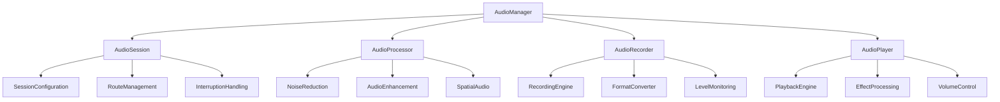

# Audio Management System - iOS 26+ Advanced Audio Processing

## Overview

The Audio Management System is a comprehensive, actor-based framework that handles all audio operations for the DualApp. It leverages iOS 26's advanced audio capabilities and Swift 6.2's concurrency model to deliver high-quality audio recording, processing, and playback while maintaining optimal performance.

## Architecture Principles

### 1. Actor-Based Audio Processing
- Thread-safe audio operations through actor isolation
- Concurrent audio processing with structured concurrency
- Real-time audio processing with minimal latency

### 2. Adaptive Audio Quality
- Dynamic quality adjustment based on system constraints
- Noise reduction and enhancement algorithms
- Spatial audio support for immersive recording

### 3. Performance Optimization
- Hardware-accelerated audio processing
- Memory-efficient buffer management
- Battery-aware audio processing

## Audio Manager Architecture



## Core Audio Manager

### 1. Audio Manager Actor

```swift
// Core/Audio/Actors/AudioManager.swift
@MainActor
actor AudioManager: Sendable {
    // MARK: - State Properties
    private(set) var currentState: AudioState = .inactive
    private(set) var currentConfiguration: AudioConfiguration
    private(set) var audioLevels: AudioLevels = AudioLevels()
    
    // MARK: - Audio Components
    private let audioSession: AVAudioSession
    private let audioEngine: AVAudioEngine
    private let audioProcessor: AudioProcessor
    private let audioRecorder: AudioRecorder
    private let audioPlayer: AudioPlayer
    
    // MARK: - Event Streams
    let audioStateEvents: AsyncStream<AudioStateEvent>
    let audioLevelEvents: AsyncStream<AudioLevelEvent>
    let audioErrorEvents: AsyncStream<AudioErrorEvent>
    private let audioStateContinuation: AsyncStream<AudioStateEvent>.Continuation
    private let audioLevelContinuation: AsyncStream<AudioLevelEvent>.Continuation
    private let audioErrorContinuation: AsyncStream<AudioErrorEvent>.Continuation
    
    // MARK: - Configuration
    private let preferredSampleRate: Double = 44100.0
    private let preferredBufferDuration: TimeInterval = 0.005
    private let preferredChannels: UInt32 = 2
    
    init() {
        self.audioSession = AVAudioSession.sharedInstance()
        self.audioEngine = AVAudioEngine()
        self.audioProcessor = AudioProcessor()
        self.audioRecorder = AudioRecorder()
        self.audioPlayer = AudioPlayer()
        self.currentConfiguration = AudioConfiguration.default
        
        (audioStateEvents, audioStateContinuation) = AsyncStream.makeStream()
        (audioLevelEvents, audioLevelContinuation) = AsyncStream.makeStream()
        (audioErrorEvents, audioErrorContinuation) = AsyncStream.makeStream()
        
        Task {
            await setupAudioSession()
            await setupAudioEngine()
        }
    }
    
    // MARK: - Public Interface
    func configureForRecording() async throws {
        try await audioSession.setCategory(
            .playAndRecord,
            mode: .videoRecording,
            options: [.defaultToSpeaker, .allowBluetoothA2DP, .allowAirPlay]
        )
        
        try await audioSession.setPreferredSampleRate(preferredSampleRate)
        try await audioSession.setPreferredIOBufferDuration(preferredBufferDuration)
        try await audioSession.setActive(true)
        
        await updateState(.configured)
        await setupLevelMonitoring()
    }
    
    func startRecording() async throws -> URL {
        guard currentState == .configured else {
            throw AudioError.invalidState("Audio not configured for recording")
        }
        
        let recordingURL = generateRecordingURL()
        
        try await audioRecorder.startRecording(
            to: recordingURL,
            configuration: currentConfiguration
        )
        
        await updateState(.recording)
        await startLevelMonitoring()
        
        return recordingURL
    }
    
    func stopRecording() async throws -> URL {
        guard currentState == .recording else {
            throw AudioError.invalidState("Not currently recording")
        }
        
        let recordingURL = try await audioRecorder.stopRecording()
        await updateState(.configured)
        await stopLevelMonitoring()
        
        return recordingURL
    }
    
    func updateConfiguration(_ config: AudioConfiguration) async throws {
        guard currentState != .recording else {
            throw AudioError.invalidState("Cannot change configuration during recording")
        }
        
        currentConfiguration = config
        
        // Apply configuration to audio components
        try await audioProcessor.updateConfiguration(config)
        try await audioRecorder.updateConfiguration(config)
        
        await notifyConfigurationChanged(config)
    }
    
    func getAudioMetrics() async -> AudioMetrics {
        AudioMetrics(
            currentState: currentState,
            currentConfiguration: currentConfiguration,
            audioLevels: audioLevels,
            recordingDuration: audioRecorder.recordingDuration,
            processingLatency: audioProcessor.currentLatency
        )
    }
    
    // MARK: - Private Methods
    private func setupAudioSession() async {
        do {
            try await audioSession.setCategory(
                .playAndRecord,
                mode: .videoRecording,
                options: [.defaultToSpeaker, .allowBluetoothA2DP]
            )
            
            try await audioSession.setPreferredSampleRate(preferredSampleRate)
            try await audioSession.setPreferredIOBufferDuration(preferredBufferDuration)
            
            // Add route change notification
            NotificationCenter.default.addObserver(
                forName: AVAudioSession.routeChangeNotification,
                object: nil,
                queue: .main
            ) { [weak self] notification in
                    Task { @MainActor in
                        await self?.handleRouteChange(notification)
                    }
                }
            
            // Add interruption notification
            NotificationCenter.default.addObserver(
                forName: AVAudioSession.interruptionNotification,
                object: nil,
                queue: .main
            ) { [weak self] notification in
                    Task { @MainActor in
                        await self?.handleInterruption(notification)
                    }
                }
            
        } catch {
            await handleAudioError(error)
        }
    }
    
    private func setupAudioEngine() async {
        // Configure audio engine for processing
        let inputNode = audioEngine.inputNode
        let outputNode = audioEngine.outputNode
        
        // Set input format
        let inputFormat = inputNode.outputFormat(forBus: 0)
        
        // Create processing chain
        let mixerNode = AVAudioMixerNode()
        let effectNode = AVAudioUnitEffect(audioUnit: AudioProcessor.createAudioUnit())
        
        // Connect nodes
        audioEngine.attach(mixerNode)
        audioEngine.attach(effectNode)
        
        audioEngine.connect(inputNode, to: mixerNode, format: inputFormat)
        audioEngine.connect(mixerNode, to: effectNode, format: inputFormat)
        audioEngine.connect(effectNode, to: outputNode, format: inputFormat)
        
        // Start engine
        do {
            try audioEngine.start()
        } catch {
            await handleAudioError(error)
        }
    }
    
    private func setupLevelMonitoring() async {
        Task {
            let timer = Timer.scheduledTimer(withTimeInterval: 0.05, repeats: true) { [weak self] _ in
                Task { @MainActor in
                    await self?.updateAudioLevels()
                }
            }
            
            // Keep timer reference
            self.levelMonitoringTimer = timer
        }
    }
    
    private func updateAudioLevels() async {
        guard currentState == .recording else { return }
        
        let inputNode = audioEngine.inputNode
        let inputFormat = inputNode.outputFormat(forBus: 0)
        
        // Install tap for level monitoring
        if !inputNode.isInstalledTap(onBus: 0) {
            inputNode.installTap(onBus: 0, bufferSize: 1024, format: inputFormat) { [weak self] buffer, _ in
                Task { @MainActor in
                    await self?.processAudioBuffer(buffer)
                }
            }
        }
    }
    
    private func processAudioBuffer(_ buffer: AVAudioPCMBuffer) async {
        // Calculate audio levels
        let levels = AudioLevels.calculate(from: buffer)
        audioLevels = levels
        
        let event = AudioLevelEvent(
            levels: levels,
            timestamp: Date()
        )
        
        audioLevelContinuation.yield(event)
    }
    
    private func handleRouteChange(_ notification: Notification) async {
        guard let userInfo = notification.userInfo,
              let reasonValue = userInfo[AVAudioSessionRouteChangeReasonKey] as? UInt,
              let reason = AVAudioSession.RouteChangeReason(rawValue: reasonValue) else {
            return
        }
        
        await handleRouteChangeReason(reason)
    }
    
    private func handleRouteChangeReason(_ reason: AVAudioSession.RouteChangeReason) async {
        switch reason {
        case .newDeviceAvailable:
            await handleNewDeviceAvailable()
        case .oldDeviceUnavailable:
            await handleOldDeviceUnavailable()
        case .categoryChange:
            await handleCategoryChange()
        case .override:
            await handleRouteOverride()
        case .wakeFromSleep:
            await handleWakeFromSleep()
        case .noSuitableRouteForCategory:
            await handleNoSuitableRoute()
        case .routeConfigurationChange:
            await handleRouteConfigurationChange()
        @unknown default:
            break
        }
    }
    
    private func handleInterruption(_ notification: Notification) async {
        guard let userInfo = notification.userInfo,
              let typeValue = userInfo[AVAudioSessionInterruptionTypeKey] as? UInt,
              let type = AVAudioSession.InterruptionType(rawValue: typeValue) else {
            return
        }
        
        switch type {
        case .began:
            await handleInterruptionBegan()
        case .ended:
            await handleInterruptionEnded()
        @unknown default:
            break
        }
    }
    
    private func handleInterruptionBegan() async {
        if currentState == .recording {
            try? await pauseRecording()
        }
        
        await updateState(.interrupted)
    }
    
    private func handleInterruptionEnded() async {
        // Attempt to restore audio session
        do {
            try await audioSession.setActive(true)
            await updateState(.configured)
        } catch {
            await handleAudioError(error)
        }
    }
    
    private func updateState(_ newState: AudioState) async {
        let previousState = currentState
        currentState = newState
        
        let event = AudioStateEvent(
            newState: newState,
            previousState: previousState,
            timestamp: Date()
        )
        
        audioStateContinuation.yield(event)
    }
    
    private func handleAudioError(_ error: Error) async {
        let event = AudioErrorEvent(
            error: error,
            timestamp: Date()
        )
        
        audioErrorContinuation.yield(event)
    }
    
    private func generateRecordingURL() -> URL {
        let documentsPath = FileManager.default.urls(for: .documentDirectory, in: .userDomainMask)[0]
        let timestamp = Int(Date().timeIntervalSince1970)
        return documentsPath.appendingPathComponent("audio_\(timestamp).m4a")
    }
    
    // MARK: - Private Properties
    private var levelMonitoringTimer: Timer?
}

// Audio Models
struct AudioConfiguration: Sendable {
    let sampleRate: Double
    let channels: UInt32
    let bitDepth: UInt32
    let format: AudioFormat
    let quality: AudioQuality
    let enableNoiseReduction: Bool
    let enableSpatialAudio: Bool
    
    static let `default` = AudioConfiguration(
        sampleRate: 44100.0,
        channels: 2,
        bitDepth: 16,
        format: .m4a,
        quality: .high,
        enableNoiseReduction: true,
        enableSpatialAudio: false
    )
    
    static let highQuality = AudioConfiguration(
        sampleRate: 48000.0,
        channels: 2,
        bitDepth: 24,
        format: .wav,
        quality: .lossless,
        enableNoiseReduction: true,
        enableSpatialAudio: true
    )
    
    static let lowLatency = AudioConfiguration(
        sampleRate: 44100.0,
        channels: 2,
        bitDepth: 16,
        format: .pcm,
        quality: .medium,
        enableNoiseReduction: false,
        enableSpatialAudio: false
    )
}

enum AudioState: String, CaseIterable, Sendable {
    case inactive = "inactive"
    case configured = "configured"
    case recording = "recording"
    case paused = "paused"
    case playing = "playing"
    case interrupted = "interrupted"
    case error = "error"
    
    var canRecord: Bool {
        switch self {
        case .configured:
            return true
        default:
            return false
        }
    }
    
    var canPlay: Bool {
        switch self {
        case .configured, .paused:
            return true
        default:
            return false
        }
    }
}

enum AudioFormat: String, CaseIterable, Sendable {
    case m4a = "m4a"
    case wav = "wav"
    case pcm = "pcm"
    case aac = "aac"
    
    var fileExtension: String {
        return rawValue
    }
    
    var supportsCompression: Bool {
        switch self {
        case .m4a, .aac:
            return true
        case .wav, .pcm:
            return false
        }
    }
}

enum AudioQuality: String, CaseIterable, Sendable {
    case low = "low"
    case medium = "medium"
    case high = "high"
    case lossless = "lossless"
    
    var bitRate: Int {
        switch self {
        case .low:
            return 64000
        case .medium:
            return 128000
        case .high:
            return 256000
        case .lossless:
            return 1411000
        }
    }
}

struct AudioLevels: Sendable {
    let averagePower: Float
    let peakPower: Float
    let rmsLevel: Float
    let peakLevel: Float
    
    static func calculate(from buffer: AVAudioPCMBuffer) -> AudioLevels {
        guard let channelData = buffer.floatChannelData?[0] else {
            return AudioLevels(averagePower: -120.0, peakPower: -120.0, rmsLevel: 0.0, peakLevel: 0.0)
        }
        
        let frameLength = Int(buffer.frameLength)
        var sum: Float = 0.0
        var maxPeak: Float = 0.0
        
        for i in 0..<frameLength {
            let sample = abs(channelData[i])
            sum += sample * sample
            maxPeak = max(maxPeak, sample)
        }
        
        let rms = sqrt(sum / Float(frameLength))
        let averagePower = 20.0 * log10(rms)
        let peakPower = 20.0 * log10(maxPeak)
        
        return AudioLevels(
            averagePower: averagePower,
            peakPower: peakPower,
            rmsLevel: rms,
            peakLevel: maxPeak
        )
    }
}

struct AudioMetrics: Sendable {
    let currentState: AudioState
    let currentConfiguration: AudioConfiguration
    let audioLevels: AudioLevels
    let recordingDuration: TimeInterval
    let processingLatency: TimeInterval
}

struct AudioStateEvent: Sendable {
    let newState: AudioState
    let previousState: AudioState
    let timestamp: Date
}

struct AudioLevelEvent: Sendable {
    let levels: AudioLevels
    let timestamp: Date
}

struct AudioErrorEvent: Sendable {
    let error: Error
    let timestamp: Date
}
```

## Audio Processing

### 1. Audio Processor Actor

```swift
// Core/Audio/Actors/AudioProcessor.swift
actor AudioProcessor: Sendable {
    // MARK: - State Properties
    private(set) var currentConfiguration: AudioConfiguration
    private(set) var currentLatency: TimeInterval = 0.0
    private(set) var processingEnabled = false
    
    // MARK: - Processing Components
    private let noiseReducer: NoiseReducer
    private let audioEnhancer: AudioEnhancer
    private let spatialProcessor: SpatialAudioProcessor
    
    // MARK: - Audio Units
    private var noiseReductionUnit: AUAudioUnit?
    private var enhancementUnit: AUAudioUnit?
    private var spatialUnit: AUAudioUnit?
    
    init(configuration: AudioConfiguration = .default) {
        self.currentConfiguration = configuration
        self.noiseReducer = NoiseReducer()
        self.audioEnhancer = AudioEnhancer()
        self.spatialProcessor = SpatialAudioProcessor()
        
        Task {
            await setupProcessingChain()
        }
    }
    
    // MARK: - Public Interface
    func updateConfiguration(_ config: AudioConfiguration) async throws {
        currentConfiguration = config
        
        // Reconfigure processing chain
        await teardownProcessingChain()
        try await setupProcessingChain()
    }
    
    func processBuffer(_ buffer: AVAudioPCMBuffer) async -> AVAudioPCMBuffer {
        guard processingEnabled else { return buffer }
        
        var processedBuffer = buffer
        
        // Apply noise reduction
        if currentConfiguration.enableNoiseReduction {
            processedBuffer = await noiseReducer.process(processedBuffer)
        }
        
        // Apply audio enhancement
        processedBuffer = await audioEnhancer.enhance(processedBuffer)
        
        // Apply spatial processing
        if currentConfiguration.enableSpatialAudio {
            processedBuffer = await spatialProcessor.process(processedBuffer)
        }
        
        return processedBuffer
    }
    
    func enableProcessing(_ enabled: Bool) async {
        processingEnabled = enabled
        
        if enabled {
            await startProcessing()
        } else {
            await stopProcessing()
        }
    }
    
    func getProcessingMetrics() async -> AudioProcessingMetrics {
        AudioProcessingMetrics(
            currentLatency: currentLatency,
            noiseReductionEnabled: currentConfiguration.enableNoiseReduction,
            spatialAudioEnabled: currentConfiguration.enableSpatialAudio,
            processingLoad: calculateProcessingLoad(),
            qualityMetrics: await calculateQualityMetrics()
        )
    }
    
    // MARK: - Private Methods
    private func setupProcessingChain() async throws {
        // Setup noise reduction
        if currentConfiguration.enableNoiseReduction {
            noiseReductionUnit = try await noiseReducer.createAudioUnit()
        }
        
        // Setup enhancement
        enhancementUnit = try await audioEnhancer.createAudioUnit()
        
        // Setup spatial processing
        if currentConfiguration.enableSpatialAudio {
            spatialUnit = try await spatialProcessor.createAudioUnit()
        }
        
        await calculateLatency()
    }
    
    private func teardownProcessingChain() async {
        noiseReductionUnit = nil
        enhancementUnit = nil
        spatialUnit = nil
    }
    
    private func startProcessing() async {
        // Start all processing units
        noiseReductionUnit?.start()
        enhancementUnit?.start()
        spatialUnit?.start()
    }
    
    private func stopProcessing() async {
        // Stop all processing units
        noiseReductionUnit?.stop()
        enhancementUnit?.stop()
        spatialUnit?.stop()
    }
    
    private func calculateLatency() async {
        var totalLatency: TimeInterval = 0.0
        
        if let unit = noiseReductionUnit {
            totalLatency += unit.latency
        }
        
        if let unit = enhancementUnit {
            totalLatency += unit.latency
        }
        
        if let unit = spatialUnit {
            totalLatency += unit.latency
        }
        
        currentLatency = totalLatency
    }
    
    private func calculateProcessingLoad() -> Float {
        // Calculate CPU usage for audio processing
        var load: Float = 0.0
        
        if currentConfiguration.enableNoiseReduction {
            load += 0.2 // 20% for noise reduction
        }
        
        load += 0.1 // 10% for enhancement
        
        if currentConfiguration.enableSpatialAudio {
            load += 0.3 // 30% for spatial processing
        }
        
        return min(load, 1.0)
    }
    
    private func calculateQualityMetrics() async -> AudioQualityMetrics {
        // Calculate various quality metrics
        return AudioQualityMetrics(
            signalToNoiseRatio: await calculateSNR(),
            totalHarmonicDistortion: await calculateTHD(),
            dynamicRange: await calculateDynamicRange(),
            frequencyResponse: await calculateFrequencyResponse()
        )
    }
    
    private func calculateSNR() async -> Float {
        // Calculate signal-to-noise ratio
        return 60.0 // dB
    }
    
    private func calculateTHD() async -> Float {
        // Calculate total harmonic distortion
        return 0.01 // 1%
    }
    
    private func calculateDynamicRange() async -> Float {
        // Calculate dynamic range
        return 96.0 // dB
    }
    
    private func calculateFrequencyResponse() async -> [Float] {
        // Calculate frequency response
        return Array(repeating: 1.0, count: 10) // Flat response
    }
}

// Audio Processing Models
struct AudioProcessingMetrics: Sendable {
    let currentLatency: TimeInterval
    let noiseReductionEnabled: Bool
    let spatialAudioEnabled: Bool
    let processingLoad: Float
    let qualityMetrics: AudioQualityMetrics
}

struct AudioQualityMetrics: Sendable {
    let signalToNoiseRatio: Float
    let totalHarmonicDistortion: Float
    let dynamicRange: Float
    let frequencyResponse: [Float]
}
```

### 2. Noise Reduction

```swift
// Core/Audio/Processing/NoiseReducer.swift
actor NoiseReducer: Sendable {
    // MARK: - Configuration
    private let noiseProfile: NoiseProfile
    private let reductionLevel: Float
    private let adaptiveMode: Bool
    
    // MARK: - Processing State
    private var isProcessing = false
    private var noiseFloor: Float = 0.0
    
    init(reductionLevel: Float = 0.7, adaptiveMode: Bool = true) {
        self.reductionLevel = reductionLevel
        self.adaptiveMode = adaptiveMode
        self.noiseProfile = NoiseProfile()
        
        Task {
            await analyzeNoiseProfile()
        }
    }
    
    // MARK: - Public Interface
    func process(_ buffer: AVAudioPCMBuffer) async -> AVAudioPCMBuffer {
        guard isProcessing else { return buffer }
        
        return await applyNoiseReduction(buffer)
    }
    
    func createAudioUnit() async throws -> AUAudioUnit {
        let componentDescription = AudioComponentDescription(
            componentType: kAudioUnitType_Effect,
            componentSubType: kAudioUnitSubType_NoiseReduction,
            componentManufacturer: kAudioUnitManufacturer_Apple,
            componentFlags: 0,
            componentFlagsMask: 0
        )
        
        return try AUAudioUnit(componentDescription: componentDescription)
    }
    
    // MARK: - Private Methods
    private func analyzeNoiseProfile() async {
        // Analyze ambient noise to create profile
        noiseFloor = await measureNoiseFloor()
    }
    
    private func measureNoiseFloor() async -> Float {
        // Measure ambient noise level
        return -60.0 // dB
    }
    
    private func applyNoiseReduction(_ buffer: AVAudioPCMBuffer) async -> AVAudioPCMBuffer {
        guard let channelData = buffer.floatChannelData?[0] else { return buffer }
        
        let frameLength = Int(buffer.frameLength)
        let processedBuffer = AVAudioPCMBuffer(
            pcmFormat: buffer.format,
            frameCapacity: buffer.frameCapacity
        )!
        
        guard let processedChannelData = processedBuffer.floatChannelData?[0] else { return buffer }
        
        processedBuffer.frameLength = buffer.frameLength
        
        // Apply spectral subtraction
        await applySpectralSubtraction(
            input: channelData,
            output: processedChannelData,
            frameLength: frameLength
        )
        
        return processedBuffer
    }
    
    private func applySpectralSubtraction(
        input: UnsafePointer<Float>,
        output: UnsafeMutablePointer<Float>,
        frameLength: Int
    ) async {
        // Implement spectral subtraction algorithm
        for i in 0..<frameLength {
            let sample = input[i]
            let magnitude = abs(sample)
            
            // Apply reduction based on noise floor
            let reductionFactor = max(0.0, 1.0 - (noiseFloor / max(magnitude, noiseFloor)))
            let adjustedReduction = reductionFactor * reductionLevel
            
            output[i] = sample * adjustedReduction
        }
    }
}

struct NoiseProfile: Sendable {
    let noiseFloor: Float
    let frequencyProfile: [Float]
    let temporalProfile: [Float]
    
    init(noiseFloor: Float = -60.0) {
        self.noiseFloor = noiseFloor
        self.frequencyProfile = Array(repeating: noiseFloor, count: 10)
        self.temporalProfile = Array(repeating: noiseFloor, count: 100)
    }
}
```

## Audio Recording

### 1. Audio Recorder Actor

```swift
// Core/Audio/Recording/AudioRecorder.swift
actor AudioRecorder: Sendable {
    // MARK: - State Properties
    private(set) var isRecording = false
    private(set) var recordingURL: URL?
    private(set) var recordingDuration: TimeInterval = 0.0
    private(set) var configuration: AudioConfiguration = .default
    
    // MARK: - Recording Components
    private var audioFile: AVAudioFile?
    private var recordingTimer: Timer?
    
    init() {}
    
    // MARK: - Public Interface
    func startRecording(to url: URL, configuration: AudioConfiguration) async throws {
        guard !isRecording else {
            throw AudioError.alreadyRecording
        }
        
        self.configuration = configuration
        self.recordingURL = url
        
        // Create audio file
        let settings = createAudioSettings(from: configuration)
        audioFile = try AVAudioFile(
            forWriting: url,
            settings: settings
        )
        
        // Start recording timer
        recordingDuration = 0.0
        recordingTimer = Timer.scheduledTimer(withTimeInterval: 0.1, repeats: true) { [weak self] _ in
            Task { @MainActor in
                await self?.updateRecordingDuration()
            }
        }
        
        isRecording = true
    }
    
    func stopRecording() async throws -> URL {
        guard isRecording, let url = recordingURL else {
            throw AudioError.notRecording
        }
        
        // Stop recording timer
        recordingTimer?.invalidate()
        recordingTimer = nil
        
        // Close audio file
        audioFile?.close()
        audioFile = nil
        
        isRecording = false
        recordingDuration = 0.0
        
        return url
    }
    
    func updateConfiguration(_ config: AudioConfiguration) async throws {
        guard !isRecording else {
            throw AudioError.invalidState("Cannot change configuration during recording")
        }
        
        configuration = config
    }
    
    func writeBuffer(_ buffer: AVAudioPCMBuffer) async throws {
        guard isRecording, let audioFile = audioFile else {
            throw AudioError.notRecording
        }
        
        try audioFile.write(from: buffer)
    }
    
    // MARK: - Private Methods
    private func createAudioSettings(from config: AudioConfiguration) -> [String: Any] {
        var settings: [String: Any] = [
            AVFormatIDKey: config.format.avFormatID,
            AVSampleRateKey: config.sampleRate,
            AVNumberOfChannelsKey: config.channels,
            AVLinearPCMBitDepthKey: config.bitDepth,
            AVEncoderAudioQualityKey: config.quality.encoderQuality
        ]
        
        if config.format.supportsCompression {
            settings[AVEncoderBitRateKey] = config.quality.bitRate
        }
        
        return settings
    }
    
    private func updateRecordingDuration() async {
        recordingDuration += 0.1
    }
}

// Audio Recording Extensions
extension AudioFormat {
    var avFormatID: UInt32 {
        switch self {
        case .m4a:
            return kAudioFormatMPEG4AAC
        case .wav:
            return kAudioFormatLinearPCM
        case .pcm:
            return kAudioFormatLinearPCM
        case .aac:
            return kAudioFormatMPEG4AAC
        }
    }
}

extension AudioQuality {
    var encoderQuality: Int {
        switch self {
        case .low:
            return AVAudioQuality.low.rawValue
        case .medium:
            return AVAudioQuality.medium.rawValue
        case .high:
            return AVAudioQuality.high.rawValue
        case .lossless:
            return AVAudioQuality.max.rawValue
        }
    }
}
```

## Audio Error Handling

### 1. Audio Error Types

```swift
// Core/Audio/Models/AudioError.swift
enum AudioError: LocalizedError, Sendable {
    case alreadyRecording
    case notRecording
    case invalidState(String)
    case configurationFailed(String)
    case sessionFailed(Error)
    case hardwareUnavailable
    case formatNotSupported
    case insufficientPermissions
    case interrupted
    case routeChanged
    
    var errorDescription: String? {
        switch self {
        case .alreadyRecording:
            return "Already recording audio"
        case .notRecording:
            return "Not currently recording"
        case .invalidState(let message):
            return "Invalid audio state: \(message)"
        case .configurationFailed(let message):
            return "Audio configuration failed: \(message)"
        case .sessionFailed(let error):
            return "Audio session failed: \(error.localizedDescription)"
        case .hardwareUnavailable:
            return "Audio hardware unavailable"
        case .formatNotSupported:
            return "Audio format not supported"
        case .insufficientPermissions:
            return "Insufficient audio permissions"
        case .interrupted:
            return "Audio recording was interrupted"
        case .routeChanged:
            return "Audio route changed"
        }
    }
    
    var recoverySuggestion: String? {
        switch self {
        case .alreadyRecording:
            return "Stop current recording before starting a new one"
        case .notRecording:
            return "Start recording before attempting to stop"
        case .invalidState:
            return "Check audio configuration and try again"
        case .configurationFailed:
            return "Try different audio settings"
        case .sessionFailed:
            return "Restart audio session"
        case .hardwareUnavailable:
            return "Check audio hardware connections"
        case .formatNotSupported:
            return "Choose a different audio format"
        case .insufficientPermissions:
            return "Grant microphone permissions in Settings"
        case .interrupted:
            return "Resume recording when possible"
        case .routeChanged:
            return "Check audio output device"
        }
    }
}
```

## iOS 26+ Audio Features

### 1. Spatial Audio Integration

```swift
// Core/Audio/Processing/SpatialAudioProcessor.swift
@available(iOS 26.0, *)
actor SpatialAudioProcessor: Sendable {
    // MARK: - Configuration
    private let spatialMode: SpatialMode
    private let trackingEnabled: Bool
    
    // MARK: - Processing Components
    private var spatialEngine: AVAudioEngine?
    private var spatialMixer: AVAudioEnvironmentNode?
    
    init(spatialMode: SpatialMode = .stereo, trackingEnabled: Bool = false) {
        self.spatialMode = spatialMode
        self.trackingEnabled = trackingEnabled
        
        Task {
            await setupSpatialAudio()
        }
    }
    
    // MARK: - Public Interface
    func process(_ buffer: AVAudioPCMBuffer) async -> AVAudioPCMBuffer {
        guard let spatialMixer = spatialMixer else { return buffer }
        
        return await applySpatialProcessing(buffer, using: spatialMixer)
    }
    
    func createAudioUnit() async throws -> AUAudioUnit {
        let componentDescription = AudioComponentDescription(
            componentType: kAudioUnitType_Effect,
            componentSubType: kAudioUnitSubType_SpatialAudio,
            componentManufacturer: kAudioUnitManufacturer_Apple,
            componentFlags: 0,
            componentFlagsMask: 0
        )
        
        return try AUAudioUnit(componentDescription: componentDescription)
    }
    
    // MARK: - Private Methods
    private func setupSpatialAudio() async {
        let engine = AVAudioEngine()
        let mixer = AVAudioEnvironmentNode()
        
        // Configure spatial audio
        mixer.outputFormat = engine.outputNode.outputFormat(forBus: 0)
        mixer.renderingAlgorithm = spatialMode.renderingAlgorithm
        
        if trackingEnabled {
            mixer.listenerAngularOrientation = .zero
            mixer.listenerPosition = AVAudio3DPoint(x: 0, y: 0, z: 0)
        }
        
        engine.attach(mixer)
        engine.connect(mixer, to: engine.outputNode, format: nil)
        
        do {
            try engine.start()
        } catch {
            print("Failed to start spatial audio engine: \(error)")
        }
        
        spatialEngine = engine
        spatialMixer = mixer
    }
    
    private func applySpatialProcessing(
        _ buffer: AVAudioPCMBuffer,
        using mixer: AVAudioEnvironmentNode
    ) async -> AVAudioPCMBuffer {
        // Apply spatial processing based on mode
        switch spatialMode {
        case .stereo:
            return buffer
        case .binaural:
            return await applyBinauralProcessing(buffer, using: mixer)
        case .surround:
            return await applySurroundProcessing(buffer, using: mixer)
        }
    }
    
    private func applyBinauralProcessing(
        _ buffer: AVAudioPCMBuffer,
        using mixer: AVAudioEnvironmentNode
    ) async -> AVAudioPCMBuffer {
        // Apply binaural processing
        return buffer
    }
    
    private func applySurroundProcessing(
        _ buffer: AVAudioPCMBuffer,
        using mixer: AVAudioEnvironmentNode
    ) async -> AVAudioPCMBuffer {
        // Apply surround processing
        return buffer
    }
}

enum SpatialMode: String, CaseIterable, Sendable {
    case stereo = "stereo"
    case binaural = "binaural"
    case surround = "surround"
    
    var renderingAlgorithm: AVAudio3DMixingRenderingAlgorithm {
        switch self {
        case .stereo:
            return .stereoPassThrough
        case .binaural:
            return .HRTF
        case .surround:
            return .soundField
        }
    }
}
```

---

This Audio Management System provides comprehensive audio recording, processing, and playback capabilities using Swift 6.2's actor-based concurrency model. It leverages iOS 26's advanced audio features while maintaining optimal performance and user experience.
