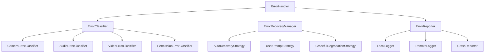

# Error Handling System - iOS 26+ Comprehensive Error Management

## Overview

The Error Handling System provides comprehensive error management for the DualApp, leveraging Swift 6.2's typed error system and iOS 26's advanced error reporting capabilities. It ensures graceful error handling, user-friendly error messages, and effective error recovery strategies.

## Architecture Principles

### 1. Typed Error System
- Comprehensive error type hierarchy
- Contextual error information
- Automatic error categorization

### 2. Graceful Degradation
- Automatic error recovery
- Fallback strategies for critical failures
- User-friendly error presentation

### 3. Comprehensive Logging
- Structured error logging
- Performance impact analysis
- Privacy-preserving error reporting

## Error Handling Architecture



## Core Error Handler

### 1. Error Handler Actor

```swift
// ErrorHandling/Core/Actors/ErrorHandler.swift
@globalActor
actor ErrorHandler: Sendable {
    static let shared = ErrorHandler()
    
    // MARK: - State Properties
    private(set) var errorHistory: [ErrorRecord] = []
    private(set) var currentError: ErrorRecord?
    private(set) var recoveryStrategies: [ErrorType: RecoveryStrategy] = [:]
    
    // MARK: - Error Components
    private let errorClassifier: ErrorClassifier
    private let errorRecoveryManager: ErrorRecoveryManager
    private let errorReporter: ErrorReporter
    
    // MARK: - Event Streams
    let errorEvents: AsyncStream<ErrorEvent>
    let recoveryEvents: AsyncStream<RecoveryEvent>
    private let errorContinuation: AsyncStream<ErrorEvent>.Continuation
    private let recoveryContinuation: AsyncStream<RecoveryEvent>.Continuation
    
    // MARK: - Configuration
    private let maxErrorHistory = 100
    private let enableRemoteReporting = true
    private let enableCrashReporting = true
    
    init() {
        self.errorClassifier = ErrorClassifier()
        self.errorRecoveryManager = ErrorRecoveryManager()
        self.errorReporter = ErrorReporter()
        
        (errorEvents, errorContinuation) = AsyncStream.makeStream()
        (recoveryEvents, recoveryContinuation) = AsyncStream.makeStream()
        
        Task {
            await setupRecoveryStrategies()
        }
    }
    
    // MARK: - Public Interface
    func handle(_ error: Error, context: ErrorContext? = nil) async {
        // Classify error
        let errorType = await errorClassifier.classify(error)
        
        // Create error record
        let errorRecord = ErrorRecord(
            error: error,
            type: errorType,
            context: context ?? ErrorContext(),
            timestamp: Date(),
            recoveryAttempted: false,
            recoverySuccessful: false
        )
        
        // Store error
        await storeError(errorRecord)
        
        // Emit error event
        let errorEvent = ErrorEvent(
            record: errorRecord,
            timestamp: Date()
        )
        
        errorContinuation.yield(errorEvent)
        
        // Attempt recovery
        await attemptRecovery(for: errorRecord)
        
        // Report error
        await errorReporter.report(errorRecord)
    }
    
    func handleCritical(_ error: Error, context: ErrorContext? = nil) async {
        // Handle critical errors that may cause app termination
        let errorRecord = ErrorRecord(
            error: error,
            type: .critical,
            context: context ?? ErrorContext(severity: .critical),
            timestamp: Date(),
            recoveryAttempted: false,
            recoverySuccessful: false
        )
        
        await storeError(errorRecord)
        
        // Attempt immediate recovery
        await attemptCriticalRecovery(for: errorRecord)
        
        // Report critical error
        await errorReporter.reportCritical(errorRecord)
        
        // Consider app termination if recovery fails
        if !errorRecord.recoverySuccessful {
            await handleUnrecoverableError(errorRecord)
        }
    }
    
    func getErrorHistory(limit: Int = 50) async -> [ErrorRecord] {
        return Array(errorHistory.suffix(limit))
    }
    
    func getErrorMetrics() async -> ErrorMetrics {
        return ErrorMetrics(
            totalErrors: errorHistory.count,
            errorsByType: calculateErrorsByType(),
            errorsBySeverity: calculateErrorsBySeverity(),
            recoveryRate: calculateRecoveryRate(),
            mostCommonError: getMostCommonError(),
            averageRecoveryTime: calculateAverageRecoveryTime()
        )
    }
    
    func clearErrorHistory() async {
        errorHistory.removeAll()
    }
    
    // MARK: - Private Methods
    private func setupRecoveryStrategies() async {
        // Setup recovery strategies for different error types
        recoveryStrategies[.camera] = CameraErrorRecoveryStrategy()
        recoveryStrategies[.audio] = AudioErrorRecoveryStrategy()
        recoveryStrategies[.video] = VideoErrorRecoveryStrategy()
        recoveryStrategies[.permission] = PermissionErrorRecoveryStrategy()
        recoveryStrategies[.network] = NetworkErrorRecoveryStrategy()
        recoveryStrategies[.storage] = StorageErrorRecoveryStrategy()
        recoveryStrategies[.performance] = PerformanceErrorRecoveryStrategy()
        recoveryStrategies[.critical] = CriticalErrorRecoveryStrategy()
    }
    
    private func storeError(_ errorRecord: ErrorRecord) async {
        currentError = errorRecord
        errorHistory.append(errorRecord)
        
        // Maintain history size
        if errorHistory.count > maxErrorHistory {
            errorHistory.removeFirst()
        }
    }
    
    private func attemptRecovery(for errorRecord: ErrorRecord) async {
        guard let strategy = recoveryStrategies[errorRecord.type] else {
            return
        }
        
        let startTime = Date()
        
        do {
            // Attempt recovery
            let recoveryResult = try await strategy.recover(from: errorRecord)
            
            // Update error record
            var updatedRecord = errorRecord
            updatedRecord.recoveryAttempted = true
            updatedRecord.recoverySuccessful = recoveryResult.success
            updatedRecord.recoveryTime = Date().timeIntervalSince(startTime)
            updatedRecord.recoveryMessage = recoveryResult.message
            
            // Update stored record
            if let index = errorHistory.firstIndex(where: { $0.id == errorRecord.id }) {
                errorHistory[index] = updatedRecord
            }
            
            // Emit recovery event
            let recoveryEvent = RecoveryEvent(
                errorRecord: updatedRecord,
                strategy: strategy.name,
                success: recoveryResult.success,
                message: recoveryResult.message,
                timestamp: Date()
            )
            
            recoveryContinuation.yield(recoveryEvent)
            
        } catch {
            // Recovery failed
            var updatedRecord = errorRecord
            updatedRecord.recoveryAttempted = true
            updatedRecord.recoverySuccessful = false
            updatedRecord.recoveryTime = Date().timeIntervalSince(startTime)
            updatedRecord.recoveryMessage = "Recovery failed: \(error.localizedDescription)"
            
            // Update stored record
            if let index = errorHistory.firstIndex(where: { $0.id == errorRecord.id }) {
                errorHistory[index] = updatedRecord
            }
            
            // Emit recovery event
            let recoveryEvent = RecoveryEvent(
                errorRecord: updatedRecord,
                strategy: strategy.name,
                success: false,
                message: "Recovery failed: \(error.localizedDescription)",
                timestamp: Date()
            )
            
            recoveryContinuation.yield(recoveryEvent)
        }
    }
    
    private func attemptCriticalRecovery(for errorRecord: ErrorRecord) async {
        // Critical error recovery with higher priority strategies
        if let strategy = recoveryStrategies[.critical] {
            do {
                let result = try await strategy.recover(from: errorRecord)
                
                var updatedRecord = errorRecord
                updatedRecord.recoveryAttempted = true
                updatedRecord.recoverySuccessful = result.success
                updatedRecord.recoveryMessage = result.message
                
                if let index = errorHistory.firstIndex(where: { $0.id == errorRecord.id }) {
                    errorHistory[index] = updatedRecord
                }
                
            } catch {
                // Critical recovery failed
                var updatedRecord = errorRecord
                updatedRecord.recoveryAttempted = true
                updatedRecord.recoverySuccessful = false
                updatedRecord.recoveryMessage = "Critical recovery failed: \(error.localizedDescription)"
                
                if let index = errorHistory.firstIndex(where: { $0.id == errorRecord.id }) {
                    errorHistory[index] = updatedRecord
                }
            }
        }
    }
    
    private func handleUnrecoverableError(_ errorRecord: ErrorRecord) async {
        // Handle unrecoverable errors
        // Log final state
        await errorReporter.reportUnrecoverable(errorRecord)
        
        // Show user alert (if possible)
        await showErrorAlert(errorRecord)
        
        // Consider graceful app termination
        DispatchQueue.main.asyncAfter(deadline: .now() + 2.0) {
            exit(1)
        }
    }
    
    private func showErrorAlert(_ errorRecord: ErrorRecord) async {
        // Show error alert to user
        let alert = UIAlertController(
            title: "Critical Error",
            message: "A critical error has occurred and the app must close. Error: \(errorRecord.error.localizedDescription)",
            preferredStyle: .alert
        )
        
        alert.addAction(UIAlertAction(title: "OK", style: .default))
        
        // Present alert if possible
        if let windowScene = UIApplication.shared.connectedScenes.first as? UIWindowScene,
           let rootViewController = windowScene.windows.first?.rootViewController {
            rootViewController.present(alert, animated: true)
        }
    }
    
    // MARK: - Metrics Calculation
    private func calculateErrorsByType() -> [ErrorType: Int] {
        var errorsByType: [ErrorType: Int] = [:]
        
        for error in errorHistory {
            errorsByType[error.type, default: 0] += 1
        }
        
        return errorsByType
    }
    
    private func calculateErrorsBySeverity() -> [ErrorSeverity: Int] {
        var errorsBySeverity: [ErrorSeverity: Int] = [:]
        
        for error in errorHistory {
            errorsBySeverity[error.context.severity, default: 0] += 1
        }
        
        return errorsBySeverity
    }
    
    private func calculateRecoveryRate() -> Double {
        let totalErrors = errorHistory.filter { $0.recoveryAttempted }.count
        guard totalErrors > 0 else { return 0.0 }
        
        let successfulRecoveries = errorHistory.filter { $0.recoverySuccessful }.count
        return Double(successfulRecoveries) / Double(totalErrors)
    }
    
    private func getMostCommonError() -> ErrorType? {
        let errorsByType = calculateErrorsByType()
        return errorsByType.max { $0.value < $1.value }?.key
    }
    
    private func calculateAverageRecoveryTime() -> TimeInterval {
        let recoveredErrors = errorHistory.filter { $0.recoverySuccessful && $0.recoveryTime > 0 }
        guard !recoveredErrors.isEmpty else { return 0.0 }
        
        let totalTime = recoveredErrors.reduce(0) { $0 + $1.recoveryTime }
        return totalTime / TimeInterval(recoveredErrors.count)
    }
}

// Error Models
struct ErrorRecord: Identifiable, Sendable {
    let id: UUID
    let error: Error
    let type: ErrorType
    let context: ErrorContext
    let timestamp: Date
    var recoveryAttempted: Bool
    var recoverySuccessful: Bool
    var recoveryTime: TimeInterval
    var recoveryMessage: String?
    
    init(error: Error, type: ErrorType, context: ErrorContext, timestamp: Date, recoveryAttempted: Bool, recoverySuccessful: Bool) {
        self.id = UUID()
        self.error = error
        self.type = type
        self.context = context
        self.timestamp = timestamp
        self.recoveryAttempted = recoveryAttempted
        self.recoverySuccessful = recoverySuccessful
        self.recoveryTime = 0
        self.recoveryMessage = nil
    }
}

struct ErrorContext: Sendable {
    let severity: ErrorSeverity
    let category: ErrorCategory
    let component: String
    let operation: String
    let userInfo: [String: Any]
    let stackTrace: [String]
    
    init(severity: ErrorSeverity = .medium, category: ErrorCategory = .general, component: String = "", operation: String = "", userInfo: [String: Any] = [:], stackTrace: [String] = Thread.callStackSymbols) {
        self.severity = severity
        self.category = category
        self.component = component
        self.operation = operation
        self.userInfo = userInfo
        self.stackTrace = stackTrace
    }
}

enum ErrorType: String, CaseIterable, Sendable {
    case camera = "camera"
    case audio = "audio"
    case video = "video"
    case permission = "permission"
    case network = "network"
    case storage = "storage"
    case performance = "performance"
    case critical = "critical"
    case unknown = "unknown"
    
    var displayName: String {
        switch self {
        case .camera:
            return "Camera"
        case .audio:
            return "Audio"
        case .video:
            return "Video"
        case .permission:
            return "Permission"
        case .network:
            return "Network"
        case .storage:
            return "Storage"
        case .performance:
            return "Performance"
        case .critical:
            return "Critical"
        case .unknown:
            return "Unknown"
        }
    }
    
    var icon: String {
        switch self {
        case .camera:
            return "camera"
        case .audio:
            return "mic"
        case .video:
            return "video"
        case .permission:
            return "lock"
        case .network:
            return "wifi"
        case .storage:
            return "externaldrive"
        case .performance:
            return "speedometer"
        case .critical:
            return "exclamationmark.triangle"
        case .unknown:
            return "questionmark"
        }
    }
}

enum ErrorSeverity: String, CaseIterable, Sendable {
    case low = "low"
    case medium = "medium"
    case high = "high"
    case critical = "critical"
    
    var displayName: String {
        switch self {
        case .low:
            return "Low"
        case .medium:
            return "Medium"
        case .high:
            return "High"
        case .critical:
            return "Critical"
        }
    }
    
    var color: Color {
        switch self {
        case .low:
            return .green
        case .medium:
            return .yellow
        case .high:
            return .orange
        case .critical:
            return .red
        }
    }
}

enum ErrorCategory: String, CaseIterable, Sendable {
    case configuration = "configuration"
    case hardware = "hardware"
    case software = "software"
    case network = "network"
    case storage = "storage"
    case permission = "permission"
    case performance = "performance"
    case user = "user"
    case general = "general"
    
    var displayName: String {
        switch self {
        case .configuration:
            return "Configuration"
        case .hardware:
            return "Hardware"
        case .software:
            return "Software"
        case .network:
            return "Network"
        case .storage:
            return "Storage"
        case .permission:
            return "Permission"
        case .performance:
            return "Performance"
        case .user:
            return "User"
        case .general:
            return "General"
        }
    }
}

struct ErrorEvent: Sendable {
    let record: ErrorRecord
    let timestamp: Date
}

struct RecoveryEvent: Sendable {
    let errorRecord: ErrorRecord
    let strategy: String
    let success: Bool
    let message: String
    let timestamp: Date
}

struct ErrorMetrics: Sendable {
    let totalErrors: Int
    let errorsByType: [ErrorType: Int]
    let errorsBySeverity: [ErrorSeverity: Int]
    let recoveryRate: Double
    let mostCommonError: ErrorType?
    let averageRecoveryTime: TimeInterval
}
```

## Error Recovery Strategies

### 1. Recovery Strategy Protocol

```swift
// ErrorHandling/Recovery/RecoveryStrategy.swift
protocol RecoveryStrategy: Sendable {
    var name: String { get }
    var supportedErrorTypes: [ErrorType] { get }
    
    func canRecover(from error: ErrorRecord) async -> Bool
    func recover(from error: ErrorRecord) async throws -> RecoveryResult
}

struct RecoveryResult: Sendable {
    let success: Bool
    let message: String
    let action: RecoveryAction?
    let retryPossible: Bool
    
    static func success(message: String, action: RecoveryAction? = nil) -> RecoveryResult {
        RecoveryResult(success: true, message: message, action: action, retryPossible: true)
    }
    
    static func failure(message: String, retryPossible: Bool = true) -> RecoveryResult {
        RecoveryResult(success: false, message: message, action: nil, retryPossible: retryPossible)
    }
}

enum RecoveryAction: Sendable {
    case restartComponent(String)
    case resetConfiguration
    case clearCache
    case requestPermission(PermissionType)
    case showSettings
    case retryOperation
    case fallbackToAlternative
    case userAction(String)
}

// Camera Error Recovery Strategy
struct CameraErrorRecoveryStrategy: RecoveryStrategy {
    let name = "Camera Error Recovery"
    let supportedErrorTypes: [ErrorType] = [.camera]
    
    func canRecover(from error: ErrorRecord) async -> Bool {
        // Check if error is recoverable
        switch error.error {
        case CameraError.configurationFailed:
            return true
        case CameraError.hardwareNotSupported:
            return false
        case CameraError.permissionDenied:
            return true
        case CameraError.thermalLimitReached:
            return true
        case CameraError.batteryLevelLow:
            return true
        default:
            return false
        }
    }
    
    func recover(from error: ErrorRecord) async throws -> RecoveryResult {
        switch error.error {
        case CameraError.configurationFailed:
            return try await recoverFromConfigurationError(error)
        case CameraError.permissionDenied:
            return try await recoverFromPermissionError(error)
        case CameraError.thermalLimitReached:
            return try await recoverFromThermalError(error)
        case CameraError.batteryLevelLow:
            return try await recoverFromBatteryError(error)
        default:
            return .failure(message: "Unknown camera error", retryPossible: false)
        }
    }
    
    private func recoverFromConfigurationError(_ error: ErrorRecord) async throws -> RecoveryResult {
        // Reset camera configuration
        await CameraManager.shared.resetConfiguration()
        
        // Attempt to reconfigure
        do {
            try await CameraManager.shared.configureCameras()
            return .success(
                message: "Camera configuration reset successfully",
                action: .retryOperation
            )
        } catch {
            return .failure(message: "Failed to reset camera configuration")
        }
    }
    
    private func recoverFromPermissionError(_ error: ErrorRecord) async throws -> RecoveryResult {
        // Request camera permission
        let granted = try await PermissionManager.shared.requestPermission(.camera)
        
        if granted.isGranted {
            return .success(
                message: "Camera permission granted",
                action: .retryOperation
            )
        } else {
            return .failure(
                message: "Camera permission denied",
                retryPossible: false,
                action: .showSettings
            )
        }
    }
    
    private func recoverFromThermalError(_ error: ErrorRecord) async throws -> RecoveryResult {
        // Reduce quality to lower thermal impact
        await CameraManager.shared.reduceQualityForThermal()
        
        return .success(
            message: "Camera quality reduced to manage thermal state",
            action: .retryOperation
        )
    }
    
    private func recoverFromBatteryError(_ error: ErrorRecord) async throws -> RecoveryResult {
        // Enable power saving mode
        await BatteryManager.shared.enablePowerSaving()
        
        return .success(
            message: "Power saving enabled to conserve battery",
            action: .retryOperation
        )
    }
}

// Audio Error Recovery Strategy
struct AudioErrorRecoveryStrategy: RecoveryStrategy {
    let name = "Audio Error Recovery"
    let supportedErrorTypes: [ErrorType] = [.audio]
    
    func canRecover(from error: ErrorRecord) async -> Bool {
        // Check if error is recoverable
        switch error.error {
        case AudioError.sessionFailed:
            return true
        case AudioError.hardwareUnavailable:
            return false
        case AudioError.insufficientPermissions:
            return true
        case AudioError.interrupted:
            return true
        case AudioError.routeChanged:
            return true
        default:
            return false
        }
    }
    
    func recover(from error: ErrorRecord) async throws -> RecoveryResult {
        switch error.error {
        case AudioError.sessionFailed:
            return try await recoverFromSessionError(error)
        case AudioError.insufficientPermissions:
            return try await recoverFromPermissionError(error)
        case AudioError.interrupted:
            return try await recoverFromInterruption(error)
        case AudioError.routeChanged:
            return try await recoverFromRouteChange(error)
        default:
            return .failure(message: "Unknown audio error", retryPossible: false)
        }
    }
    
    private func recoverFromSessionError(_ error: ErrorRecord) async throws -> RecoveryResult {
        // Reset audio session
        try await AudioManager.shared.resetAudioSession()
        
        return .success(
            message: "Audio session reset successfully",
            action: .retryOperation
        )
    }
    
    private func recoverFromPermissionError(_ error: ErrorRecord) async throws -> RecoveryResult {
        // Request microphone permission
        let granted = try await PermissionManager.shared.requestPermission(.microphone)
        
        if granted.isGranted {
            return .success(
                message: "Microphone permission granted",
                action: .retryOperation
            )
        } else {
            return .failure(
                message: "Microphone permission denied",
                retryPossible: false,
                action: .showSettings
            )
        }
    }
    
    private func recoverFromInterruption(_ error: ErrorRecord) async throws -> RecoveryResult {
        // Attempt to resume audio session
        try await AudioManager.shared.resumeAudioSession()
        
        return .success(
            message: "Audio session resumed",
            action: .retryOperation
        )
    }
    
    private func recoverFromRouteChange(_ error: ErrorRecord) async throws -> RecoveryResult {
        // Update audio configuration for new route
        try await AudioManager.shared.updateConfigurationForNewRoute()
        
        return .success(
            message: "Audio configuration updated for new route",
            action: .retryOperation
        )
    }
}

// Video Error Recovery Strategy
struct VideoErrorRecoveryStrategy: RecoveryStrategy {
    let name = "Video Error Recovery"
    let supportedErrorTypes: [ErrorType] = [.video]
    
    func canRecover(from error: ErrorRecord) async -> Bool {
        // Check if error is recoverable
        switch error.error {
        case VideoError.invalidState:
            return true
        case VideoError.invalidBuffer:
            return true
        case VideoError.frameDropped:
            return true
        case VideoError.encodingFailed:
            return true
        case VideoError.processingFailed:
            return true
        default:
            return false
        }
    }
    
    func recover(from error: ErrorRecord) async throws -> RecoveryResult {
        switch error.error {
        case VideoError.invalidState:
            return try await recoverFromInvalidState(error)
        case VideoError.invalidBuffer:
            return try await recoverFromInvalidBuffer(error)
        case VideoError.frameDropped:
            return try await recoverFromFrameDropped(error)
        case VideoError.encodingFailed:
            return try await recoverFromEncodingError(error)
        case VideoError.processingFailed:
            return try await recoverFromProcessingError(error)
        default:
            return .failure(message: "Unknown video error", retryPossible: false)
        }
    }
    
    private func recoverFromInvalidState(_ error: ErrorRecord) async throws -> RecoveryResult {
        // Reset video processor
        try await VideoProcessor.shared.reset()
        
        return .success(
            message: "Video processor reset successfully",
            action: .retryOperation
        )
    }
    
    private func recoverFromInvalidBuffer(_ error: ErrorRecord) async throws -> RecoveryResult {
        // Recreate buffer pool
        try await VideoProcessor.shared.recreateBufferPool()
        
        return .success(
            message: "Video buffer pool recreated",
            action: .retryOperation
        )
    }
    
    private func recoverFromFrameDropped(_ error: ErrorRecord) async throws -> RecoveryResult {
        // Reduce quality to prevent frame drops
        await VideoProcessor.shared.reduceQuality()
        
        return .success(
            message: "Video quality reduced to prevent frame drops",
            action: .retryOperation
        )
    }
    
    private func recoverFromEncodingError(_ error: ErrorRecord) async throws -> RecoveryResult {
        // Switch to fallback encoder
        try await VideoProcessor.shared.switchToFallbackEncoder()
        
        return .success(
            message: "Switched to fallback video encoder",
            action: .retryOperation
        )
    }
    
    private func recoverFromProcessingError(_ error: ErrorRecord) async throws -> RecoveryResult {
        // Reset processing pipeline
        try await VideoProcessor.shared.resetProcessingPipeline()
        
        return .success(
            message: "Video processing pipeline reset",
            action: .retryOperation
        )
    }
}
```

## Error Types

### 1. Camera Errors

```swift
// ErrorHandling/Errors/CameraError.swift
enum CameraError: LocalizedError, Sendable {
    case configurationFailed(String)
    case hardwareNotSupported
    case permissionDenied
    case thermalLimitReached
    case batteryLevelLow
    case multiCamNotSupported
    case deviceInUse
    case formatNotSupported
    case focusFailed
    case exposureFailed
    case flashFailed
    case captureFailed
    
    var errorDescription: String? {
        switch self {
        case .configurationFailed(let reason):
            return "Camera configuration failed: \(reason)"
        case .hardwareNotSupported:
            return "Camera hardware not supported"
        case .permissionDenied:
            return "Camera permission denied"
        case .thermalLimitReached:
            return "Camera thermal limit reached"
        case .batteryLevelLow:
            return "Camera battery level too low"
        case .multiCamNotSupported:
            return "Multi-camera not supported"
        case .deviceInUse:
            return "Camera device already in use"
        case .formatNotSupported:
            return "Camera format not supported"
        case .focusFailed:
            return "Camera focus failed"
        case .exposureFailed:
            return "Camera exposure failed"
        case .flashFailed:
            return "Camera flash failed"
        case .captureFailed:
            return "Camera capture failed"
        }
    }
    
    var recoverySuggestion: String? {
        switch self {
        case .configurationFailed:
            return "Try resetting camera configuration"
        case .hardwareNotSupported:
            return "Use a device with supported camera hardware"
        case .permissionDenied:
            return "Grant camera permission in Settings"
        case .thermalLimitReached:
            return "Wait for device to cool down"
        case .batteryLevelLow:
            return "Charge device or enable power saving"
        case .multiCamNotSupported:
            return "Use a device that supports multi-camera"
        case .deviceInUse:
            return "Wait for camera to become available"
        case .formatNotSupported:
            return "Try a different camera format"
        case .focusFailed:
            return "Try manual focus or different focus point"
        case .exposureFailed:
            return "Try auto exposure or different exposure settings"
        case .flashFailed:
            return "Check flash availability or try without flash"
        case .captureFailed:
            return "Restart camera or try different settings"
        }
    }
    
    var severity: ErrorSeverity {
        switch self {
        case .configurationFailed, .focusFailed, .exposureFailed, .flashFailed:
            return .medium
        case .thermalLimitReached, .batteryLevelLow, .deviceInUse, .formatNotSupported, .captureFailed:
            return .high
        case .hardwareNotSupported, .multiCamNotSupported, .permissionDenied:
            return .critical
        }
    }
}
```

### 2. Audio Errors

```swift
// ErrorHandling/Errors/AudioError.swift
enum AudioError: LocalizedError, Sendable {
    case sessionFailed(Error)
    case hardwareUnavailable
    case insufficientPermissions
    case interrupted
    case routeChanged
    case formatNotSupported
    case recordingFailed
    case playbackFailed
    case processingFailed
    
    var errorDescription: String? {
        switch self {
        case .sessionFailed(let error):
            return "Audio session failed: \(error.localizedDescription)"
        case .hardwareUnavailable:
            return "Audio hardware unavailable"
        case .insufficientPermissions:
            return "Insufficient audio permissions"
        case .interrupted:
            return "Audio session interrupted"
        case .routeChanged:
            return "Audio route changed"
        case .formatNotSupported:
            return "Audio format not supported"
        case .recordingFailed:
            return "Audio recording failed"
        case .playbackFailed:
            return "Audio playback failed"
        case .processingFailed:
            return "Audio processing failed"
        }
    }
    
    var recoverySuggestion: String? {
        switch self {
        case .sessionFailed:
            return "Reset audio session"
        case .hardwareUnavailable:
            return "Check audio hardware connections"
        case .insufficientPermissions:
            return "Grant microphone permission in Settings"
        case .interrupted:
            return "Resume audio session when possible"
        case .routeChanged:
            return "Update audio configuration for new route"
        case .formatNotSupported:
            return "Try a different audio format"
        case .recordingFailed:
            return "Restart audio recording"
        case .playbackFailed:
            return "Restart audio playback"
        case .processingFailed:
            return "Reset audio processing"
        }
    }
    
    var severity: ErrorSeverity {
        switch self {
        case .sessionFailed, .interrupted, .routeChanged, .recordingFailed, .playbackFailed, .processingFailed:
            return .medium
        case .hardwareUnavailable, .formatNotSupported:
            return .high
        case .insufficientPermissions:
            return .critical
        }
    }
}
```

### 3. Video Errors

```swift
// ErrorHandling/Errors/VideoError.swift
enum VideoError: LocalizedError, Sendable {
    case invalidState(String)
    case invalidBuffer(String)
    case frameDropped
    case encodingFailed(Error)
    case decodingFailed(Error)
    case processingFailed(Error)
    case hardwareNotSupported
    case formatNotSupported
    case storageFailed
    case memoryInsufficient
    
    var errorDescription: String? {
        switch self {
        case .invalidState(let message):
            return "Invalid video processing state: \(message)"
        case .invalidBuffer(let message):
            return "Invalid video buffer: \(message)"
        case .frameDropped:
            return "Video frame dropped"
        case .encodingFailed(let error):
            return "Video encoding failed: \(error.localizedDescription)"
        case .decodingFailed(let error):
            return "Video decoding failed: \(error.localizedDescription)"
        case .processingFailed(let error):
            return "Video processing failed: \(error.localizedDescription)"
        case .hardwareNotSupported:
            return "Video hardware not supported"
        case .formatNotSupported:
            return "Video format not supported"
        case .storageFailed:
            return "Video storage failed"
        case .memoryInsufficient:
            return "Insufficient memory for video processing"
        }
    }
    
    var recoverySuggestion: String? {
        switch self {
        case .invalidState:
            return "Reset video processor"
        case .invalidBuffer:
            return "Recreate video buffer"
        case .frameDropped:
            return "Reduce video quality"
        case .encodingFailed:
            return "Switch to fallback encoder"
        case .decodingFailed:
            return "Switch to fallback decoder"
        case .processingFailed:
            return "Reset processing pipeline"
        case .hardwareNotSupported:
            return "Use supported video hardware"
        case .formatNotSupported:
            return "Try a different video format"
        case .storageFailed:
            return "Check storage availability"
        case .memoryInsufficient:
            return "Free up memory or reduce quality"
        }
    }
    
    var severity: ErrorSeverity {
        switch self {
        case .invalidState, .invalidBuffer, .frameDropped:
            return .medium
        case .encodingFailed, .decodingFailed, .processingFailed, .storageFailed, .memoryInsufficient:
            return .high
        case .hardwareNotSupported, .formatNotSupported:
            return .critical
        }
    }
}
```

## Error Reporting

### 1. Error Reporter

```swift
// ErrorHandling/Reporting/ErrorReporter.swift
actor ErrorReporter: Sendable {
    // MARK: - Configuration
    private let enableRemoteReporting: Bool
    private let enableCrashReporting: Bool
    private let enableLocalLogging: Bool
    
    // MARK: - Reporting Components
    private let localLogger: LocalLogger
    private let remoteLogger: RemoteLogger
    private let crashReporter: CrashReporter
    
    init(enableRemoteReporting: Bool = true, enableCrashReporting: Bool = true, enableLocalLogging: Bool = true) {
        self.enableRemoteReporting = enableRemoteReporting
        self.enableCrashReporting = enableCrashReporting
        self.enableLocalLogging = enableLocalLogging
        
        self.localLogger = LocalLogger()
        self.remoteLogger = RemoteLogger()
        self.crashReporter = CrashReporter()
        
        if enableCrashReporting {
            setupCrashReporting()
        }
    }
    
    // MARK: - Public Interface
    func report(_ error: ErrorRecord) async {
        // Local logging
        if enableLocalLogging {
            await localLogger.log(error)
        }
        
        // Remote reporting
        if enableRemoteReporting {
            await remoteLogger.report(error)
        }
    }
    
    func reportCritical(_ error: ErrorRecord) async {
        // Critical errors get highest priority reporting
        if enableLocalLogging {
            await localLogger.logCritical(error)
        }
        
        if enableRemoteReporting {
            await remoteLogger.reportCritical(error)
        }
    }
    
    func reportUnrecoverable(_ error: ErrorRecord) async {
        // Unrecoverable errors get immediate reporting
        if enableLocalLogging {
            await localLogger.logUnrecoverable(error)
        }
        
        if enableRemoteReporting {
            await remoteLogger.reportUnrecoverable(error)
        }
        
        if enableCrashReporting {
            await crashReporter.recordUnrecoverableError(error)
        }
    }
    
    // MARK: - Private Methods
    private func setupCrashReporting() {
        // Setup crash reporting
        crashReporter.setup { [weak self] crashReport in
            Task { @MainActor in
                await self?.handleCrashReport(crashReport)
            }
        }
    }
    
    private func handleCrashReport(_ crashReport: CrashReport) async {
        // Handle crash report
        if enableRemoteReporting {
            await remoteLogger.reportCrash(crashReport)
        }
    }
}

// Local Logger
actor LocalLogger: Sendable {
    private let logFileURL: URL
    private let maxLogFileSize: UInt64 = 10 * 1024 * 1024 // 10MB
    
    init() {
        let documentsPath = FileManager.default.urls(for: .documentDirectory, in: .userDomainMask)[0]
        logFileURL = documentsPath.appendingPathComponent("error_log.txt")
    }
    
    func log(_ error: ErrorRecord) async {
        let logEntry = createLogEntry(error)
        await writeLogEntry(logEntry)
    }
    
    func logCritical(_ error: ErrorRecord) async {
        let logEntry = createCriticalLogEntry(error)
        await writeLogEntry(logEntry)
    }
    
    func logUnrecoverable(_ error: ErrorRecord) async {
        let logEntry = createUnrecoverableLogEntry(error)
        await writeLogEntry(logEntry)
    }
    
    private func createLogEntry(_ error: ErrorRecord) -> String {
        let formatter = DateFormatter()
        formatter.dateFormat = "yyyy-MM-dd HH:mm:ss.SSS"
        
        return """
        [\(formatter.string(from: error.timestamp))] [\(error.type.rawValue)] [\(error.context.severity.rawValue)]
        Error: \(error.error.localizedDescription)
        Component: \(error.context.component)
        Operation: \(error.context.operation)
        Recovery: \(error.recoverySuccessful ? "Success" : "Failed")
        ---
        """
    }
    
    private func createCriticalLogEntry(_ error: ErrorRecord) -> String {
        return """
        🚨 CRITICAL ERROR 🚨
        \(createLogEntry(error))
        """
    }
    
    private func createUnrecoverableLogEntry(_ error: ErrorRecord) -> String {
        return """
        💀 UNRECOVERABLE ERROR 💀
        \(createLogEntry(error))
        """
    }
    
    private func writeLogEntry(_ logEntry: String) async {
        // Check file size and rotate if needed
        if await shouldRotateLogFile() {
            await rotateLogFile()
        }
        
        // Write log entry
        if let data = (logEntry + "\n").data(using: .utf8) {
            if let fileHandle = try? FileHandle(forWritingTo: logFileURL) {
                fileHandle.seekToEndOfFile()
                fileHandle.write(data)
                fileHandle.closeFile()
            }
        }
    }
    
    private func shouldRotateLogFile() async -> Bool {
        do {
            let attributes = try FileManager.default.attributesOfItem(atPath: logFileURL.path)
            if let fileSize = attributes[.size] as? UInt64 {
                return fileSize > maxLogFileSize
            }
        } catch {
            // If we can't get file size, assume we should rotate
            return true
        }
        
        return false
    }
    
    private func rotateLogFile() async {
        // Create backup file
        let backupURL = logFileURL.appendingPathExtension("backup")
        
        // Remove existing backup
        try? FileManager.default.removeItem(at: backupURL)
        
        // Move current log to backup
        try? FileManager.default.moveItem(at: logFileURL, to: backupURL)
    }
}

// Remote Logger
actor RemoteLogger: Sendable {
    private let apiEndpoint: URL
    private let apiKey: String
    
    init(apiEndpoint: URL = URL(string: "https://api.dualapp.com/errors")!, apiKey: String = "") {
        self.apiEndpoint = apiEndpoint
        self.apiKey = apiKey
    }
    
    func report(_ error: ErrorRecord) async {
        // Create error report
        let report = createErrorReport(error)
        
        // Send to remote server
        await sendReport(report)
    }
    
    func reportCritical(_ error: ErrorRecord) async {
        // Create critical error report
        let report = createCriticalErrorReport(error)
        
        // Send to remote server with high priority
        await sendReport(report, priority: .high)
    }
    
    func reportUnrecoverable(_ error: ErrorRecord) async {
        // Create unrecoverable error report
        let report = createUnrecoverableErrorReport(error)
        
        // Send to remote server immediately
        await sendReport(report, priority: .critical)
    }
    
    func reportCrash(_ crashReport: CrashReport) async {
        // Create crash report
        let report = createCrashReport(crashReport)
        
        // Send to remote server immediately
        await sendReport(report, priority: .critical)
    }
    
    private func createErrorReport(_ error: ErrorRecord) -> [String: Any] {
        return [
            "errorId": error.id.uuidString,
            "type": error.type.rawValue,
            "severity": error.context.severity.rawValue,
            "message": error.error.localizedDescription,
            "component": error.context.component,
            "operation": error.context.operation,
            "timestamp": ISO8601DateFormatter().string(from: error.timestamp),
            "recoveryAttempted": error.recoveryAttempted,
            "recoverySuccessful": error.recoverySuccessful,
            "recoveryTime": error.recoveryTime,
            "recoveryMessage": error.recoveryMessage ?? "",
            "userInfo": error.context.userInfo,
            "stackTrace": error.context.stackTrace
        ]
    }
    
    private func createCriticalErrorReport(_ error: ErrorRecord) -> [String: Any] {
        var report = createErrorReport(error)
        report["isCritical"] = true
        return report
    }
    
    private func createUnrecoverableErrorReport(_ error: ErrorRecord) -> [String: Any] {
        var report = createErrorReport(error)
        report["isUnrecoverable"] = true
        return report
    }
    
    private func createCrashReport(_ crashReport: CrashReport) -> [String: Any] {
        return [
            "crashId": crashReport.id.uuidString,
            "type": "crash",
            "severity": "critical",
            "message": crashReport.reason,
            "timestamp": ISO8601DateFormatter().string(from: crashReport.timestamp),
            "stackTrace": crashReport.stackTrace,
            "deviceInfo": crashReport.deviceInfo,
            "appInfo": crashReport.appInfo,
            "systemInfo": crashReport.systemInfo
        ]
    }
    
    private func sendReport(_ report: [String: Any], priority: ReportPriority = .normal) async {
        // Send report to remote server
        guard let url = apiEndpoint else { return }
        
        var request = URLRequest(url: url)
        request.httpMethod = "POST"
        request.setValue("application/json", forHTTPHeaderField: "Content-Type")
        request.setValue("Bearer \(apiKey)", forHTTPHeaderField: "Authorization")
        
        do {
            let jsonData = try JSONSerialization.data(withJSONObject: report)
            request.httpBody = jsonData
            
            let (_, response) = try await URLSession.shared.data(for: request)
            
            if let httpResponse = response as? HTTPURLResponse {
                if httpResponse.statusCode != 200 {
                    print("Failed to report error: \(httpResponse.statusCode)")
                }
            }
        } catch {
            print("Failed to send error report: \(error)")
        }
    }
    
    enum ReportPriority {
        case normal
        case high
        case critical
    }
}

// Crash Reporter
class CrashReporter: Sendable {
    private var crashHandler: ((CrashReport) -> Void)?
    
    func setup(handler: @escaping (CrashReport) -> Void) {
        crashHandler = handler
        
        // Set up crash handler
        NSSetUncaughtExceptionHandler { exception in
            let crashReport = CrashReport(
                reason: exception.reason ?? "Unknown reason",
                stackTrace: exception.callStackSymbols,
                timestamp: Date()
            )
            
            handler(crashReport)
        }
    }
    
    func recordUnrecoverableError(_ error: ErrorRecord) {
        // Record unrecoverable error for crash reporting
        let crashReport = CrashReport(
            reason: "Unrecoverable error: \(error.error.localizedDescription)",
            stackTrace: error.context.stackTrace,
            timestamp: Date()
        )
        
        crashHandler?(crashReport)
    }
}

struct CrashReport: Sendable {
    let id: UUID
    let reason: String
    let stackTrace: [String]
    let timestamp: Date
    let deviceInfo: [String: Any]
    let appInfo: [String: Any]
    let systemInfo: [String: Any]
    
    init(reason: String, stackTrace: [String], timestamp: Date) {
        self.id = UUID()
        self.reason = reason
        self.stackTrace = stackTrace
        self.timestamp = timestamp
        self.deviceInfo = CrashReporter.collectDeviceInfo()
        self.appInfo = CrashReporter.collectAppInfo()
        self.systemInfo = CrashReporter.collectSystemInfo()
    }
    
    static func collectDeviceInfo() -> [String: Any] {
        return [
            "model": UIDevice.current.model,
            "systemName": UIDevice.current.systemName,
            "systemVersion": UIDevice.current.systemVersion,
            "name": UIDevice.current.name,
            "localizedModel": UIDevice.current.localizedModel
        ]
    }
    
    static func collectAppInfo() -> [String: Any] {
        return [
            "bundleIdentifier": Bundle.main.bundleIdentifier ?? "",
            "bundleVersion": Bundle.main.infoDictionary?["CFBundleShortVersionString"] as? String ?? "",
            "buildNumber": Bundle.main.infoDictionary?["CFBundleVersion"] as? String ?? "",
            "appName": Bundle.main.infoDictionary?["CFBundleDisplayName"] as? String ?? ""
        ]
    }
    
    static func collectSystemInfo() -> [String: Any] {
        return [
            "availableMemory": ProcessInfo.processInfo.physicalMemory,
            "activeProcessorCount": ProcessInfo.processInfo.processorCount,
            "thermalState": ProcessInfo.processInfo.thermalState.rawValue,
            "lowPowerModeEnabled": ProcessInfo.processInfo.isLowPowerModeEnabled
        ]
    }
}
```

---

This Error Handling System provides comprehensive error management using Swift 6.2's typed error system and iOS 26's advanced error reporting capabilities. It ensures graceful error handling, user-friendly error messages, and effective error recovery strategies throughout the application.
