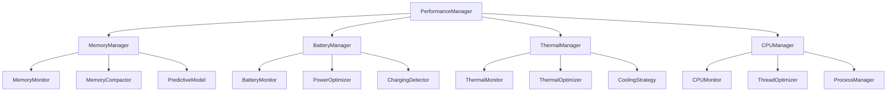

# Performance Management System - iOS 26+ Optimization

## Overview

The Performance Management System is a comprehensive, actor-based framework that monitors and optimizes system resources in real-time. It leverages iOS 26's advanced APIs and Swift 6.2's concurrency model to deliver optimal performance while maintaining battery life and thermal efficiency.

## Architecture Principles

### 1. Proactive Optimization
- Predictive resource management using machine learning
- Preemptive quality adjustment based on system state
- Continuous monitoring with adaptive thresholds

### 2. Actor-Based Isolation
- Thread-safe performance monitoring
- Concurrent resource management
- Isolated state for each performance domain

### 3. Hardware-Aware Design
- Leverages iOS 26's hardware capabilities
- Optimizes for specific device characteristics
- Adapts to thermal and battery constraints

## Performance Manager Architecture



## Memory Management

### 1. Memory Manager Actor

```swift
// Performance/Memory/Actors/MemoryManager.swift
@globalActor
actor MemoryManager: Sendable {
    static let shared = MemoryManager()
    
    // MARK: - State Properties
    private(set) var currentMemoryPressure: MemoryPressureLevel = .nominal
    private(set) var memoryMetrics: MemoryMetrics = MemoryMetrics()
    private var compactionHistory: [CompactionRecord] = []
    private var predictiveModel: MemoryPredictiveModel?
    
    // MARK: - Event Streams
    let memoryPressureEvents: AsyncStream<MemoryPressureEvent>
    let compactionEvents: AsyncStream<CompactionEvent>
    private let memoryPressureContinuation: AsyncStream<MemoryPressureEvent>.Continuation
    private let compactionContinuation: AsyncStream<CompactionEvent>.Continuation
    
    // MARK: - Configuration
    private let warningThreshold: UInt64 = 500 * 1024 * 1024  // 500MB
    private let criticalThreshold: UInt64 = 800 * 1024 * 1024 // 800MB
    private let maxHistoryCount = 20
    
    init() {
        (memoryPressureEvents, memoryPressureContinuation) = AsyncStream.makeStream()
        (compactionEvents, compactionContinuation) = AsyncStream.makeStream()
        
        Task {
            await startMonitoring()
        }
    }
    
    // MARK: - Public Interface
    func handleMemoryWarning(_ level: MemoryPressureLevel) async {
        currentMemoryPressure = level
        
        let event = MemoryPressureEvent(
            level: level,
            timestamp: Date(),
            currentUsage: getCurrentMemoryUsage(),
            availableMemory: getAvailableMemory()
        )
        
        memoryPressureContinuation.yield(event)
        
        switch level {
        case .warning:
            await performLightCompaction()
        case .critical:
            await performAggressiveCompaction()
        case .emergency:
            await performEmergencyCleanup()
        case .nominal:
            break
        }
        
        await recordCompaction(level: level)
    }
    
    func performPredictiveCompaction() async throws {
        guard let model = predictiveModel else {
            predictiveModel = try await createPredictiveModel()
            return
        }
        
        let prediction = try await model.predictMemoryPressure()
        
        if prediction.probability > 0.7 {
            let strategy = prediction.recommendedStrategy
            await executeCompactionStrategy(strategy)
        }
    }
    
    func getMemoryMetrics() async -> MemoryMetrics {
        MemoryMetrics(
            currentUsage: getCurrentMemoryUsage(),
            availableMemory: getAvailableMemory(),
            pressureLevel: currentMemoryPressure,
            compactionCount: compactionHistory.count,
            lastCompaction: compactionHistory.last?.timestamp
        )
    }
    
    // MARK: - iOS 26 Advanced Compaction
    @available(iOS 26.0, *)
    func performAdvancedCompaction() async throws {
        let request = MemoryCompactionRequest()
        request.priority = .high
        request.includeNonEssentialObjects = true
        request.targetReduction = 0.3
        request.compactionMode = .aggressive
        request.preserveCriticalObjects = true
        
        // Add custom strategies
        request.addCustomStrategy(ImageCacheCompactionStrategy())
        request.addCustomStrategy(VideoBufferCompactionStrategy())
        request.addCustomStrategy(PreviewLayerCompactionStrategy())
        
        let result = try await MemoryCompactor.performCompaction(request)
        
        await handleCompactionResult(result)
    }
    
    // MARK: - Private Methods
    private func startMonitoring() async {
        // Monitor memory pressure sources
        await setupMemoryPressureSource()
        await setupMemoryWarningSource()
        await setupPeriodicMonitoring()
    }
    
    private func setupMemoryPressureSource() async {
        let source = MemoryPressureSource()
        for await event in source.events {
            await handleMemoryWarning(event.level)
        }
    }
    
    private func performLightCompaction() async {
        // Clear non-essential caches
        await clearImageCaches()
        await clearPreviewCaches()
        await reduceBufferPoolSize()
    }
    
    private func performAggressiveCompaction() async {
        await performLightCompaction()
        await clearVideoBuffers()
        await reduceQualityLevels()
        await triggerGarbageCollection()
    }
    
    private func performEmergencyCleanup() async {
        await performAggressiveCompaction()
        await stopNonCriticalProcesses()
        await reduceToMinimumQuality()
    }
    
    private func getCurrentMemoryUsage() -> UInt64 {
        var info = mach_task_basic_info()
        var count = mach_msg_type_number_t(MemoryLayout<mach_task_basic_info>.size) / 4
        
        let kerr: kern_return_t = withUnsafeMutablePointer(to: &info) {
            $0.withMemoryRebound(to: integer_t.self, capacity: 1) {
                task_info(mach_task_self_, task_flavor_t(MACH_TASK_BASIC_INFO), $0, &count)
            }
        }
        
        return kerr == KERN_SUCCESS ? info.resident_size : 0
    }
    
    private func getAvailableMemory() -> UInt64 {
        var info = vm_statistics64_data_t()
        var count = HOST_VM_INFO64_COUNT
        
        let result = withUnsafeMutablePointer(to: &info) {
            $0.withMemoryRebound(to: integer_t.self, capacity: 1) {
                host_statistics(mach_host_self(), HOST_VM_INFO64, $0, &count)
            }
        }
        
        guard result == KERN_SUCCESS else { return 0 }
        
        let pageSize = vm_kernel_page_size
        return UInt64(info.free_count) * UInt64(pageSize)
    }
}

// Memory Models
struct MemoryMetrics: Sendable {
    let currentUsage: UInt64
    let availableMemory: UInt64
    let pressureLevel: MemoryPressureLevel
    let compactionCount: Int
    let lastCompaction: Date?
    
    var usagePercentage: Double {
        guard availableMemory > 0 else { return 1.0 }
        return Double(currentUsage) / Double(currentUsage + availableMemory)
    }
}

enum MemoryPressureLevel: String, CaseIterable, Sendable {
    case nominal = "nominal"
    case warning = "warning"
    case critical = "critical"
    case emergency = "emergency"
    
    var color: Color {
        switch self {
        case .nominal:
            return .green
        case .warning:
            return .yellow
        case .critical:
            return .orange
        case .emergency:
            return .red
        }
    }
}

struct MemoryPressureEvent: Sendable {
    let level: MemoryPressureLevel
    let timestamp: Date
    let currentUsage: UInt64
    let availableMemory: UInt64
}
```

### 2. Predictive Memory Model

```swift
// Performance/Memory/Models/MemoryPredictiveModel.swift
@available(iOS 26.0, *)
actor MemoryPredictiveModel: Sendable {
    private var model: MLModel?
    private var trainingData: [MemoryPattern] = []
    private let maxTrainingData = 100
    
    func predictMemoryPressure() async throws -> MemoryPressurePrediction {
        guard let model = model else {
            throw MemoryModelError.modelNotLoaded
        }
        
        let currentPattern = await collectCurrentPattern()
        let prediction = try await model.prediction(from: currentPattern.featureVector)
        
        return MemoryPressurePrediction(
            probability: prediction.probability,
            timeToPressure: prediction.timeToPressure,
            recommendedStrategy: determineStrategy(from: prediction),
            confidence: prediction.confidence
        )
    }
    
    func trainModel(with patterns: [MemoryPattern]) async throws {
        trainingData.append(contentsOf: patterns)
        
        if trainingData.count > maxTrainingData {
            trainingData = Array(trainingData.suffix(maxTrainingData))
        }
        
        let trainingData = try await prepareTrainingData()
        model = try await MLTrainer.trainModel(with: trainingData)
    }
    
    private func collectCurrentPattern() async -> MemoryPattern {
        let currentUsage = await MemoryManager.shared.getCurrentMemoryUsage()
        let availableMemory = await MemoryManager.shared.getAvailableMemory()
        let thermalState = await ThermalManager.shared.getCurrentState()
        let batteryLevel = await BatteryManager.shared.getCurrentLevel()
        
        return MemoryPattern(
            timestamp: Date(),
            memoryUsage: currentUsage,
            availableMemory: availableMemory,
            thermalState: thermalState,
            batteryLevel: batteryLevel,
            activeProcesses: getActiveProcessCount()
        )
    }
    
    private func determineStrategy(from prediction: MLModelPrediction) -> CompactionStrategy {
        switch prediction.severity {
        case .low:
            return .light
        case .medium:
            return .moderate
        case .high:
            return .aggressive
        case .critical:
            return .emergency
        }
    }
}

struct MemoryPattern: Sendable {
    let timestamp: Date
    let memoryUsage: UInt64
    let availableMemory: UInt64
    let thermalState: ThermalState
    let batteryLevel: Float
    let activeProcesses: Int
    
    var featureVector: [Float] {
        [
            Float(memoryUsage),
            Float(availableMemory),
            Float(thermalState.rawValue),
            batteryLevel,
            Float(activeProcesses)
        ]
    }
}

struct MemoryPressurePrediction: Sendable {
    let probability: Double
    let timeToPressure: TimeInterval
    let recommendedStrategy: CompactionStrategy
    let confidence: Float
}
```

## Battery Management

### 1. Battery Manager Actor

```swift
// Performance/Battery/Actors/BatteryManager.swift
@globalActor
actor BatteryManager: Sendable {
    static let shared = BatteryManager()
    
    // MARK: - State Properties
    private(set) var currentLevel: Float = 1.0
    private(set) var currentState: BatteryState = .unplugged
    private(set) var powerOptimizationEnabled = false
    
    // MARK: - Event Streams
    let batteryLevelEvents: AsyncStream<BatteryLevelEvent>
    let powerStateEvents: AsyncStream<PowerStateEvent>
    private let batteryLevelContinuation: AsyncStream<BatteryLevelEvent>.Continuation
    private let powerStateContinuation: AsyncStream<PowerStateEvent>.Continuation
    
    // MARK: - Configuration
    private let lowBatteryThreshold: Float = 0.2
    private let criticalBatteryThreshold: Float = 0.1
    private let powerSavingThreshold: Float = 0.3
    
    init() {
        (batteryLevelEvents, batteryLevelContinuation) = AsyncStream.makeStream()
        (powerStateEvents, powerStateContinuation) = AsyncStream.makeStream()
        
        Task {
            await startMonitoring()
        }
    }
    
    // MARK: - Public Interface
    func getCurrentLevel() async -> Float {
        return currentLevel
    }
    
    func getCurrentState() async -> BatteryState {
        return currentState
    }
    
    func enablePowerSaving() async {
        powerOptimizationEnabled = true
        await applyPowerSavingSettings()
    }
    
    func disablePowerSaving() async {
        powerOptimizationEnabled = false
        await restoreNormalSettings()
    }
    
    func getBatteryMetrics() async -> BatteryMetrics {
        BatteryMetrics(
            currentLevel: currentLevel,
            currentState: currentState,
            powerOptimizationEnabled: powerOptimizationEnabled,
            estimatedTimeRemaining: estimateTimeRemaining(),
            thermalImpact: await ThermalManager.shared.getBatteryImpact()
        )
    }
    
    // MARK: - Private Methods
    private func startMonitoring() async {
        await setupBatteryLevelMonitoring()
        await setupPowerStateMonitoring()
        await setupThermalImpactMonitoring()
    }
    
    private func setupBatteryLevelMonitoring() async {
        let source = BatteryLevelSource()
        for await level in source.levels {
            await handleBatteryLevelChange(level)
        }
    }
    
    private func handleBatteryLevelChange(_ level: Float) async {
        let previousLevel = currentLevel
        currentLevel = level
        
        let event = BatteryLevelEvent(
            level: level,
            previousLevel: previousLevel,
            timestamp: Date()
        )
        
        batteryLevelContinuation.yield(event)
        
        // Handle low battery scenarios
        if level < criticalBatteryThreshold {
            await handleCriticalBatteryLevel()
        } else if level < lowBatteryThreshold {
            await handleLowBatteryLevel()
        } else if level < powerSavingThreshold && !powerOptimizationEnabled {
            await enablePowerSaving()
        } else if level > powerSavingThreshold + 0.1 && powerOptimizationEnabled {
            await disablePowerSaving()
        }
    }
    
    private func handleCriticalBatteryLevel() async {
        // Enable maximum power saving
        powerOptimizationEnabled = true
        await applyCriticalPowerSaving()
        
        // Notify user
        await NotificationCenter.default.post(
            CriticalBatteryWarning(
                level: currentLevel,
                estimatedTimeRemaining: estimateTimeRemaining()
            )
        )
    }
    
    private func handleLowBatteryLevel() async {
        // Enable moderate power saving
        if !powerOptimizationEnabled {
            await enablePowerSaving()
        }
        
        // Reduce quality settings
        await CameraManager.shared.reduceQualityForBattery()
        
        // Notify user
        await NotificationCenter.default.post(
            LowBatteryWarning(
                level: currentLevel,
                estimatedTimeRemaining: estimateTimeRemaining()
            )
        )
    }
    
    private func applyPowerSavingSettings() async {
        // Reduce video quality
        await CameraManager.shared.setQuality(.hd720)
        
        // Disable non-essential features
        await CameraManager.shared.disableHDR()
        await CameraManager.shared.disableStabilization()
        
        // Reduce frame rate
        await CameraManager.shared.setFrameRate(24)
        
        // Optimize processing
        await FrameCompositor.shared.setQualityLevel(0.7)
    }
    
    private func applyCriticalPowerSaving() async {
        await applyPowerSavingSettings()
        
        // Further reduce quality
        await CameraManager.shared.setQuality(.hd480)
        await CameraManager.shared.setFrameRate(15)
        
        // Disable advanced features
        await CameraManager.shared.disableAllAdvancedFeatures()
        
        // Minimize processing
        await FrameCompositor.shared.setQualityLevel(0.5)
    }
    
    private func estimateTimeRemaining() -> TimeInterval {
        // Use historical data and current usage patterns
        let currentUsageRate = calculateCurrentUsageRate()
        guard currentUsageRate > 0 else { return 0 }
        
        return TimeInterval(currentLevel / currentUsageRate)
    }
    
    private func calculateCurrentUsageRate() -> Float {
        // Calculate based on current recording settings and system load
        let baseRate: Float = 0.01 // 1% per minute at normal usage
        let qualityMultiplier = getCurrentQualityMultiplier()
        let thermalMultiplier = getThermalMultiplier()
        
        return baseRate * qualityMultiplier * thermalMultiplier
    }
    
    private func getCurrentQualityMultiplier() -> Float {
        // Higher quality = higher battery usage
        switch CameraManager.shared.currentQuality {
        case .uhd4k:
            return 2.0
        case .hd1080:
            return 1.5
        case .hd720:
            return 1.0
        case .hd480:
            return 0.7
        }
    }
    
    private func getThermalMultiplier() -> Float {
        // Higher temperature = higher battery usage
        switch ThermalManager.shared.currentState {
        case .nominal:
            return 1.0
        case .fair:
            return 1.2
        case .serious:
            return 1.5
        case .critical:
            return 2.0
        }
    }
}

// Battery Models
struct BatteryMetrics: Sendable {
    let currentLevel: Float
    let currentState: BatteryState
    let powerOptimizationEnabled: Bool
    let estimatedTimeRemaining: TimeInterval
    let thermalImpact: Float
}

enum BatteryState: String, CaseIterable, Sendable {
    case unplugged = "unplugged"
    case charging = "charging"
    case full = "full"
    
    var isCharging: Bool {
        switch self {
        case .charging, .full:
            return true
        case .unplugged:
            return false
        }
    }
}

struct BatteryLevelEvent: Sendable {
    let level: Float
    let previousLevel: Float
    let timestamp: Date
}

struct PowerStateEvent: Sendable {
    let newState: BatteryState
    let previousState: BatteryState
    let timestamp: Date
}
```

## Thermal Management

### 1. Thermal Manager Actor

```swift
// Performance/Thermal/Actors/ThermalManager.swift
@globalActor
actor ThermalManager: Sendable {
    static let shared = ThermalManager()
    
    // MARK: - State Properties
    private(set) var currentState: ThermalState = .nominal
    private(set) var currentTemperature: Float = 0.0
    private(set) var thermalHistory: [ThermalReading] = []
    
    // MARK: - Event Streams
    let thermalStateEvents: AsyncStream<ThermalStateEvent>
    let temperatureEvents: AsyncStream<TemperatureEvent>
    private let thermalStateContinuation: AsyncStream<ThermalStateEvent>.Continuation
    private let temperatureContinuation: AsyncStream<TemperatureEvent>.Continuation
    
    // MARK: - Configuration
    private let warningThreshold: Float = 45.0
    private let criticalThreshold: Float = 55.0
    private let emergencyThreshold: Float = 65.0
    private let maxHistoryCount = 50
    
    init() {
        (thermalStateEvents, thermalStateContinuation) = AsyncStream.makeStream()
        (temperatureEvents, temperatureContinuation) = AsyncStream.makeStream()
        
        Task {
            await startMonitoring()
        }
    }
    
    // MARK: - Public Interface
    func getCurrentState() async -> ThermalState {
        return currentState
    }
    
    func getCurrentTemperature() async -> Float {
        return currentTemperature
    }
    
    func getBatteryImpact() async -> Float {
        // Calculate thermal impact on battery
        switch currentState {
        case .nominal:
            return 1.0
        case .fair:
            return 1.2
        case .serious:
            return 1.5
        case .critical:
            return 2.0
        }
    }
    
    func getThermalMetrics() async -> ThermalMetrics {
        ThermalMetrics(
            currentTemperature: currentTemperature,
            currentState: currentState,
            trend: calculateThermalTrend(),
            timeInCurrentState: getTimeInCurrentState(),
            batteryImpact: await getBatteryImpact()
        )
    }
    
    // MARK: - Private Methods
    private func startMonitoring() async {
        await setupThermalMonitoring()
        await setupTemperatureMonitoring()
        await setupPeriodicAnalysis()
    }
    
    private func setupThermalMonitoring() async {
        let source = ProcessInfo.thermalStateSource
        for await state in source.states {
            await handleThermalStateChange(state)
        }
    }
    
    private func handleThermalStateChange(_ state: ProcessInfo.ThermalState) async {
        let previousState = currentState
        currentState = convertThermalState(state)
        
        let event = ThermalStateEvent(
            newState: currentState,
            previousState: previousState,
            timestamp: Date()
        )
        
        thermalStateContinuation.yield(event)
        
        // Apply thermal mitigation strategies
        await applyThermalMitigation()
    }
    
    private func applyThermalMitigation() async {
        switch currentState {
        case .nominal:
            await restoreNormalPerformance()
        case .fair:
            await applyLightThermalMitigation()
        case .serious:
            await applyModerateThermalMitigation()
        case .critical:
            await applyAggressiveThermalMitigation()
        }
    }
    
    private func applyLightThermalMitigation() async {
        // Reduce quality slightly
        await CameraManager.shared.reduceQualityForThermal()
        
        // Optimize processing
        await FrameCompositor.shared.setQualityLevel(0.8)
        
        // Notify user
        await NotificationCenter.default.post(
            ThermalWarning(
                state: currentState,
                temperature: currentTemperature,
                message: "Device is getting warm. Quality reduced slightly."
            )
        )
    }
    
    private func applyModerateThermalMitigation() async {
        await applyLightThermalMitigation()
        
        // Further reduce quality
        await CameraManager.shared.setQuality(.hd720)
        await CameraManager.shared.setFrameRate(24)
        
        // Disable advanced features
        await CameraManager.shared.disableHDR()
        
        // Optimize processing
        await FrameCompositor.shared.setQualityLevel(0.6)
        
        // Notify user
        await NotificationCenter.default.post(
            ThermalWarning(
                state: currentState,
                temperature: currentTemperature,
                message: "Device is hot. Quality reduced to prevent overheating."
            )
        )
    }
    
    private func applyAggressiveThermalMitigation() async {
        await applyModerateThermalMitigation()
        
        // Minimum quality settings
        await CameraManager.shared.setQuality(.hd480)
        await CameraManager.shared.setFrameRate(15)
        
        // Disable all advanced features
        await CameraManager.shared.disableAllAdvancedFeatures()
        
        // Minimize processing
        await FrameCompositor.shared.setQualityLevel(0.4)
        
        // Consider pausing recording
        if await CameraManager.shared.isRecording {
            await CameraManager.shared.pauseRecording()
            
            await NotificationCenter.default.post(
                ThermalWarning(
                    state: currentState,
                    temperature: currentTemperature,
                    message: "Device is overheating. Recording paused to cool down."
                )
            )
        }
    }
    
    private func restoreNormalPerformance() async {
        // Gradually restore performance
        await CameraManager.shared.restoreQualityAfterThermal()
        await FrameCompositor.shared.setQualityLevel(1.0)
        
        // Resume recording if paused
        if await CameraManager.shared.isPaused {
            await CameraManager.shared.resumeRecording()
        }
    }
    
    private func convertThermalState(_ state: ProcessInfo.ThermalState) -> ThermalState {
        switch state {
        case .nominal:
            return .nominal
        case .fair:
            return .fair
        case .serious:
            return .serious
        case .critical:
            return .critical
        @unknown default:
            return .nominal
        }
    }
    
    private func calculateThermalTrend() -> ThermalTrend {
        guard thermalHistory.count >= 3 else { return .stable }
        
        let recent = Array(thermalHistory.suffix(3))
        let trend = recent.map { $0.temperature }.reduce(0, +) / Float(recent.count)
        
        if trend > currentTemperature + 1.0 {
            return .cooling
        } else if trend < currentTemperature - 1.0 {
            return .heating
        } else {
            return .stable
        }
    }
    
    private func getTimeInCurrentState() -> TimeInterval {
        guard let lastStateChange = thermalHistory.last(where: { $0.state != currentState }) else {
            return Date().timeIntervalSince(thermalHistory.first?.timestamp ?? Date())
        }
        
        return Date().timeIntervalSince(lastStateChange.timestamp)
    }
}

// Thermal Models
struct ThermalMetrics: Sendable {
    let currentTemperature: Float
    let currentState: ThermalState
    let trend: ThermalTrend
    let timeInCurrentState: TimeInterval
    let batteryImpact: Float
}

enum ThermalState: String, CaseIterable, Sendable {
    case nominal = "nominal"
    case fair = "fair"
    case serious = "serious"
    case critical = "critical"
    
    var color: Color {
        switch self {
        case .nominal:
            return .green
        case .fair:
            return .yellow
        case .serious:
            return .orange
        case .critical:
            return .red
        }
    }
}

enum ThermalTrend: String, CaseIterable, Sendable {
    case cooling = "cooling"
    case stable = "stable"
    case heating = "heating"
}

struct ThermalStateEvent: Sendable {
    let newState: ThermalState
    let previousState: ThermalState
    let timestamp: Date
}

struct TemperatureEvent: Sendable {
    let temperature: Float
    let previousTemperature: Float
    let timestamp: Date
}

struct ThermalReading: Sendable {
    let temperature: Float
    let state: ThermalState
    let timestamp: Date
}
```

## Performance Coordinator

### 1. Central Performance Coordinator

```swift
// Performance/Core/PerformanceCoordinator.swift
@MainActor
actor PerformanceCoordinator: Sendable {
    static let shared = PerformanceCoordinator()
    
    // MARK: - Managers
    private let memoryManager = MemoryManager.shared
    private let batteryManager = BatteryManager.shared
    private let thermalManager = ThermalManager.shared
    
    // MARK: - State
    private(set) var currentPerformanceLevel: PerformanceLevel = .high
    private(set) var adaptiveStrategies: [AdaptiveStrategy] = []
    
    // MARK: - Event Streams
    let performanceEvents: AsyncStream<PerformanceEvent>
    private let performanceContinuation: AsyncStream<PerformanceEvent>.Continuation
    
    init() {
        (performanceEvents, performanceContinuation) = AsyncStream.makeStream()
        
        Task {
            await startCoordination()
        }
    }
    
    // MARK: - Public Interface
    func getCurrentPerformanceLevel() async -> PerformanceLevel {
        return currentPerformanceLevel
    }
    
    func getSystemMetrics() async -> SystemMetrics {
        let memoryMetrics = await memoryManager.getMemoryMetrics()
        let batteryMetrics = await batteryManager.getBatteryMetrics()
        let thermalMetrics = await thermalManager.getThermalMetrics()
        
        return SystemMetrics(
            memory: memoryMetrics,
            battery: batteryMetrics,
            thermal: thermalMetrics,
            performanceLevel: currentPerformanceLevel,
            timestamp: Date()
        )
    }
    
    func optimizeForConstraints(_ constraints: SystemConstraints) async {
        let strategy = await calculateOptimalStrategy(constraints)
        await applyAdaptiveStrategy(strategy)
    }
    
    // MARK: - Private Methods
    private func startCoordination() async {
        await setupEventMonitoring()
        await setupPeriodicOptimization()
    }
    
    private func setupEventMonitoring() async {
        // Monitor memory events
        Task {
            for await event in memoryManager.memoryPressureEvents {
                await handleMemoryPressureEvent(event)
            }
        }
        
        // Monitor battery events
        Task {
            for await event in batteryManager.batteryLevelEvents {
                await handleBatteryLevelEvent(event)
            }
        }
        
        // Monitor thermal events
        Task {
            for await event in thermalManager.thermalStateEvents {
                await handleThermalStateEvent(event)
            }
        }
    }
    
    private func handleMemoryPressureEvent(_ event: MemoryPressureEvent) async {
        let constraints = SystemConstraints(
            memory: event.level,
            battery: await batteryManager.getCurrentLevel(),
            thermal: await thermalManager.getCurrentState()
        )
        
        await optimizeForConstraints(constraints)
        
        performanceContinuation.yield(
            PerformanceEvent(
                type: .memoryPressure,
                severity: event.level,
                timestamp: event.timestamp
            )
        )
    }
    
    private func handleBatteryLevelEvent(_ event: BatteryLevelEvent) async {
        if event.level < 0.2 {
            let constraints = SystemConstraints(
                memory: await memoryManager.currentMemoryPressure,
                battery: .critical,
                thermal: await thermalManager.getCurrentState()
            )
            
            await optimizeForConstraints(constraints)
        }
        
        performanceContinuation.yield(
            PerformanceEvent(
                type: .batteryLevel,
                severity: event.level < 0.2 ? .critical : .warning,
                timestamp: event.timestamp
            )
        )
    }
    
    private func handleThermalStateEvent(_ event: ThermalStateEvent) async {
        let constraints = SystemConstraints(
            memory: await memoryManager.currentMemoryPressure,
            battery: await batteryManager.getCurrentLevel(),
            thermal: event.newState
        )
        
        await optimizeForConstraints(constraints)
        
        performanceContinuation.yield(
            PerformanceEvent(
                type: .thermalState,
                severity: event.newState,
                timestamp: event.timestamp
            )
        )
    }
    
    private func calculateOptimalStrategy(_ constraints: SystemConstraints) async -> AdaptiveStrategy {
        var strategies: [AdaptiveStrategy] = []
        
        // Memory-based strategies
        switch constraints.memory {
        case .warning:
            strategies.append(.lightMemoryOptimization)
        case .critical:
            strategies.append(.aggressiveMemoryOptimization)
        case .emergency:
            strategies.append(.emergencyMemoryCleanup)
        case .nominal:
            break
        }
        
        // Battery-based strategies
        if constraints.battery < 0.2 {
            strategies.append(.powerSaving)
        }
        
        // Thermal-based strategies
        switch constraints.thermal {
        case .fair:
            strategies.append(.lightThermalMitigation)
        case .serious:
            strategies.append(.moderateThermalMitigation)
        case .critical:
            strategies.append(.aggressiveThermalMitigation)
        case .nominal:
            break
        }
        
        return AdaptiveStrategy.combined(strategies)
    }
    
    private func applyAdaptiveStrategy(_ strategy: AdaptiveStrategy) async {
        switch strategy {
        case .lightMemoryOptimization:
            await memoryManager.performLightCompaction()
        case .aggressiveMemoryOptimization:
            await memoryManager.performAggressiveCompaction()
        case .emergencyMemoryCleanup:
            await memoryManager.performEmergencyCleanup()
        case .powerSaving:
            await batteryManager.enablePowerSaving()
        case .lightThermalMitigation:
            await thermalManager.applyLightThermalMitigation()
        case .moderateThermalMitigation:
            await thermalManager.applyModerateThermalMitigation()
        case .aggressiveThermalMitigation:
            await thermalManager.applyAggressiveThermalMitigation()
        case .combined(let strategies):
            for subStrategy in strategies {
                await applyAdaptiveStrategy(subStrategy)
            }
        }
        
        // Update performance level
        currentPerformanceLevel = calculatePerformanceLevel(strategy)
    }
    
    private func calculatePerformanceLevel(_ strategy: AdaptiveStrategy) -> PerformanceLevel {
        switch strategy {
        case .lightMemoryOptimization, .lightThermalMitigation:
            return .high
        case .aggressiveMemoryOptimization, .moderateThermalMitigation, .powerSaving:
            return .medium
        case .emergencyMemoryCleanup, .aggressiveThermalMitigation:
            return .low
        case .combined(let strategies):
            if strategies.contains(where: { $0.isAggressive }) {
                return .low
            } else if strategies.contains(where: { $0.isModerate }) {
                return .medium
            } else {
                return .high
            }
        }
    }
}

// Performance Models
struct SystemMetrics: Sendable {
    let memory: MemoryMetrics
    let battery: BatteryMetrics
    let thermal: ThermalMetrics
    let performanceLevel: PerformanceLevel
    let timestamp: Date
}

enum PerformanceLevel: String, CaseIterable, Sendable {
    case high = "high"
    case medium = "medium"
    case low = "low"
    
    var color: Color {
        switch self {
        case .high:
            return .green
        case .medium:
            return .yellow
        case .low:
            return .red
        }
    }
}

struct SystemConstraints: Sendable {
    let memory: MemoryPressureLevel
    let battery: Float
    let thermal: ThermalState
}

enum AdaptiveStrategy: Sendable {
    case lightMemoryOptimization
    case aggressiveMemoryOptimization
    case emergencyMemoryCleanup
    case powerSaving
    case lightThermalMitigation
    case moderateThermalMitigation
    case aggressiveThermalMitigation
    case combined([AdaptiveStrategy])
    
    var isAggressive: Bool {
        switch self {
        case .aggressiveMemoryOptimization, .emergencyMemoryCleanup, .aggressiveThermalMitigation:
            return true
        case .combined(let strategies):
            return strategies.contains { $0.isAggressive }
        default:
            return false
        }
    }
    
    var isModerate: Bool {
        switch self {
        case .aggressiveMemoryOptimization, .moderateThermalMitigation, .powerSaving:
            return true
        case .combined(let strategies):
            return strategies.contains { $0.isModerate }
        default:
            return false
        }
    }
}

struct PerformanceEvent: Sendable {
    let type: PerformanceEventType
    let severity: Any
    let timestamp: Date
}

enum PerformanceEventType: String, CaseIterable, Sendable {
    case memoryPressure = "memory_pressure"
    case batteryLevel = "battery_level"
    case thermalState = "thermal_state"
}
```

---

This Performance Management System provides comprehensive monitoring and optimization of system resources using Swift 6.2's actor-based concurrency model. It proactively manages memory, battery, and thermal constraints while maintaining optimal performance and user experience.
