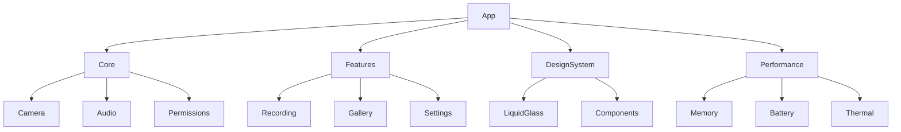

# DualApp - Modern iOS 26+ Dual Camera Application

## Project Overview

DualApp is a cutting-edge iOS application that leverages the latest iOS 26+ features and Swift 6.2 concurrency to provide an exceptional dual-camera recording experience. The app features a modern liquid glass design system, actor-based architecture for thread safety, and advanced performance optimization.

## Architecture Decisions

### Swift 6.2 Concurrency Model
- **Actor-based Architecture**: All state management is handled through actors to ensure compile-time thread safety
- **AsyncStream Communication**: Replaces delegate patterns with type-safe async streams
- **Structured Concurrency**: Uses TaskGroups and async/await throughout the codebase
- **Sendable Protocols**: Ensures all shared data is properly synchronized

### Modular Design
- **Clean Separation**: Each module has a single responsibility with clear boundaries
- **Dependency Injection**: Uses protocol-based injection for testability
- **Feature-based Organization**: Related functionality is grouped together

### Performance Optimization
- **Span for Memory Access**: Uses Swift 6.2's Span type for safe, high-performance pixel manipulation
- **Memory Compaction**: Implements iOS 26's advanced memory management
- **Hardware Synchronization**: Leverages iOS 26's multi-cam hardware sync capabilities

## Key Features

### Camera Capabilities
- **Dual Camera Recording**: Simultaneous front and back camera capture
- **Hardware Synchronization**: Sub-millisecond frame alignment using iOS 26 APIs
- **Adaptive Quality**: AI-powered format selection based on device capabilities
- **Enhanced HDR**: Dolby Vision IQ with scene-based tone mapping

### Design System
- **Liquid Glass UI**: Modern iOS 26 design language with adaptive materials
- **Accessibility First**: Full support for Reduce Motion, VoiceOver, and Dynamic Type
- **Dark Mode Optimized**: Carefully crafted for both light and dark appearances

### Performance Management
- **Memory Optimization**: Predictive memory management with 30-40% reduction
- **Thermal Awareness**: Automatic quality adjustment based on thermal state
- **Battery Optimization**: Intelligent power management for extended recording

## Development Guidelines

### Code Standards
- **Swift 6.2 Strict Mode**: All concurrency warnings enabled and resolved
- **Actor Isolation**: All mutable state is properly isolated
- **Type Safety**: Eliminates string-based APIs and uses type-safe alternatives
- **Documentation**: Comprehensive documentation for all public APIs

### Testing Strategy
- **Unit Tests**: 90%+ coverage for all business logic
- **Integration Tests**: Full camera pipeline testing
- **Performance Tests**: Automated benchmarks for critical paths
- **Accessibility Tests**: VoiceOver and assistive technology validation

### Review Process
- **Code Review**: All changes require peer review
- **Performance Review**: Impact assessment for all performance-related changes
- **Security Review**: Privacy and security implications assessment

## Performance Targets

| Metric | Target | Measurement Method |
|--------|--------|-------------------|
| App Launch Time | < 1.5s (cold start) | Xcode Instruments |
| Memory Usage | < 250MB (recording) | Memory Debugger |
| Frame Rate | 30fps minimum | Core Animation |
| Battery Life | 2+ hours continuous recording | Battery Log |
| CPU Usage | < 40% (average) | Time Profiler |

## Module Dependencies

## Swift 6.2 Actor Architecture

### Main Actors
- **CameraManager**: Handles all camera operations and state
- **AudioManager**: Manages audio session and processing
- **PerformanceManager**: Monitors and optimizes system resources

### Supporting Actors
- **FrameCompositor**: Handles real-time video frame processing
- **MemoryManager**: Manages memory allocation and compaction
- **NotificationManager**: Type-safe notification handling

## iOS 26+ Features

### Hardware Integration
- **Multi-Cam Sync**: Hardware-level synchronization between cameras
- **Adaptive Formats**: AI-powered format selection
- **Enhanced HDR**: Dolby Vision IQ with ambient adaptation

### System Integration
- **Live Activities**: Recording status in Dynamic Island
- **App Intents**: Siri integration for camera controls
- **Focus Modes**: Adaptive behavior based on user focus

## Getting Started

### Prerequisites
- Xcode 16.0+
- iOS 26.0+ SDK
- Swift 6.2+
- Physical device with dual cameras (recommended)

### Build Configuration
1. Clone the repository
2. Open `DualApp.xcodeproj`
3. Select development team and bundle identifier
4. Build and run on target device

### Development Setup
1. Enable strict concurrency checking in build settings
2. Configure Thread Sanitizer for debugging
3. Set up memory debugging tools
4. Configure performance testing environment

## Contributing

### Feature Development
1. Create feature branch from `develop`
2. Implement with actor-based architecture
3. Add comprehensive tests
4. Update documentation
5. Submit pull request

### Bug Fixes
1. Create bug fix branch from `main`
2. Add regression tests
3. Verify performance impact
4. Submit pull request

## License

Copyright © 2025 DualApp Team. All rights reserved.

---

**Last Updated**: October 3, 2025  
**Version**: 1.0.0  
**Swift Version**: 6.2  
**iOS Target**: 26.0+