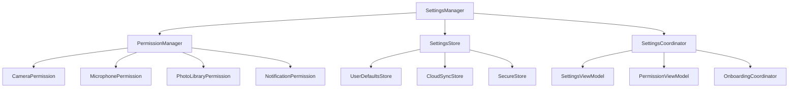

# Settings and Permissions System - iOS 26+ User Control

## Overview

The Settings and Permissions System provides comprehensive user control over app configuration and privacy settings. It leverages iOS 26's advanced permission APIs and Swift 6.2's concurrency model to deliver a seamless, secure, and user-friendly experience.

## Architecture Principles

### 1. User-Centric Design
- Clear, intuitive settings organization
- Granular permission controls
- Transparent data usage information

### 2. Privacy-First Approach
- Minimal permission requests
- Clear justification for each permission
- Easy permission management

### 3. Adaptive Settings
- Context-aware setting suggestions
- Performance-based recommendations
- User behavior learning

## Settings and Permissions Architecture



## Settings Manager

### 1. Settings Manager Actor

```swift
// Settings/Core/Actors/SettingsManager.swift
@MainActor
actor SettingsManager: Sendable {
    // MARK: - State Properties
    private(set) var currentSettings: AppSettings
    private(set) var isLoaded = false
    
    // MARK: - Storage Components
    private let userDefaultsStore: UserDefaultsStore
    private let cloudSyncStore: CloudSyncStore
    private let secureStore: SecureStore
    
    // MARK: - Event Streams
    let settingsUpdateEvents: AsyncStream<SettingsUpdateEvent>
    let settingsSyncEvents: AsyncStream<SettingsSyncEvent>
    private let settingsUpdateContinuation: AsyncStream<SettingsUpdateEvent>.Continuation
    private let settingsSyncContinuation: AsyncStream<SettingsSyncEvent>.Continuation
    
    init() {
        self.currentSettings = AppSettings.default
        self.userDefaultsStore = UserDefaultsStore()
        self.cloudSyncStore = CloudSyncStore()
        self.secureStore = SecureStore()
        
        (settingsUpdateEvents, settingsUpdateContinuation) = AsyncStream.makeStream()
        (settingsSyncEvents, settingsSyncContinuation) = AsyncStream.makeStream()
        
        Task {
            await loadSettings()
        }
    }
    
    // MARK: - Public Interface
    func updateSettings(_ settings: AppSettings) async throws {
        let previousSettings = currentSettings
        currentSettings = settings
        
        // Save to local storage
        try await userDefaultsStore.save(settings)
        
        // Save to secure storage for sensitive data
        try await secureStore.save(settings.sensitiveData)
        
        // Sync to cloud if enabled
        if settings.cloudSyncEnabled {
            try await syncToCloud(settings)
        }
        
        // Notify listeners
        let event = SettingsUpdateEvent(
            newSettings: settings,
            previousSettings: previousSettings,
            timestamp: Date()
        )
        
        settingsUpdateContinuation.yield(event)
        
        // Apply settings changes
        await applySettingsChanges(from: previousSettings, to: settings)
    }
    
    func updateSetting<T>(_ keyPath: WritableKeyPath<AppSettings, T>, value: T) async throws {
        var updatedSettings = currentSettings
        updatedSettings[keyPath: keyPath] = value
        try await updateSettings(updatedSettings)
    }
    
    func resetToDefaults() async throws {
        try await updateSettings(.default)
    }
    
    func exportSettings() async throws -> Data {
        let encoder = JSONEncoder()
        encoder.dateEncodingStrategy = .iso8601
        return try encoder.encode(currentSettings)
    }
    
    func importSettings(from data: Data) async throws {
        let decoder = JSONDecoder()
        decoder.dateDecodingStrategy = .iso8601
        let settings = try decoder.decode(AppSettings.self, from: data)
        try await updateSettings(settings)
    }
    
    func getSettings() async -> AppSettings {
        return currentSettings
    }
    
    // MARK: - Private Methods
    private func loadSettings() async {
        do {
            // Load from local storage
            let localSettings = try await userDefaultsStore.load()
            
            // Load sensitive data from secure storage
            let sensitiveData = try await secureStore.load()
            
            // Merge settings
            var settings = localSettings
            settings.sensitiveData = sensitiveData
            
            // Load from cloud if enabled and newer
            if settings.cloudSyncEnabled {
                if let cloudSettings = try await loadFromCloud() {
                    if cloudSettings.lastModified > settings.lastModified {
                        settings = cloudSettings
                    }
                }
            }
            
            currentSettings = settings
            isLoaded = true
            
        } catch {
            print("Failed to load settings: \(error)")
            // Use default settings
            currentSettings = .default
            isLoaded = true
        }
    }
    
    private func syncToCloud(_ settings: AppSettings) async throws {
        do {
            try await cloudSyncStore.save(settings)
            
            let event = SettingsSyncEvent(
                type: .upload,
                timestamp: Date(),
                success: true
            )
            
            settingsSyncContinuation.yield(event)
            
        } catch {
            let event = SettingsSyncEvent(
                type: .upload,
                timestamp: Date(),
                success: false,
                error: error
            )
            
            settingsSyncContinuation.yield(event)
            throw error
        }
    }
    
    private func loadFromCloud() async throws -> AppSettings? {
        do {
            let cloudSettings = try await cloudSyncStore.load()
            
            let event = SettingsSyncEvent(
                type: .download,
                timestamp: Date(),
                success: true
            )
            
            settingsSyncContinuation.yield(event)
            
            return cloudSettings
            
        } catch {
            let event = SettingsSyncEvent(
                type: .download,
                timestamp: Date(),
                success: false,
                error: error
            )
            
            settingsSyncContinuation.yield(event)
            return nil
        }
    }
    
    private func applySettingsChanges(from previous: AppSettings, to current: AppSettings) async {
        // Apply camera settings changes
        if previous.cameraSettings != current.cameraSettings {
            await CameraManager.shared.updateConfiguration(current.cameraSettings)
        }
        
        // Apply audio settings changes
        if previous.audioSettings != current.audioSettings {
            await AudioManager.shared.updateConfiguration(current.audioSettings)
        }
        
        // Apply performance settings changes
        if previous.performanceSettings != current.performanceSettings {
            await PerformanceCoordinator.shared.updateConfiguration(current.performanceSettings)
        }
        
        // Apply accessibility settings changes
        if previous.accessibilitySettings != current.accessibilitySettings {
            await applyAccessibilitySettings(current.accessibilitySettings)
        }
    }
    
    private func applyAccessibilitySettings(_ settings: AccessibilitySettings) async {
        // Apply accessibility settings
        UIAccessibility.post(notification: .layoutChanged, argument: nil)
    }
}

// Settings Models
struct AppSettings: Codable, Sendable {
    var cameraSettings: CameraSettings
    var audioSettings: AudioSettings
    var performanceSettings: PerformanceSettings
    var accessibilitySettings: AccessibilitySettings
    var privacySettings: PrivacySettings
    var generalSettings: GeneralSettings
    var sensitiveData: SensitiveSettings
    var cloudSyncEnabled: Bool
    var lastModified: Date
    
    static let `default` = AppSettings(
        cameraSettings: .default,
        audioSettings: .default,
        performanceSettings: .default,
        accessibilitySettings: .default,
        privacySettings: .default,
        generalSettings: .default,
        sensitiveData: .default,
        cloudSyncEnabled: false,
        lastModified: Date()
    )
}

struct CameraSettings: Codable, Sendable {
    var videoQuality: VideoQuality
    var frameRate: Int
    var enableHDR: Bool
    var enableStabilization: Bool
    var enableLowLightMode: Bool
    var defaultCamera: CameraPosition
    var enableGrid: Bool
    var enableLevel: Bool
    var enableMacroMode: Bool
    var enablePortraitMode: Bool
    var enableNightMode: Bool
    var enableCinematicMode: Bool
    var enableProRAW: Bool
    var enableProRes: Bool
    
    static let `default` = CameraSettings(
        videoQuality: .hd1080,
        frameRate: 30,
        enableHDR: true,
        enableStabilization: true,
        enableLowLightMode: false,
        defaultCamera: .back,
        enableGrid: false,
        enableLevel: false,
        enableMacroMode: false,
        enablePortraitMode: false,
        enableNightMode: false,
        enableCinematicMode: false,
        enableProRAW: false,
        enableProRes: false
    )
}

struct AudioSettings: Codable, Sendable {
    var sampleRate: Double
    var channels: Int
    var bitRate: Int
    var enableNoiseReduction: Bool
    var enableEchoCancellation: Bool
    var enableSpatialAudio: Bool
    var enableVoiceIsolation: Bool
    var enableStereoRecording: Bool
    var microphoneGain: Float
    var enableWindNoiseReduction: Bool
    
    static let `default` = AudioSettings(
        sampleRate: 44100.0,
        channels: 2,
        bitRate: 128000,
        enableNoiseReduction: true,
        enableEchoCancellation: true,
        enableSpatialAudio: false,
        enableVoiceIsolation: false,
        enableStereoRecording: true,
        microphoneGain: 1.0,
        enableWindNoiseReduction: true
    )
}

struct PerformanceSettings: Codable, Sendable {
    var enableAdaptiveQuality: Bool
    var enableMemoryOptimization: Bool
    var enableBatteryOptimization: Bool
    var enableThermalOptimization: Bool
    var maxMemoryUsage: UInt64
    var lowBatteryThreshold: Float
    var thermalThreshold: ThermalState
    var enableBackgroundProcessing: Bool
    var enableHardwareAcceleration: Bool
    
    static let `default` = PerformanceSettings(
        enableAdaptiveQuality: true,
        enableMemoryOptimization: true,
        enableBatteryOptimization: true,
        enableThermalOptimization: true,
        maxMemoryUsage: 500 * 1024 * 1024, // 500MB
        lowBatteryThreshold: 0.2,
        thermalThreshold: .serious,
        enableBackgroundProcessing: false,
        enableHardwareAcceleration: true
    )
}

struct AccessibilitySettings: Codable, Sendable {
    var enableVoiceOver: Bool
    var enableReduceMotion: Bool
    var enableHighContrast: Bool
    var enableReduceTransparency: Bool
    var enableLargeText: Bool
    var enableBoldText: Bool
    var enableButtonShapes: Bool
    var enableOnOffLabels: Bool
    var enableDifferentiateWithoutColor: Bool
    var enableSmartInvert: Bool
    var enableClassicInvert: Bool
    
    static let `default` = AccessibilitySettings(
        enableVoiceOver: false,
        enableReduceMotion: false,
        enableHighContrast: false,
        enableReduceTransparency: false,
        enableLargeText: false,
        enableBoldText: false,
        enableButtonShapes: false,
        enableOnOffLabels: false,
        enableDifferentiateWithoutColor: false,
        enableSmartInvert: false,
        enableClassicInvert: false
    )
}

struct PrivacySettings: Codable, Sendable {
    var enableAnalytics: Bool
    var enableCrashReporting: Bool
    var enableUsageData: Bool
    var enableLocationServices: Bool
    var enablePersonalization: Bool
    var enableDataCollection: Bool
    var enableThirdPartySharing: Bool
    var dataRetentionPeriod: Int
    var enableAutoDelete: Bool
    var enableEncryption: Bool
    
    static let `default` = PrivacySettings(
        enableAnalytics: false,
        enableCrashReporting: true,
        enableUsageData: false,
        enableLocationServices: false,
        enablePersonalization: false,
        enableDataCollection: false,
        enableThirdPartySharing: false,
        dataRetentionPeriod: 30,
        enableAutoDelete: false,
        enableEncryption: true
    )
}

struct GeneralSettings: Codable, Sendable {
    var enableHapticFeedback: Bool
    var enableSoundEffects: Bool
    var enableNotifications: Bool
    var enableLiveActivities: Bool
    var enableSiriShortcuts: Bool
    var enableWidget: Bool
    var enableAppleWatch: Bool
    var language: String
    var region: String
    var enableDarkMode: Bool
    var enableAutoDarkMode: Bool
    
    static let `default` = GeneralSettings(
        enableHapticFeedback: true,
        enableSoundEffects: true,
        enableNotifications: true,
        enableLiveActivities: true,
        enableSiriShortcuts: false,
        enableWidget: true,
        enableAppleWatch: false,
        language: "en",
        region: "US",
        enableDarkMode: false,
        enableAutoDarkMode: true
    )
}

struct SensitiveSettings: Codable, Sendable {
    var enableBiometricAuth: Bool
    var enablePasscode: Bool
    var passcode: String?
    var enableFaceID: Bool
    var enableTouchID: Bool
    var enableTwoFactor: Bool
    var enableAutoLock: Bool
    var autoLockTimeout: TimeInterval
    
    static let `default` = SensitiveSettings(
        enableBiometricAuth: false,
        enablePasscode: false,
        passcode: nil,
        enableFaceID: false,
        enableTouchID: false,
        enableTwoFactor: false,
        enableAutoLock: false,
        autoLockTimeout: 300 // 5 minutes
    )
}

struct SettingsUpdateEvent: Sendable {
    let newSettings: AppSettings
    let previousSettings: AppSettings
    let timestamp: Date
}

struct SettingsSyncEvent: Sendable {
    let type: SyncType
    let timestamp: Date
    let success: Bool
    let error: Error?
    
    enum SyncType: String, CaseIterable, Sendable {
        case upload = "upload"
        case download = "download"
        case conflict = "conflict"
    }
}
```

## Permission Manager

### 1. Permission Manager Actor

```swift
// Settings/Permissions/Actors/PermissionManager.swift
@MainActor
actor PermissionManager: Sendable {
    // MARK: - State Properties
    private(set) var permissionStates: [PermissionType: PermissionState] = [:]
    private(set) var isInitialized = false
    
    // MARK: - Event Streams
    let permissionUpdateEvents: AsyncStream<PermissionUpdateEvent>
    let permissionRequestEvents: AsyncStream<PermissionRequestEvent>
    private let permissionUpdateContinuation: AsyncStream<PermissionUpdateEvent>.Continuation
    private let permissionRequestContinuation: AsyncStream<PermissionRequestEvent>.Continuation
    
    init() {
        (permissionUpdateEvents, permissionUpdateContinuation) = AsyncStream.makeStream()
        (permissionRequestEvents, permissionRequestContinuation) = AsyncStream.makeStream()
        
        Task {
            await initializePermissions()
        }
    }
    
    // MARK: - Public Interface
    func requestPermission(_ type: PermissionType) async throws -> PermissionState {
        let currentState = await getPermissionState(type)
        
        switch currentState {
        case .authorized:
            return currentState
        case .denied:
            // Show settings redirect
            await showSettingsRedirect(for: type)
            return currentState
        case .notDetermined:
            return try await requestPermissionFromSystem(type)
        case .restricted:
            return currentState
        case .limited:
            return currentState
        }
    }
    
    func requestPermissions(_ types: [PermissionType]) async throws -> [PermissionType: PermissionState] {
        var results: [PermissionType: PermissionState] = [:]
        
        for type in types {
            results[type] = try await requestPermission(type)
        }
        
        return results
    }
    
    func getPermissionState(_ type: PermissionType) async -> PermissionState {
        if let cachedState = permissionStates[type] {
            return cachedState
        }
        
        let currentState = await checkSystemPermissionState(type)
        permissionStates[type] = currentState
        return currentState
    }
    
    func getAllPermissionStates() async -> [PermissionType: PermissionState] {
        var states: [PermissionType: PermissionState] = [:]
        
        for type in PermissionType.allCases {
            states[type] = await getPermissionState(type)
        }
        
        return states
    }
    
    func openAppSettings() async {
        guard let settingsURL = URL(string: UIApplication.openSettingsURLString) else {
            return
        }
        
        await UIApplication.shared.open(settingsURL)
    }
    
    // MARK: - Private Methods
    private func initializePermissions() async {
        // Initialize all permission states
        for type in PermissionType.allCases {
            permissionStates[type] = await checkSystemPermissionState(type)
        }
        
        isInitialized = true
        
        // Set up notification observers for permission changes
        await setupPermissionObservers()
    }
    
    private func setupPermissionObservers() async {
        // Observer for notification permission changes
        NotificationCenter.default.addObserver(
            forName: UIApplication.didBecomeActiveNotification,
            object: nil,
            queue: .main
        ) { [weak self] _ in
            Task { @MainActor in
                await self?.checkForPermissionChanges()
            }
        }
    }
    
    private func checkForPermissionChanges() async {
        for type in PermissionType.allCases {
            let previousState = permissionStates[type] ?? .notDetermined
            let currentState = await checkSystemPermissionState(type)
            
            if previousState != currentState {
                permissionStates[type] = currentState
                
                let event = PermissionUpdateEvent(
                    type: type,
                    newState: currentState,
                    previousState: previousState,
                    timestamp: Date()
                )
                
                permissionUpdateContinuation.yield(event)
            }
        }
    }
    
    private func checkSystemPermissionState(_ type: PermissionType) async -> PermissionState {
        switch type {
        case .camera:
            return await checkCameraPermission()
        case .microphone:
            return await checkMicrophonePermission()
        case .photoLibrary:
            return await checkPhotoLibraryPermission()
        case .notifications:
            return await checkNotificationPermission()
        case .location:
            return await checkLocationPermission()
        case .contacts:
            return await checkContactsPermission()
        case .calendar:
            return await checkCalendarPermission()
        case .reminders:
            return await checkRemindersPermission()
        }
    }
    
    private func checkCameraPermission() async -> PermissionState {
        let status = AVCaptureDevice.authorizationStatus(for: .video)
        return convertAuthorizationStatus(status)
    }
    
    private func checkMicrophonePermission() async -> PermissionState {
        let status = AVCaptureDevice.authorizationStatus(for: .audio)
        return convertAuthorizationStatus(status)
    }
    
    private func checkPhotoLibraryPermission() async -> PermissionState {
        let status = PHPhotoLibrary.authorizationStatus()
        return convertPhotoAuthorizationStatus(status)
    }
    
    private func checkNotificationPermission() async -> PermissionState {
        if #available(iOS 26.0, *) {
            let status = await UNUserNotificationCenter.current().notificationSettings()
            return convertNotificationSettings(status)
        } else {
            let status = UIApplication.shared.isRegisteredForRemoteNotifications
            return status ? .authorized : .notDetermined
        }
    }
    
    private func checkLocationPermission() async -> PermissionState {
        let status = CLLocationManager.authorizationStatus()
        return convertLocationAuthorizationStatus(status)
    }
    
    private func checkContactsPermission() async -> PermissionState {
        let status = CNContactStore.authorizationStatus(for: .contacts)
        return convertContactsAuthorizationStatus(status)
    }
    
    private func checkCalendarPermission() async -> PermissionState {
        let status = EKEventStore.authorizationStatus(for: .event)
        return convertCalendarAuthorizationStatus(status)
    }
    
    private func checkRemindersPermission() async -> PermissionState {
        let status = EKEventStore.authorizationStatus(for: .reminder)
        return convertRemindersAuthorizationStatus(status)
    }
    
    private func requestPermissionFromSystem(_ type: PermissionType) async throws -> PermissionState {
        let requestEvent = PermissionRequestEvent(
            type: type,
            timestamp: Date()
        )
        
        permissionRequestContinuation.yield(requestEvent)
        
        switch type {
        case .camera:
            return try await requestCameraPermission()
        case .microphone:
            return try await requestMicrophonePermission()
        case .photoLibrary:
            return try await requestPhotoLibraryPermission()
        case .notifications:
            return try await requestNotificationPermission()
        case .location:
            return try await requestLocationPermission()
        case .contacts:
            return try await requestContactsPermission()
        case .calendar:
            return try await requestCalendarPermission()
        case .reminders:
            return try await requestRemindersPermission()
        }
    }
    
    private func requestCameraPermission() async throws -> PermissionState {
        return try await withCheckedThrowingContinuation { continuation in
            AVCaptureDevice.requestAccess(for: .video) { granted in
                continuation.resume(returning: granted ? .authorized : .denied)
            }
        }
    }
    
    private func requestMicrophonePermission() async throws -> PermissionState {
        return try await withCheckedThrowingContinuation { continuation in
            AVCaptureDevice.requestAccess(for: .audio) { granted in
                continuation.resume(returning: granted ? .authorized : .denied)
            }
        }
    }
    
    private func requestPhotoLibraryPermission() async throws -> PermissionState {
        return try await withCheckedThrowingContinuation { continuation in
            PHPhotoLibrary.requestAuthorization { status in
                continuation.resume(returning: self.convertPhotoAuthorizationStatus(status))
            }
        }
    }
    
    private func requestNotificationPermission() async throws -> PermissionState {
        if #available(iOS 26.0, *) {
            let granted = try await UNUserNotificationCenter.current().requestAuthorization(options: [.alert, .sound, .badge])
            return granted ? .authorized : .denied
        } else {
            return try await withCheckedThrowingContinuation { continuation in
                UIApplication.shared.registerForRemoteNotifications { deviceToken, error in
                    if error != nil {
                        continuation.resume(returning: .denied)
                    } else {
                        continuation.resume(returning: .authorized)
                    }
                }
            }
        }
    }
    
    private func requestLocationPermission() async throws -> PermissionState {
        return try await withCheckedThrowingContinuation { continuation in
            CLLocationManager().requestWhenInUseAuthorization { _ in
                // Check actual status after request
                let status = CLLocationManager.authorizationStatus()
                continuation.resume(returning: self.convertLocationAuthorizationStatus(status))
            }
        }
    }
    
    private func requestContactsPermission() async throws -> PermissionState {
        return try await withCheckedThrowingContinuation { continuation in
            CNContactStore().requestAccess(for: .contacts) { granted, error in
                continuation.resume(returning: granted ? .authorized : .denied)
            }
        }
    }
    
    private func requestCalendarPermission() async throws -> PermissionState {
        return try await withCheckedThrowingContinuation { continuation in
            EKEventStore().requestAccess(to: .event) { granted, error in
                continuation.resume(returning: granted ? .authorized : .denied)
            }
        }
    }
    
    private func requestRemindersPermission() async throws -> PermissionState {
        return try await withCheckedThrowingContinuation { continuation in
            EKEventStore().requestAccess(to: .reminder) { granted, error in
                continuation.resume(returning: granted ? .authorized : .denied)
            }
        }
    }
    
    private func showSettingsRedirect(for type: PermissionType) async {
        // Show alert directing user to settings
        // Implementation would depend on UI framework
    }
    
    // MARK: - Conversion Methods
    private func convertAuthorizationStatus(_ status: AVAuthorizationStatus) -> PermissionState {
        switch status {
        case .authorized:
            return .authorized
        case .denied:
            return .denied
        case .restricted:
            return .restricted
        case .notDetermined:
            return .notDetermined
        @unknown default:
            return .notDetermined
        }
    }
    
    private func convertPhotoAuthorizationStatus(_ status: PHAuthorizationStatus) -> PermissionState {
        switch status {
        case .authorized:
            return .authorized
        case .limited:
            return .limited
        case .denied:
            return .denied
        case .restricted:
            return .restricted
        case .notDetermined:
            return .notDetermined
        @unknown default:
            return .notDetermined
        }
    }
    
    @available(iOS 26.0, *)
    private func convertNotificationSettings(_ settings: UNNotificationSettings) -> PermissionState {
        switch settings.authorizationStatus {
        case .authorized:
            return .authorized
        case .denied:
            return .denied
        case .ephemeral:
            return .authorized
        case .provisional:
            return .authorized
        case .notDetermined:
            return .notDetermined
        @unknown default:
            return .notDetermined
        }
    }
    
    private func convertLocationAuthorizationStatus(_ status: CLAuthorizationStatus) -> PermissionState {
        switch status {
        case .authorizedWhenInUse, .authorizedAlways:
            return .authorized
        case .denied:
            return .denied
        case .restricted:
            return .restricted
        case .notDetermined:
            return .notDetermined
        @unknown default:
            return .notDetermined
        }
    }
    
    private func convertContactsAuthorizationStatus(_ status: CNAuthorizationStatus) -> PermissionState {
        switch status {
        case .authorized:
            return .authorized
        case .denied:
            return .denied
        case .restricted:
            return .restricted
        case .notDetermined:
            return .notDetermined
        }
    }
    
    private func convertCalendarAuthorizationStatus(_ status: EKAuthorizationStatus) -> PermissionState {
        switch status {
        case .authorized:
            return .authorized
        case .denied:
            return .denied
        case .restricted:
            return .restricted
        case .notDetermined:
            return .notDetermined
        }
    }
    
    private func convertRemindersAuthorizationStatus(_ status: EKAuthorizationStatus) -> PermissionState {
        switch status {
        case .authorized:
            return .authorized
        case .denied:
            return .denied
        case .restricted:
            return .restricted
        case .notDetermined:
            return .notDetermined
        }
    }
}

// Permission Models
enum PermissionType: String, CaseIterable, Sendable {
    case camera = "camera"
    case microphone = "microphone"
    case photoLibrary = "photoLibrary"
    case notifications = "notifications"
    case location = "location"
    case contacts = "contacts"
    case calendar = "calendar"
    case reminders = "reminders"
    
    var displayName: String {
        switch self {
        case .camera:
            return "Camera"
        case .microphone:
            return "Microphone"
        case .photoLibrary:
            return "Photo Library"
        case .notifications:
            return "Notifications"
        case .location:
            return "Location"
        case .contacts:
            return "Contacts"
        case .calendar:
            return "Calendar"
        case .reminders:
            return "Reminders"
        }
    }
    
    var description: String {
        switch self {
        case .camera:
            return "Access to camera for recording photos and videos"
        case .microphone:
            return "Access to microphone for recording audio"
        case .photoLibrary:
            return "Access to photo library for saving and viewing media"
        case .notifications:
            return "Permission to send notifications about recordings and updates"
        case .location:
            return "Access to location for location-tagged media"
        case .contacts:
            return "Access to contacts for sharing media"
        case .calendar:
            return "Access to calendar for scheduling recordings"
        case .reminders:
            return "Access to reminders for recording reminders"
        }
    }
    
    var isRequired: Bool {
        switch self {
        case .camera, .microphone, .photoLibrary:
            return true
        default:
            return false
        }
    }
    
    var systemIcon: String {
        switch self {
        case .camera:
            return "camera"
        case .microphone:
            return "mic"
        case .photoLibrary:
            return "photo"
        case .notifications:
            return "bell"
        case .location:
            return "location"
        case .contacts:
            return "person.2"
        case .calendar:
            return "calendar"
        case .reminders:
            return "list.bullet"
        }
    }
}

enum PermissionState: String, CaseIterable, Sendable {
    case authorized = "authorized"
    case denied = "denied"
    case restricted = "restricted"
    case notDetermined = "notDetermined"
    case limited = "limited"
    
    var isGranted: Bool {
        switch self {
        case .authorized, .limited:
            return true
        default:
            return false
        }
    }
    
    var canRequest: Bool {
        switch self {
        case .notDetermined:
            return true
        default:
            return false
        }
    }
    
    var displayName: String {
        switch self {
        case .authorized:
            return "Authorized"
        case .denied:
            return "Denied"
        case .restricted:
            return "Restricted"
        case .notDetermined:
            return "Not Determined"
        case .limited:
            return "Limited"
        }
    }
    
    var color: Color {
        switch self {
        case .authorized:
            return .green
        case .limited:
            return .yellow
        case .denied, .restricted:
            return .red
        case .notDetermined:
            return .gray
        }
    }
}

struct PermissionUpdateEvent: Sendable {
    let type: PermissionType
    let newState: PermissionState
    let previousState: PermissionState
    let timestamp: Date
}

struct PermissionRequestEvent: Sendable {
    let type: PermissionType
    let timestamp: Date
}
```

## Settings UI

### 1. Settings View

```swift
// Settings/UI/Views/SettingsView.swift
struct SettingsView: View {
    @StateObject private var viewModel = SettingsViewModel()
    @State private var selectedSection: SettingsSection? = nil
    
    var body: some View {
        NavigationView {
            List {
                // Camera Settings
                SettingsSectionView(
                    section: .camera,
                    icon: "camera",
                    title: "Camera",
                    subtitle: viewModel.settings.cameraSettings.displaySummary
                ) {
                    CameraSettingsView(settings: $viewModel.settings.cameraSettings)
                }
                
                // Audio Settings
                SettingsSectionView(
                    section: .audio,
                    icon: "mic",
                    title: "Audio",
                    subtitle: viewModel.settings.audioSettings.displaySummary
                ) {
                    AudioSettingsView(settings: $viewModel.settings.audioSettings)
                }
                
                // Performance Settings
                SettingsSectionView(
                    section: .performance,
                    icon: "speedometer",
                    title: "Performance",
                    subtitle: viewModel.settings.performanceSettings.displaySummary
                ) {
                    PerformanceSettingsView(settings: $viewModel.settings.performanceSettings)
                }
                
                // Privacy Settings
                SettingsSectionView(
                    section: .privacy,
                    icon: "lock",
                    title: "Privacy",
                    subtitle: viewModel.settings.privacySettings.displaySummary
                ) {
                    PrivacySettingsView(settings: $viewModel.settings.privacySettings)
                }
                
                // Accessibility Settings
                SettingsSectionView(
                    section: .accessibility,
                    icon: "accessibility",
                    title: "Accessibility",
                    subtitle: viewModel.settings.accessibilitySettings.displaySummary
                ) {
                    AccessibilitySettingsView(settings: $viewModel.settings.accessibilitySettings)
                }
                
                // General Settings
                SettingsSectionView(
                    section: .general,
                    icon: "gear",
                    title: "General",
                    subtitle: viewModel.settings.generalSettings.displaySummary
                ) {
                    GeneralSettingsView(settings: $viewModel.settings.generalSettings)
                }
            }
            .navigationTitle("Settings")
            .navigationBarTitleDisplayMode(.large)
            .liquidGlassBackground()
        }
        .sheet(item: $selectedSection) { section in
            SettingsDetailView(section: section, settings: $viewModel.settings)
        }
    }
}

// Settings Section View
struct SettingsSectionView<Content: View>: View {
    let section: SettingsSection
    let icon: String
    let title: String
    let subtitle: String
    let content: () -> Content
    
    @State private var showingDetail = false
    
    var body: some View {
        Button(action: {
            showingDetail = true
        }) {
            HStack {
                Image(systemName: icon)
                    .font(.title2)
                    .foregroundColor(DesignColors.accent)
                    .frame(width: 30)
                
                VStack(alignment: .leading, spacing: 4) {
                    Text(title)
                        .font(DesignTypography.headline)
                        .foregroundColor(DesignColors.primary)
                    
                    Text(subtitle)
                        .font(DesignTypography.caption)
                        .foregroundColor(DesignColors.secondary)
                }
                
                Spacer()
                
                Image(systemName: "chevron.right")
                    .font(.caption)
                    .foregroundColor(DesignColors.secondary)
            }
            .padding(.vertical, 4)
        }
        .buttonStyle(PlainButtonStyle())
        .accessibilityElement(children: .combine)
        .accessibilityLabel("\(title), \(subtitle)")
        .accessibilityAddTraits(.isButton)
        .sheet(isPresented: $showingDetail) {
            NavigationView {
                content()
                    .navigationTitle(title)
                    .navigationBarTitleDisplayMode(.large)
                    .navigationBarItems(
                        trailing: Button("Done") {
                            showingDetail = false
                        }
                    )
            }
        }
    }
}

// Settings Sections
enum SettingsSection: String, CaseIterable, Identifiable {
    case camera = "camera"
    case audio = "audio"
    case performance = "performance"
    case privacy = "privacy"
    case accessibility = "accessibility"
    case general = "general"
    
    var id: String { rawValue }
}

// Settings View Extensions
extension CameraSettings {
    var displaySummary: String {
        var components: [String] = []
        
        components.append(videoQuality.displayName)
        components.append("\(frameRate) fps")
        
        if enableHDR {
            components.append("HDR")
        }
        
        if enableStabilization {
            components.append("Stabilization")
        }
        
        return components.joined(separator: " • ")
    }
}

extension AudioSettings {
    var displaySummary: String {
        var components: [String] = []
        
        components.append("\(Int(sampleRate)) Hz")
        components.append("\(channels) channels")
        components.append("\(bitRate / 1000) kbps")
        
        if enableNoiseReduction {
            components.append("Noise Reduction")
        }
        
        if enableSpatialAudio {
            components.append("Spatial Audio")
        }
        
        return components.joined(separator: " • ")
    }
}

extension PerformanceSettings {
    var displaySummary: String {
        var components: [String] = []
        
        if enableAdaptiveQuality {
            components.append("Adaptive Quality")
        }
        
        if enableMemoryOptimization {
            components.append("Memory Optimization")
        }
        
        if enableBatteryOptimization {
            components.append("Battery Optimization")
        }
        
        if enableThermalOptimization {
            components.append("Thermal Optimization")
        }
        
        return components.isEmpty ? "Standard" : components.joined(separator: " • ")
    }
}

extension PrivacySettings {
    var displaySummary: String {
        var components: [String] = []
        
        if enableAnalytics {
            components.append("Analytics")
        }
        
        if enableCrashReporting {
            components.append("Crash Reporting")
        }
        
        if enableDataCollection {
            components.append("Data Collection")
        }
        
        if enableEncryption {
            components.append("Encryption")
        }
        
        return components.isEmpty ? "Private" : components.joined(separator: " • ")
    }
}

extension AccessibilitySettings {
    var displaySummary: String {
        var components: [String] = []
        
        if enableVoiceOver {
            components.append("VoiceOver")
        }
        
        if enableReduceMotion {
            components.append("Reduce Motion")
        }
        
        if enableHighContrast {
            components.append("High Contrast")
        }
        
        if enableLargeText {
            components.append("Large Text")
        }
        
        return components.isEmpty ? "Standard" : components.joined(separator: " • ")
    }
}

extension GeneralSettings {
    var displaySummary: String {
        var components: [String] = []
        
        if enableHapticFeedback {
            components.append("Haptics")
        }
        
        if enableNotifications {
            components.append("Notifications")
        }
        
        if enableLiveActivities {
            components.append("Live Activities")
        }
        
        if enableSiriShortcuts {
            components.append("Siri Shortcuts")
        }
        
        return components.isEmpty ? "Basic" : components.joined(separator: " • ")
    }
}
```

---

This Settings and Permissions System provides comprehensive user control over app configuration and privacy settings using Swift 6.2's actor-based concurrency model. It leverages iOS 26's advanced permission APIs and offers a seamless, secure, and user-friendly experience.
