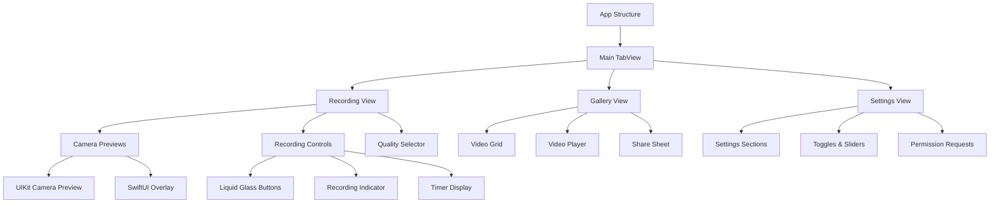

# UI Components Architecture - SwiftUI-First with UIKit Integration

## Overview

DualApp's UI architecture follows a SwiftUI-first approach with strategic UIKit integration for camera previews and complex interactions. The design system is built around iOS 26's Liquid Glass aesthetics with full accessibility support.

## Design Philosophy

### 1. SwiftUI-First Development
- New views built with SwiftUI for modern, declarative UI
- UIKit integration only where necessary (camera previews, complex gestures)
- Seamless interoperability between SwiftUI and UIKit

### 2. Liquid Glass Design System
- iOS 26's native Liquid Glass materials
- Adaptive transparency and blur effects
- Accessibility-aware design with Reduce Motion support

### 3. Component-Based Architecture
- Reusable, composable components
- Consistent design language across all features
- Performance-optimized rendering

## Component Hierarchy



## SwiftUI Views Structure

### 1. Main App Structure

```swift
// DualAppApp.swift
@main
struct DualAppApp: App {
    @StateObject private var appState = AppState()
    @StateObject private var cameraManager = CameraManager()
    @StateObject private var audioManager = AudioManager()
    
    var body: some Scene {
        WindowGroup {
            ContentView()
                .environmentObject(appState)
                .environmentObject(cameraManager)
                .environmentObject(audioManager)
                .onAppear {
                    setupApp()
                }
        }
    }
    
    private func setupApp() {
        Task {
            await cameraManager.initialize()
            await audioManager.initialize()
            await PerformanceManager.shared.startMonitoring()
        }
    }
}

// ContentView.swift
struct ContentView: View {
    @EnvironmentObject var appState: AppState
    @EnvironmentObject var cameraManager: CameraManager
    
    var body: some View {
        TabView(selection: $appState.selectedTab) {
            RecordingView()
                .tabItem {
                    Label("Record", systemImage: "camera.fill")
                }
                .tag(Tab.recording)
            
            GalleryView()
                .tabItem {
                    Label("Gallery", systemImage: "photo.stack")
                }
                .tag(Tab.gallery)
            
            SettingsView()
                .tabItem {
                    Label("Settings", systemImage: "gear")
                }
                .tag(Tab.settings)
        }
        .liquidGlassBackground()
        .onReceive(NotificationCenter.default.notifications(of: MemoryPressureWarning.self)) { notification in
            appState.handleMemoryPressure(notification)
        }
    }
}
```

### 2. Recording View Architecture

```swift
// RecordingView.swift
struct RecordingView: View {
    @EnvironmentObject var cameraManager: CameraManager
    @StateObject private var viewModel = RecordingViewModel()
    @State private var showingQualitySelector = false
    
    var body: some View {
        GeometryReader { geometry in
            ZStack {
                // Camera Previews
                CameraPreviewContainer()
                    .frame(width: geometry.size.width, height: geometry.size.height)
                
                // UI Overlay
                VStack {
                    // Top Controls
                    HStack {
                        QualitySelectorButton()
                            .onTapGesture {
                                showingQualitySelector = true
                            }
                        
                        Spacer()
                        
                        FlashToggleButton()
                    }
                    .padding()
                    
                    Spacer()
                    
                    // Recording Controls
                    RecordingControlsView()
                        .padding(.bottom, 50)
                }
            }
        }
        .ignoresSafeArea()
        .sheet(isPresented: $showingQualitySelector) {
            QualitySelectorView(selectedQuality: $viewModel.videoQuality)
        }
        .onReceive(viewModel.$isRecording) { isRecording in
            if isRecording {
                HapticFeedbackManager.recordingStarted()
            } else {
                HapticFeedbackManager.recordingStopped()
            }
        }
    }
}

// CameraPreviewContainer.swift
struct CameraPreviewContainer: UIViewRepresentable {
    @EnvironmentObject var cameraManager: CameraManager
    
    func makeUIView(context: Context) -> CameraPreviewView {
        let previewView = CameraPreviewView()
        previewView.cameraManager = cameraManager
        return previewView
    }
    
    func updateUIView(_ uiView: CameraPreviewView, context: Context) {
        uiView.updateConfiguration()
    }
}

// CameraPreviewView.swift (UIKit Integration)
class CameraPreviewView: UIView {
    weak var cameraManager: CameraManager?
    
    private let frontPreviewLayer = AVCaptureVideoPreviewLayer()
    private let backPreviewLayer = AVCaptureVideoPreviewLayer()
    private let overlayView = UIView()
    
    override init(frame: CGRect) {
        super.init(frame: frame)
        setupPreviewLayers()
        setupOverlay()
    }
    
    required init?(coder: NSCoder) {
        super.init(coder: coder)
        setupPreviewLayers()
        setupOverlay()
    }
    
    private func setupPreviewLayers() {
        // Front camera preview
        frontPreviewLayer.videoGravity = .resizeAspectFill
        frontPreviewLayer.frame = CGRect(x: 0, y: 0, width: frame.width / 2, height: frame.height)
        layer.addSublayer(frontPreviewLayer)
        
        // Back camera preview
        backPreviewLayer.videoGravity = .resizeAspectFill
        backPreviewLayer.frame = CGRect(x: frame.width / 2, y: 0, width: frame.width / 2, height: frame.height)
        layer.addSublayer(backPreviewLayer)
    }
    
    private func setupOverlay() {
        overlayView.backgroundColor = UIColor.clear
        overlayView.isUserInteractionEnabled = false
        addSubview(overlayView)
    }
    
    func updateConfiguration() {
        Task { @MainActor in
            if let frontLayer = await cameraManager?.frontPreviewLayer {
                frontPreviewLayer.session = frontLayer.session
            }
            if let backLayer = await cameraManager?.backPreviewLayer {
                backPreviewLayer.session = backLayer.session
            }
        }
    }
    
    override func layoutSubviews() {
        super.layoutSubviews()
        
        let halfWidth = bounds.width / 2
        frontPreviewLayer.frame = CGRect(x: 0, y: 0, width: halfWidth, height: bounds.height)
        backPreviewLayer.frame = CGRect(x: halfWidth, y: 0, width: halfWidth, height: bounds.height)
        overlayView.frame = bounds
    }
}
```

## Liquid Glass Components

### 1. Liquid Glass Button

```swift
// LiquidGlassButton.swift
struct LiquidGlassButton: View {
    let title: String
    let icon: String?
    let action: () -> Void
    @State private var isPressed = false
    
    @Environment(\.accessibilityReduceTransparency) var reduceTransparency
    @Environment(\.colorScheme) var colorScheme
    
    var body: some View {
        Button(action: action) {
            HStack(spacing: 8) {
                if let icon = icon {
                    Image(systemName: icon)
                        .font(.system(size: 16, weight: .medium))
                }
                
                Text(title)
                    .font(.system(size: 16, weight: .medium))
            }
            .foregroundColor(.primary)
            .padding(.horizontal, 20)
            .padding(.vertical, 12)
            .background(
                // iOS 26 Liquid Glass Material
                .liquidGlass.tint(.white)
                    .glassIntensity(reduceTransparency ? 0.3 : 0.8)
                    .glassBorder(.adaptive)
                    .cornerRadius(20)
            )
            .scaleEffect(isPressed ? 0.95 : 1.0)
            .opacity(isPressed ? 0.8 : 1.0)
        }
        .buttonStyle(LiquidGlassButtonStyle())
        .sensoryFeedback(.impact(weight: .medium), trigger: isPressed)
        .onLongPressGesture(minimumDuration: 0, maximumDistance: .infinity, pressing: { pressing in
            withAnimation(.easeInOut(duration: 0.1)) {
                isPressed = pressing
            }
        }, perform: {})
    }
}

// LiquidGlassButtonStyle.swift
struct LiquidGlassButtonStyle: ButtonStyle {
    @Environment(\.accessibilityReduceTransparency) var reduceTransparency
    
    func makeBody(configuration: Configuration) -> some View {
        configuration.label
            .scaleEffect(configuration.isPressed ? 0.95 : 1.0)
            .opacity(configuration.isPressed ? 0.8 : 1.0)
            .animation(
                reduceTransparency ? .none : .easeInOut(duration: 0.1),
                value: configuration.isPressed
            )
    }
}
```

### 2. Recording Controls

```swift
// RecordingControlsView.swift
struct RecordingControlsView: View {
    @StateObject private var viewModel = RecordingViewModel()
    @Environment(\.accessibilityReduceTransparency) var reduceTransparency
    
    var body: some View {
        HStack(spacing: 30) {
            // Flash Toggle
            LiquidGlassButton(
                title: "Flash",
                icon: viewModel.isFlashOn ? "bolt.fill" : "bolt.slash.fill"
            ) {
                viewModel.toggleFlash()
            }
            .foregroundColor(viewModel.isFlashOn ? .yellow : .primary)
            
            // Record Button
            RecordButton(isRecording: $viewModel.isRecording) {
                viewModel.toggleRecording()
            }
            
            // Camera Switch
            LiquidGlassButton(
                title: "Switch",
                icon: "camera.rotate"
            ) {
                viewModel.switchCamera()
            }
        }
        .padding(.horizontal, 20)
        .liquidGlassBackground()
        .cornerRadius(25)
        .padding(.horizontal, 20)
    }
}

// RecordButton.swift
struct RecordButton: View {
    @Binding var isRecording: Bool
    let action: () -> Void
    
    @Environment(\.accessibilityReduceTransparency) var reduceTransparency
    
    var body: some View {
        Button(action: action) {
            ZStack {
                Circle()
                    .fill(isRecording ? Color.red : Color.gray)
                    .frame(width: 80, height: 80)
                    .overlay(
                        Circle()
                            .stroke(.white.opacity(0.3), lineWidth: 2)
                    )
                    .scaleEffect(isRecording ? 1.1 : 1.0)
                    .shadow(color: isRecording ? .red.opacity(0.3) : .clear, radius: 10)
                
                Image(systemName: isRecording ? "stop.fill" : "record.fill")
                    .font(.title)
                    .foregroundColor(.white)
            }
        }
        .sensoryFeedback(
            isRecording ? .recordingStart : .recordingStop,
            trigger: isRecording
        )
        .accessibilityLabel(isRecording ? "Stop Recording" : "Start Recording")
        .accessibilityHint(isRecording ? "Stops video recording" : "Starts video recording")
    }
}
```

## Gallery Components

### 1. Video Grid View

```swift
// GalleryView.swift
struct GalleryView: View {
    @StateObject private var viewModel = GalleryViewModel()
    @State private var selectedVideo: VideoMetadata?
    @State private var showingVideoPlayer = false
    
    private let columns = [
        GridItem(.adaptive(minimum: 150), spacing: 10)
    ]
    
    var body: some View {
        NavigationView {
            ScrollView {
                LazyVGrid(columns: columns, spacing: 10) {
                    ForEach(viewModel.videos) { video in
                        VideoThumbnailView(video: video)
                            .onTapGesture {
                                selectedVideo = video
                                showingVideoPlayer = true
                            }
                    }
                }
                .padding()
            }
            .navigationTitle("Gallery")
            .navigationBarTitleDisplayMode(.large)
            .liquidGlassBackground()
        }
        .sheet(isPresented: $showingVideoPlayer) {
            if let video = selectedVideo {
                VideoPlayerView(video: video)
            }
        }
        .onAppear {
            viewModel.loadVideos()
        }
    }
}

// VideoThumbnailView.swift
struct VideoThumbnailView: View {
    let video: VideoMetadata
    
    var body: some View {
        ZStack(alignment: .bottomLeading) {
            // Thumbnail Image
            AsyncImage(url: video.thumbnailURL) { image in
                image
                    .resizable()
                    .aspectRatio(contentMode: .fill)
            } placeholder: {
                Rectangle()
                    .fill(Color.gray.opacity(0.3))
            }
            .frame(height: 150)
            .cornerRadius(12)
            .clipped()
            
            // Duration Badge
            HStack {
                Image(systemName: "play.circle.fill")
                    .font(.caption)
                Text(video.durationFormatted)
                    .font(.caption)
                    .monospacedDigit()
            }
            .foregroundColor(.white)
            .padding(.horizontal, 8)
            .padding(.vertical, 4)
            .background(
                .liquidGlass.tint(.black)
                    .glassIntensity(0.8)
                    .cornerRadius(8)
            )
            .padding(8)
        }
    }
}
```

## Settings Components

### 1. Settings Sections

```swift
// SettingsView.swift
struct SettingsView: View {
    @StateObject private var viewModel = SettingsViewModel()
    
    var body: some View {
        NavigationView {
            List {
                CameraSettingsSection(settings: $viewModel.cameraSettings)
                PerformanceSettingsSection(settings: $viewModel.performanceSettings)
                AccessibilitySettingsSection(settings: $viewModel.accessibilitySettings)
                AboutSection()
            }
            .navigationTitle("Settings")
            .navigationBarTitleDisplayMode(.large)
            .liquidGlassBackground()
        }
    }
}

// CameraSettingsSection.swift
struct CameraSettingsSection: View {
    @Binding var settings: CameraSettings
    
    var body: some View {
        Section {
            // Video Quality
            HStack {
                Label("Video Quality", systemImage: "video")
                Spacer()
                Text(settings.videoQuality.displayName)
                    .foregroundColor(.secondary)
            }
            .contentShape(Rectangle())
            .onTapGesture {
                // Show quality selector
            }
            
            // HDR Mode
            ToggleRow(
                title: "HDR Mode",
                icon: "camera.metering.matrix",
                isOn: $settings.hdrEnabled
            )
            
            // Stabilization
            ToggleRow(
                title: "Video Stabilization",
                icon: "camera.metering.spot",
                isOn: $settings.stabilizationEnabled
            )
        } header: {
            Text("Camera Settings")
        }
    }
}

// ToggleRow.swift
struct ToggleRow: View {
    let title: String
    let icon: String
    @Binding var isOn: Bool
    
    var body: some View {
        HStack {
            Label(title, systemImage: icon)
            Spacer()
            Toggle("", isOn: $isOn)
                .labelsHidden()
        }
        .sensoryFeedback(.selection, trigger: isOn)
    }
}
```

## Accessibility Integration

### 1. Accessibility-Aware Components

```swift
// AccessibleLiquidGlassView.swift
struct AccessibleLiquidGlassView<Content: View>: View {
    let content: Content
    
    @Environment(\.accessibilityReduceTransparency) var reduceTransparency
    @Environment(\.accessibilityReduceMotion) var reduceMotion
    @Environment(\.accessibilityLargeContentViewerEnabled) var largeContentViewerEnabled
    
    init(@ViewBuilder content: () -> Content) {
        self.content = content()
    }
    
    var body: some View {
        content
            .background(
                // Adaptive background based on accessibility settings
                Group {
                    if reduceTransparency {
                        Color.systemBackground
                    } else {
                        .liquidGlass.tint(.white)
                            .glassIntensity(0.8)
                    }
                }
            )
            .animation(
                reduceMotion ? .none : .easeInOut(duration: 0.3),
                value: reduceTransparency
            )
            .accessibilityElement(children: .contain)
    }
}

// AccessibilityHelpers.swift
extension View {
    func accessibleButton(
        label: String,
        hint: String? = nil,
        action: @escaping () -> Void
    ) -> some View {
        self
            .accessibilityLabel(label)
            .accessibilityHint(hint ?? "")
            .accessibilityAddTraits(.isButton)
            .onTapGesture {
                action()
            }
    }
    
    func accessibleProgress(
        value: Double,
        total: Double = 1.0,
        label: String
    ) -> some View {
        self
            .accessibilityLabel(label)
            .accessibilityValue("\(Int(value/total * 100)) percent")
            .accessibilityAddTraits(.updatesFrequently)
    }
}
```

## Performance Optimization

### 1. View Performance

```swift
// PerformanceOptimizedView.swift
struct PerformanceOptimizedView: View {
    @State private var isVisible = false
    
    var body: some View {
        VStack {
            // Heavy content only when visible
            if isVisible {
                HeavyContentView()
            } else {
                LoadingView()
            }
        }
        .onAppear {
            isVisible = true
        }
        .onDisappear {
            isVisible = false
        }
        .drawingGroup(opaque: false) // Optimizes complex views
    }
}

// LazyLoadingGrid.swift
struct LazyLoadingGrid<Item: Identifiable, Content: View>: View {
    let items: [Item]
    let content: (Item) -> Content
    
    var body: some View {
        LazyVGrid(columns: [
            GridItem(.adaptive(minimum: 150), spacing: 10)
        ], spacing: 10) {
            ForEach(items) { item in
                content(item)
                    .id(item.id)
            }
        }
    }
}
```

## UIKit Integration Patterns

### 1. Camera Preview Integration

```swift
// CameraPreviewCoordinator.swift
@MainActor
class CameraPreviewCoordinator: NSObject, ObservableObject {
    @Published var isReady = false
    
    private let cameraManager: CameraManager
    private var previewView: CameraPreviewView?
    
    init(cameraManager: CameraManager) {
        self.cameraManager = cameraManager
        super.init()
        
        setupCameraManager()
    }
    
    private func setupCameraManager() {
        Task {
            await cameraManager.events.sink { [weak self] event in
                await self?.handleCameraEvent(event)
            }
        }
    }
    
    private func handleCameraEvent(_ event: CameraEvent) async {
        switch event {
        case .configured:
            isReady = true
        case .error(let error):
            // Handle error
            break
        default:
            break
        }
    }
    
    func makePreviewView() -> CameraPreviewView {
        let previewView = CameraPreviewView()
        previewView.cameraManager = cameraManager
        self.previewView = previewView
        return previewView
    }
}
```

### 2. Gesture Handling

```swift
// GestureHandlingView.swift
struct GestureHandlingView: UIViewRepresentable {
    @Binding var zoomLevel: CGFloat
    @Binding var focusPoint: CGPoint?
    
    func makeUIView(context: Context) -> GestureHandlingUIView {
        let view = GestureHandlingUIView()
        view.coordinator = context.coordinator
        return view
    }
    
    func updateUIView(_ uiView: GestureHandlingUIView, context: Context) {
        uiView.zoomLevel = zoomLevel
        uiView.focusPoint = focusPoint
    }
    
    func makeCoordinator() -> GestureCoordinator {
        GestureCoordinator(self)
    }
}

class GestureHandlingUIView: UIView {
    weak var coordinator: GestureCoordinator?
    var zoomLevel: CGFloat = 1.0 {
        didSet {
            // Update zoom
        }
    }
    
    var focusPoint: CGPoint? {
        didSet {
            // Update focus
        }
    }
    
    override func touchesBegan(_ touches: Set<UITouch>, with event: UIEvent?) {
        super.touchesBegan(touches, with: event)
        coordinator?.handleTouches(touches, with: event)
    }
}

class GestureCoordinator: NSObject {
    let parent: GestureHandlingView
    
    init(_ parent: GestureHandlingView) {
        self.parent = parent
    }
    
    func handleTouches(_ touches: Set<UITouch>, with event: UIEvent?) {
        guard let touch = touches.first else { return }
        let location = touch.location(in: parent)
        
        // Handle tap for focus
        parent.focusPoint = location
        
        // Handle pinch for zoom
        if event?.allTouches?.count ?? 0 > 1 {
            // Handle zoom gesture
        }
    }
}
```

---

This UI components architecture provides a modern, accessible, and performant foundation for the DualApp. The SwiftUI-first approach with strategic UIKit integration ensures we can leverage the best of both frameworks while maintaining a consistent design language and optimal performance.
