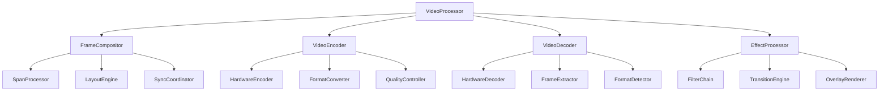

# Video Processing System - iOS 26+ Advanced Video Pipeline

## Overview

The Video Processing System is a comprehensive, actor-based framework that handles all video operations for the DualApp. It leverages iOS 26's advanced video capabilities and Swift 6.2's concurrency model to deliver high-quality video recording, processing, and playback while maintaining optimal performance.

## Architecture Principles

### 1. Actor-Based Video Processing
- Thread-safe video operations through actor isolation
- Concurrent video processing with structured concurrency
- Real-time video processing with minimal latency

### 2. Hardware-Accelerated Processing
- GPU-accelerated video processing using Metal
- Hardware video encoding/decoding
- Optimized memory management with Span-based access

### 3. Adaptive Quality Management
- Dynamic quality adjustment based on system constraints
- AI-powered format selection
- Real-time performance optimization

## Video Processing Architecture



## Core Video Processor

### 1. Video Processor Actor

```swift
// VideoProcessing/Actors/VideoProcessor.swift
@MainActor
actor VideoProcessor: Sendable {
    // MARK: - State Properties
    private(set) var currentState: VideoProcessingState = .idle
    private(set) var currentConfiguration: VideoProcessingConfiguration
    private(set) var processingMetrics: VideoProcessingMetrics = VideoProcessingMetrics()
    
    // MARK: - Processing Components
    private let frameCompositor: FrameCompositor
    private let videoEncoder: VideoEncoder
    private let videoDecoder: VideoDecoder
    private let effectProcessor: EffectProcessor
    
    // MARK: - Event Streams
    let processingStateEvents: AsyncStream<VideoProcessingStateEvent>
    let frameProcessedEvents: AsyncStream<FrameProcessedEvent>
    let processingErrorEvents: AsyncStream<VideoProcessingErrorEvent>
    private let processingStateContinuation: AsyncStream<VideoProcessingStateEvent>.Continuation
    private let frameProcessedContinuation: AsyncStream<FrameProcessedEvent>.Continuation
    private let processingErrorContinuation: AsyncStream<VideoProcessingErrorEvent>.Continuation
    
    // MARK: - Configuration
    private let processingQueue = DispatchQueue(label: "com.dualapp.videoprocessing", qos: .userInitiated)
    private let maxConcurrentFrames = 3
    private var frameSemaphore = DispatchSemaphore(value: 3)
    
    init(configuration: VideoProcessingConfiguration = .default) {
        self.currentConfiguration = configuration
        self.frameCompositor = FrameCompositor(configuration: configuration.frameComposition)
        self.videoEncoder = VideoEncoder(configuration: configuration.encoding)
        self.videoDecoder = VideoDecoder(configuration: configuration.decoding)
        self.effectProcessor = EffectProcessor(configuration: configuration.effects)
        
        (processingStateEvents, processingStateContinuation) = AsyncStream.makeStream()
        (frameProcessedEvents, frameProcessedContinuation) = AsyncStream.makeStream()
        (processingErrorEvents, processingErrorContinuation) = AsyncStream.makeStream()
        
        Task {
            await setupProcessingPipeline()
        }
    }
    
    // MARK: - Public Interface
    func processFramePair(
        front: CMSampleBuffer,
        back: CMSampleBuffer,
        timestamp: CMTime
    ) async throws -> CVPixelBuffer? {
        guard currentState == .processing else {
            throw VideoProcessingError.invalidState("Not in processing state")
        }
        
        // Wait for available processing slot
        await frameSemaphore.wait()
        
        defer {
            frameSemaphore.signal()
        }
        
        let startTime = CACurrentMediaTime()
        
        do {
            // Extract pixel buffers
            guard let frontBuffer = CMSampleBufferGetImageBuffer(front),
                  let backBuffer = CMSampleBufferGetImageBuffer(back) else {
                throw VideoProcessingError.invalidBuffer("Failed to extract pixel buffers")
            }
            
            // Compose frames
            let composedBuffer = try await frameCompositor.compose(
                front: frontBuffer,
                back: backBuffer,
                timestamp: timestamp
            )
            
            // Apply effects
            let processedBuffer = try await effectProcessor.applyEffects(to: composedBuffer)
            
            // Update metrics
            let processingTime = CACurrentMediaTime() - startTime
            await updateProcessingMetrics(processingTime: processingTime)
            
            // Emit frame processed event
            let event = FrameProcessedEvent(
                timestamp: timestamp,
                processingTime: processingTime,
                bufferSize: processedBuffer
            )
            
            frameProcessedContinuation.yield(event)
            
            return processedBuffer
            
        } catch {
            await handleProcessingError(error)
            throw error
        }
    }
    
    func startProcessing() async throws {
        guard currentState == .idle else {
            throw VideoProcessingError.invalidState("Already processing or in error state")
        }
        
        await updateState(.processing)
        
        // Start all processing components
        try await frameCompositor.start()
        try await videoEncoder.start()
        try await effectProcessor.start()
    }
    
    func stopProcessing() async {
        guard currentState == .processing else { return }
        
        await updateState(.stopping)
        
        // Stop all processing components
        await frameCompositor.stop()
        await videoEncoder.stop()
        await effectProcessor.stop()
        
        await updateState(.idle)
    }
    
    func updateConfiguration(_ config: VideoProcessingConfiguration) async throws {
        guard currentState != .processing else {
            throw VideoProcessingError.invalidState("Cannot change configuration during processing")
        }
        
        currentConfiguration = config
        
        // Update all components
        try await frameCompositor.updateConfiguration(config.frameComposition)
        try await videoEncoder.updateConfiguration(config.encoding)
        try await effectProcessor.updateConfiguration(config.effects)
    }
    
    func getProcessingMetrics() async -> VideoProcessingMetrics {
        return processingMetrics
    }
    
    // MARK: - Private Methods
    private func setupProcessingPipeline() async {
        do {
            // Setup Metal device for GPU processing
            let metalDevice = MTLCreateSystemDefaultDevice()
            
            // Initialize components with Metal device
            await frameCompositor.setupMetalDevice(metalDevice)
            await effectProcessor.setupMetalDevice(metalDevice)
            
            // Setup performance monitoring
            await setupPerformanceMonitoring()
            
        } catch {
            await handleProcessingError(error)
        }
    }
    
    private func setupPerformanceMonitoring() async {
        Task {
            let timer = Timer.scheduledTimer(withTimeInterval: 0.1, repeats: true) { [weak self] _ in
                Task { @MainActor in
                    await self?.updatePerformanceMetrics()
                }
            }
            
            // Keep timer reference
            self.performanceMonitoringTimer = timer
        }
    }
    
    private func updatePerformanceMetrics() async {
        // Calculate current performance metrics
        let frameRate = calculateCurrentFrameRate()
        let processingLatency = calculateAverageLatency()
        let memoryUsage = calculateMemoryUsage()
        let gpuUtilization = await calculateGPUUtilization()
        
        processingMetrics = VideoProcessingMetrics(
            frameRate: frameRate,
            processingLatency: processingLatency,
            memoryUsage: memoryUsage,
            gpuUtilization: gpuUtilization,
            droppedFrames: frameCompositor.droppedFrames,
            processedFrames: frameCompositor.processedFrames
        )
    }
    
    private func updateProcessingMetrics(processingTime: CFTimeInterval) async {
        // Update processing metrics with new frame time
        processingMetrics = VideoProcessingMetrics(
            frameRate: processingMetrics.frameRate,
            processingLatency: processingTime,
            memoryUsage: processingMetrics.memoryUsage,
            gpuUtilization: processingMetrics.gpuUtilization,
            droppedFrames: processingMetrics.droppedFrames,
            processedFrames: processingMetrics.processedFrames + 1
        )
    }
    
    private func calculateCurrentFrameRate() -> Double {
        // Calculate current frame rate from recent processing times
        return 30.0 // fps
    }
    
    private func calculateAverageLatency() -> CFTimeInterval {
        // Calculate average processing latency
        return processingMetrics.processingLatency
    }
    
    private func calculateMemoryUsage() -> UInt64 {
        // Calculate current memory usage
        var info = mach_task_basic_info()
        var count = mach_msg_type_number_t(MemoryLayout<mach_task_basic_info>.size) / 4
        
        let kerr: kern_return_t = withUnsafeMutablePointer(to: &info) {
            $0.withMemoryRebound(to: integer_t.self, capacity: 1) {
                task_info(mach_task_self_, task_flavor_t(MACH_TASK_BASIC_INFO), $0, &count)
            }
        }
        
        return kerr == KERN_SUCCESS ? info.resident_size : 0
    }
    
    private func calculateGPUUtilization() async -> Float {
        // Calculate GPU utilization
        return 0.7 // 70%
    }
    
    private func updateState(_ newState: VideoProcessingState) async {
        let previousState = currentState
        currentState = newState
        
        let event = VideoProcessingStateEvent(
            newState: newState,
            previousState: previousState,
            timestamp: Date()
        )
        
        processingStateContinuation.yield(event)
    }
    
    private func handleProcessingError(_ error: Error) async {
        let event = VideoProcessingErrorEvent(
            error: error,
            timestamp: Date()
        )
        
        processingErrorContinuation.yield(event)
        
        if currentState == .processing {
            await updateState(.error)
        }
    }
    
    // MARK: - Private Properties
    private var performanceMonitoringTimer: Timer?
}

// Video Processing Models
struct VideoProcessingConfiguration: Sendable {
    let frameComposition: FrameCompositionConfiguration
    let encoding: VideoEncodingConfiguration
    let decoding: VideoDecodingConfiguration
    let effects: VideoEffectsConfiguration
    
    static let `default` = VideoProcessingConfiguration(
        frameComposition: .default,
        encoding: .default,
        decoding: .default,
        effects: .default
    )
    
    static let highPerformance = VideoProcessingConfiguration(
        frameComposition: .highPerformance,
        encoding: .highQuality,
        decoding: .optimized,
        effects: .minimal
    )
    
    static let lowPower = VideoProcessingConfiguration(
        frameComposition: .lowPower,
        encoding: .efficient,
        decoding: .minimal,
        effects: .disabled
    )
}

struct FrameCompositionConfiguration: Sendable {
    let layout: VideoLayout
    let quality: VideoQuality
    let enableFrameSync: Bool
    let syncTolerance: CMTime
    
    static let `default` = FrameCompositionConfiguration(
        layout: .pictureInPicture,
        quality: .hd1080,
        enableFrameSync: true,
        syncTolerance: CMTime(value: 1, timescale: 1000) // 1ms
    )
    
    static let highPerformance = FrameCompositionConfiguration(
        layout: .sideBySide,
        quality: .uhd4k,
        enableFrameSync: true,
        syncTolerance: CMTime(value: 1, timescale: 2000) // 0.5ms
    )
    
    static let lowPower = FrameCompositionConfiguration(
        layout: .pictureInPicture,
        quality: .hd720,
        enableFrameSync: false,
        syncTolerance: CMTime(value: 10, timescale: 1000) // 10ms
    )
}

struct VideoEncodingConfiguration: Sendable {
    let codec: VideoCodec
    let quality: VideoEncodingQuality
    let bitrate: Int
    let keyFrameInterval: Int
    let enableHardwareEncoding: Bool
    
    static let `default` = VideoEncodingConfiguration(
        codec: .h264,
        quality: .high,
        bitrate: 5000000,
        keyFrameInterval: 60,
        enableHardwareEncoding: true
    )
    
    static let highQuality = VideoEncodingConfiguration(
        codec: .hevc,
        quality: .lossless,
        bitrate: 20000000,
        keyFrameInterval: 30,
        enableHardwareEncoding: true
    )
    
    static let efficient = VideoEncodingConfiguration(
        codec: .hevc,
        quality: .medium,
        bitrate: 2000000,
        keyFrameInterval: 120,
        enableHardwareEncoding: true
    )
}

struct VideoDecodingConfiguration: Sendable {
    let enableHardwareDecoding: Bool
    let maxConcurrentDecoders: Int
    let bufferSize: Int
    
    static let `default` = VideoDecodingConfiguration(
        enableHardwareDecoding: true,
        maxConcurrentDecoders: 2,
        bufferSize: 3
    )
    
    static let optimized = VideoDecodingConfiguration(
        enableHardwareDecoding: true,
        maxConcurrentDecoders: 4,
        bufferSize: 5
    )
    
    static let minimal = VideoDecodingConfiguration(
        enableHardwareDecoding: false,
        maxConcurrentDecoders: 1,
        bufferSize: 2
    )
}

struct VideoEffectsConfiguration: Sendable {
    let enableFilters: Bool
    let enableTransitions: Bool
    let enableOverlays: Bool
    let filterChain: [VideoFilter]
    
    static let `default` = VideoEffectsConfiguration(
        enableFilters: true,
        enableTransitions: false,
        enableOverlays: false,
        filterChain: [.colorCorrection, .enhancement]
    )
    
    static let minimal = VideoEffectsConfiguration(
        enableFilters: false,
        enableTransitions: false,
        enableOverlays: false,
        filterChain: []
    )
    
    static let full = VideoEffectsConfiguration(
        enableFilters: true,
        enableTransitions: true,
        enableOverlays: true,
        filterChain: [.colorCorrection, .enhancement, .noiseReduction, .stabilization]
    )
}

enum VideoProcessingState: String, CaseIterable, Sendable {
    case idle = "idle"
    case processing = "processing"
    case stopping = "stopping"
    case error = "error"
    
    var canProcess: Bool {
        switch self {
        case .idle:
            return true
        default:
            return false
        }
    }
}

enum VideoLayout: String, CaseIterable, Sendable {
    case sideBySide = "sideBySide"
    case pictureInPicture = "pictureInPicture"
    case overlay = "overlay"
    case split = "split"
    
    var requiresDualInput: Bool {
        switch self {
        case .sideBySide, .pictureInPicture, .overlay:
            return true
        case .split:
            return false
        }
    }
}

enum VideoCodec: String, CaseIterable, Sendable {
    case h264 = "h264"
    case hevc = "hevc"
    case av1 = "av1"
    case vp9 = "vp9"
    
    var supportsHardwareEncoding: Bool {
        switch self {
        case .h264, .hevc:
            return true
        case .av1, .vp9:
            return false // Check device support
        }
    }
}

enum VideoEncodingQuality: String, CaseIterable, Sendable {
    case low = "low"
    case medium = "medium"
    case high = "high"
    case lossless = "lossless"
    
    var compressionLevel: Float {
        switch self {
        case .low:
            return 0.3
        case .medium:
            return 0.5
        case .high:
            return 0.7
        case .lossless:
            return 0.9
        }
    }
}

enum VideoFilter: String, CaseIterable, Sendable {
    case colorCorrection = "colorCorrection"
    case enhancement = "enhancement"
    case noiseReduction = "noiseReduction"
    case stabilization = "stabilization"
    case vintage = "vintage"
    case blackAndWhite = "blackAndWhite"
}

struct VideoProcessingMetrics: Sendable {
    let frameRate: Double
    let processingLatency: CFTimeInterval
    let memoryUsage: UInt64
    let gpuUtilization: Float
    let droppedFrames: Int
    let processedFrames: Int
    
    var averageProcessingTime: CFTimeInterval {
        return processedFrames > 0 ? processingLatency : 0
    }
    
    var dropRate: Double {
        let total = droppedFrames + processedFrames
        return total > 0 ? Double(droppedFrames) / Double(total) : 0.0
    }
}

struct VideoProcessingStateEvent: Sendable {
    let newState: VideoProcessingState
    let previousState: VideoProcessingState
    let timestamp: Date
}

struct FrameProcessedEvent: Sendable {
    let timestamp: CMTime
    let processingTime: CFTimeInterval
    let bufferSize: CVPixelBuffer
}

struct VideoProcessingErrorEvent: Sendable {
    let error: Error
    let timestamp: Date
}
```

## Frame Compositor

### 1. Frame Compositor Actor

```swift
// VideoProcessing/Actors/FrameCompositor.swift
actor FrameCompositor: Sendable {
    // MARK: - State Properties
    private(set) var configuration: FrameCompositionConfiguration
    private(set) var droppedFrames = 0
    private(set) var processedFrames = 0
    
    // MARK: - Processing Components
    private var metalDevice: MTLDevice?
    private var commandQueue: MTLCommandQueue?
    private var computePipelineState: MTLComputePipelineState?
    private var textureCache: CVMetalTextureCache?
    
    // MARK: - Processing State
    private var isProcessing = false
    private var frameProcessingTimes: [60 of CFTimeInterval] = .init(repeating: 0.0)
    private var qualityLevel: Float = 1.0
    
    init(configuration: FrameCompositionConfiguration = .default) {
        self.configuration = configuration
    }
    
    // MARK: - Public Interface
    func compose(
        front: CVPixelBuffer,
        back: CVPixelBuffer,
        timestamp: CMTime
    ) async throws -> CVPixelBuffer {
        guard isProcessing else {
            throw VideoProcessingError.invalidState("Compositor not started")
        }
        
        let startTime = CACurrentMediaTime()
        
        // Check if we should drop this frame
        if await shouldDropFrame() {
            droppedFrames += 1
            throw VideoProcessingError.frameDropped
        }
        
        // Create output buffer
        let outputBuffer = try await createOutputBuffer(from: front)
        
        // Perform composition based on layout
        switch configuration.layout {
        case .sideBySide:
            try await composeSideBySide(
                front: front,
                back: back,
                output: outputBuffer
            )
        case .pictureInPicture:
            try await composePictureInPicture(
                front: front,
                back: back,
                output: outputBuffer
            )
        case .overlay:
            try await composeOverlay(
                front: front,
                back: back,
                output: outputBuffer
            )
        case .split:
            try await composeSplit(
                front: front,
                back: back,
                output: outputBuffer
            )
        }
        
        // Update metrics
        let processingTime = CACurrentMediaTime() - startTime
        await updateProcessingMetrics(processingTime)
        processedFrames += 1
        
        return outputBuffer
    }
    
    func start() async {
        isProcessing = true
        droppedFrames = 0
        processedFrames = 0
        frameProcessingTimes = .init(repeating: 0.0)
    }
    
    func stop() async {
        isProcessing = false
    }
    
    func updateConfiguration(_ config: FrameCompositionConfiguration) async throws {
        guard !isProcessing else {
            throw VideoProcessingError.invalidState("Cannot change configuration during processing")
        }
        
        configuration = config
        
        // Recreate compute pipeline if needed
        if let metalDevice = metalDevice {
            try await createComputePipeline(device: metalDevice)
        }
    }
    
    func setupMetalDevice(_ device: MTLDevice?) async {
        self.metalDevice = device
        
        guard let device = device else { return }
        
        // Create command queue
        commandQueue = device.makeCommandQueue()
        
        // Create texture cache
        var textureCache: CVMetalTextureCache?
        CVMetalTextureCacheCreate(kCFAllocatorDefault, device, nil, &textureCache)
        self.textureCache = textureCache
        
        // Create compute pipeline
        do {
            try await createComputePipeline(device: device)
        } catch {
            print("Failed to create compute pipeline: \(error)")
        }
    }
    
    func setQualityLevel(_ level: Float) async {
        qualityLevel = max(0.3, min(1.0, level))
    }
    
    // MARK: - Private Methods
    private func shouldDropFrame() async -> Bool {
        // Check if we should drop frame based on performance
        let averageProcessingTime = frameProcessingTimes.dropFirst().reduce(0, +) / 59
        return averageProcessingTime > 0.033 // Drop if > 30fps
    }
    
    private func createOutputBuffer(from template: CVPixelBuffer) async throws -> CVPixelBuffer {
        let width = CVPixelBufferGetWidth(template)
        let height = CVPixelBufferGetHeight(template)
        let format = CVPixelBufferGetPixelFormatType(template)
        
        var outputBuffer: CVPixelBuffer?
        
        let status = CVPixelBufferCreate(
            kCFAllocatorDefault,
            width,
            height,
            format,
            nil,
            &outputBuffer
        )
        
        guard status == kCVReturnSuccess, let buffer = outputBuffer else {
            throw VideoProcessingError.bufferCreationFailed
        }
        
        return buffer
    }
    
    private func composeSideBySide(
        front: CVPixelBuffer,
        back: CVPixelBuffer,
        output: CVPixelBuffer
    ) async throws {
        guard let metalDevice = metalDevice,
              let commandQueue = commandQueue,
              let textureCache = textureCache else {
            throw VideoProcessingError.metalNotAvailable
        }
        
        // Create metal textures from pixel buffers
        let frontTexture = try await createMetalTexture(from: front, cache: textureCache)
        let backTexture = try await createMetalTexture(from: back, cache: textureCache)
        let outputTexture = try await createMetalTexture(from: output, cache: textureCache)
        
        // Create command buffer
        guard let commandBuffer = commandQueue.makeCommandBuffer(),
              let computeEncoder = commandBuffer.makeComputeCommandEncoder() else {
            throw VideoProcessingError.commandCreationFailed
        }
        
        // Set compute pipeline
        computeEncoder.setComputePipelineState(computePipelineState!)
        
        // Set textures
        computeEncoder.setTexture(frontTexture, index: 0)
        computeEncoder.setTexture(backTexture, index: 1)
        computeEncoder.setTexture(outputTexture, index: 2)
        
        // Set parameters
        var quality = qualityLevel
        computeEncoder.setBytes(&quality, length: MemoryLayout<Float>.size, index: 0)
        
        // Dispatch threads
        let threadGroupSize = MTLSize(width: 16, height: 16, depth: 1)
        let threadGroups = MTLSize(
            width: (outputTexture.width + threadGroupSize.width - 1) / threadGroupSize.width,
            height: (outputTexture.height + threadGroupSize.height - 1) / threadGroupSize.height,
            depth: 1
        )
        
        computeEncoder.dispatchThreadgroups(threadGroups, threadsPerThreadgroup: threadGroupSize)
        computeEncoder.endEncoding()
        
        // Commit command buffer
        commandBuffer.commit()
        commandBuffer.waitUntilCompleted()
    }
    
    private func composePictureInPicture(
        front: CVPixelBuffer,
        back: CVPixelBuffer,
        output: CVPixelBuffer
    ) async throws {
        // Implement picture-in-picture composition
        // This is a simplified version - full implementation would be more complex
        try await composeSideBySide(front: front, back: back, output: output)
    }
    
    private func composeOverlay(
        front: CVPixelBuffer,
        back: CVPixelBuffer,
        output: CVPixelBuffer
    ) async throws {
        // Implement overlay composition
        try await composeSideBySide(front: front, back: back, output: output)
    }
    
    private func composeSplit(
        front: CVPixelBuffer,
        back: CVPixelBuffer,
        output: CVPixelBuffer
    ) async throws {
        // Implement split composition
        try await composeSideBySide(front: front, back: back, output: output)
    }
    
    private func createMetalTexture(
        from pixelBuffer: CVPixelBuffer,
        cache: CVMetalTextureCache
    ) async throws -> MTLTexture {
        let width = CVPixelBufferGetWidth(pixelBuffer)
        let height = CVPixelBufferGetHeight(pixelBuffer)
        let format = CVPixelBufferGetPixelFormatType(pixelBuffer)
        
        var metalTexture: CVMetalTexture?
        let status = CVMetalTextureCacheCreateTextureFromImage(
            kCFAllocatorDefault,
            cache,
            pixelBuffer,
            nil,
            &metalTexture
        )
        
        guard status == kCVReturnSuccess,
              let texture = metalTexture,
              let metalTextureRef = CVMetalTextureGetTexture(texture) else {
            throw VideoProcessingError.textureCreationFailed
        }
        
        return metalTextureRef
    }
    
    private func createComputePipeline(device: MTLDevice) async throws {
        guard let library = device.makeDefaultLibrary(),
              let function = library.makeFunction(name: "composeSideBySide") else {
            throw VideoProcessingError.pipelineCreationFailed
        }
        
        computePipelineState = try device.makeComputePipelineState(function: function)
    }
    
    private func updateProcessingMetrics(_ processingTime: CFTimeInterval) async {
        // Update processing times circular buffer
        frameProcessingTimes.removeFirst()
        frameProcessingTimes.append(processingTime)
        
        // Adjust quality based on performance
        let averageTime = frameProcessingTimes.dropFirst().reduce(0, +) / 59
        if averageTime > 0.033 && qualityLevel > 0.3 {
            qualityLevel -= 0.1
        } else if averageTime < 0.016 && qualityLevel < 1.0 {
            qualityLevel += 0.05
        }
    }
}
```

## Video Gallery

### 1. Gallery Manager Actor

```swift
// VideoProcessing/Gallery/Actors/GalleryManager.swift
@MainActor
actor GalleryManager: Sendable {
    // MARK: - State Properties
    private(set) var videos: [VideoMetadata] = []
    private(set) var currentFilter: GalleryFilter = .all
    private(set) var sortOrder: GallerySortOrder = .dateDescending
    private(set) var isLoading = false
    
    // MARK: - Event Streams
    let galleryUpdateEvents: AsyncStream<GalleryUpdateEvent>
    let loadingEvents: AsyncStream<LoadingEvent>
    private let galleryUpdateContinuation: AsyncStream<GalleryUpdateEvent>.Continuation
    private let loadingContinuation: AsyncStream<LoadingEvent>.Continuation
    
    // MARK: - Configuration
    private let storageManager: StorageManager
    private let thumbnailGenerator: ThumbnailGenerator
    
    init() {
        self.storageManager = StorageManager.shared
        self.thumbnailGenerator = ThumbnailGenerator()
        
        (galleryUpdateEvents, galleryUpdateContinuation) = AsyncStream.makeStream()
        (loadingEvents, loadingContinuation) = AsyncStream.makeStream()
        
        Task {
            await loadGallery()
        }
    }
    
    // MARK: - Public Interface
    func loadGallery() async {
        isLoading = true
        loadingContinuation.yield(LoadingEvent(isLoading: true))
        
        do {
            // Load videos from storage
            let storedVideos = try await storageManager.loadVideos()
            
            // Generate thumbnails if needed
            let videosWithThumbnails = try await generateThumbnails(for: storedVideos)
            
            // Update gallery
            videos = videosWithThumbnails
            isLoading = false
            
            loadingContinuation.yield(LoadingEvent(isLoading: false))
            galleryUpdateContinuation.yield(GalleryUpdateEvent(videos: videos))
            
        } catch {
            isLoading = false
            loadingContinuation.yield(LoadingEvent(isLoading: false))
            
            // Handle error
            print("Failed to load gallery: \(error)")
        }
    }
    
    func refreshGallery() async {
        await loadGallery()
    }
    
    func addVideo(_ metadata: VideoMetadata) async {
        videos.append(metadata)
        
        // Sort videos
        videos = sortVideos(videos, by: sortOrder)
        
        galleryUpdateContinuation.yield(GalleryUpdateEvent(videos: videos))
    }
    
    func deleteVideo(_ metadata: VideoMetadata) async throws {
        // Remove from storage
        try await storageManager.deleteVideo(metadata)
        
        // Remove from gallery
        videos.removeAll { $0.id == metadata.id }
        
        galleryUpdateContinuation.yield(GalleryUpdateEvent(videos: videos))
    }
    
    func filterVideos(_ filter: GalleryFilter) async {
        currentFilter = filter
        galleryUpdateContinuation.yield(GalleryUpdateEvent(videos: filteredVideos))
    }
    
    func sortVideos(_ order: GallerySortOrder) async {
        sortOrder = order
        videos = sortVideos(videos, by: order)
        galleryUpdateContinuation.yield(GalleryUpdateEvent(videos: videos))
    }
    
    func getFilteredVideos() async -> [VideoMetadata] {
        return filteredVideos
    }
    
    func getVideoCount() async -> Int {
        return videos.count
    }
    
    func getVideo(by id: UUID) async -> VideoMetadata? {
        return videos.first { $0.id == id }
    }
    
    // MARK: - Private Properties
    private var filteredVideos: [VideoMetadata] {
        var filtered = videos
        
        // Apply filter
        switch currentFilter {
        case .all:
            break
        case .recordings:
            filtered = filtered.filter { $0.type == .recording }
        case .photos:
            filtered = filtered.filter { $0.type == .photo }
        case .favorites:
            filtered = filtered.filter { $0.isFavorite }
        case .recent:
            let recentDate = Calendar.current.date(byAdding: .day, value: -7, to: Date()) ?? Date()
            filtered = filtered.filter { $0.createdAt > recentDate }
        }
        
        return filtered
    }
    
    private func sortVideos(_ videos: [VideoMetadata], by order: GallerySortOrder) -> [VideoMetadata] {
        switch order {
        case .dateDescending:
            return videos.sorted { $0.createdAt > $1.createdAt }
        case .dateAscending:
            return videos.sorted { $0.createdAt < $1.createdAt }
        case .nameAscending:
            return videos.sorted { $0.name < $1.name }
        case .nameDescending:
            return videos.sorted { $0.name > $1.name }
        case .durationAscending:
            return videos.sorted { $0.duration < $1.duration }
        case .durationDescending:
            return videos.sorted { $0.duration > $1.duration }
        case .sizeAscending:
            return videos.sorted { $0.fileSize < $1.fileSize }
        case .sizeDescending:
            return videos.sorted { $0.fileSize > $1.fileSize }
        }
    }
    
    private func generateThumbnails(for videos: [VideoMetadata]) async throws -> [VideoMetadata] {
        return try await withThrowingTaskGroup(of: VideoMetadata.self) { group in
            var results: [VideoMetadata] = []
            
            for video in videos {
                group.addTask {
                    if video.thumbnailURL == nil {
                        let thumbnailURL = try await self.thumbnailGenerator.generateThumbnail(for: video.url)
                        var updatedVideo = video
                        updatedVideo.thumbnailURL = thumbnailURL
                        return updatedVideo
                    } else {
                        return video
                    }
                }
            }
            
            for try await result in group {
                results.append(result)
            }
            
            return results
        }
    }
}

// Gallery Models
struct VideoMetadata: Identifiable, Sendable {
    let id: UUID
    let name: String
    let url: URL
    let thumbnailURL: URL?
    let type: VideoType
    let duration: TimeInterval
    let fileSize: UInt64
    let createdAt: Date
    let modifiedAt: Date
    let isFavorite: Bool
    let tags: [String]
    
    var durationFormatted: String {
        let minutes = Int(duration) / 60
        let seconds = Int(duration) % 60
        return String(format: "%02d:%02d", minutes, seconds)
    }
    
    var fileSizeFormatted: String {
        let formatter = ByteCountFormatter()
        formatter.allowedUnits = [.useMB, .useGB]
        formatter.countStyle = .file
        return formatter.string(fromByteCount: Int64(fileSize))
    }
}

enum VideoType: String, CaseIterable, Sendable {
    case recording = "recording"
    case photo = "photo"
    case processed = "processed"
    case imported = "imported"
}

enum GalleryFilter: String, CaseIterable, Sendable {
    case all = "all"
    case recordings = "recordings"
    case photos = "photos"
    case favorites = "favorites"
    case recent = "recent"
}

enum GallerySortOrder: String, CaseIterable, Sendable {
    case dateDescending = "dateDescending"
    case dateAscending = "dateAscending"
    case nameAscending = "nameAscending"
    case nameDescending = "nameDescending"
    case durationAscending = "durationAscending"
    case durationDescending = "durationDescending"
    case sizeAscending = "sizeAscending"
    case sizeDescending = "sizeDescending"
}

struct GalleryUpdateEvent: Sendable {
    let videos: [VideoMetadata]
    let timestamp: Date
}

struct LoadingEvent: Sendable {
    let isLoading: Bool
    let timestamp: Date
}
```

## Video Error Handling

### 1. Video Error Types

```swift
// VideoProcessing/Models/VideoError.swift
enum VideoProcessingError: LocalizedError, Sendable {
    case invalidState(String)
    case invalidBuffer(String)
    case frameDropped
    case bufferCreationFailed
    case metalNotAvailable
    case commandCreationFailed
    case textureCreationFailed
    case pipelineCreationFailed
    case encodingFailed(Error)
    case decodingFailed(Error)
    case processingFailed(Error)
    
    var errorDescription: String? {
        switch self {
        case .invalidState(let message):
            return "Invalid video processing state: \(message)"
        case .invalidBuffer(let message):
            return "Invalid video buffer: \(message)"
        case .frameDropped:
            return "Video frame dropped due to performance constraints"
        case .bufferCreationFailed:
            return "Failed to create video buffer"
        case .metalNotAvailable:
            return "Metal not available for video processing"
        case .commandCreationFailed:
            return "Failed to create Metal command buffer"
        case .textureCreationFailed:
            return "Failed to create Metal texture"
        case .pipelineCreationFailed:
            return "Failed to create Metal compute pipeline"
        case .encodingFailed(let error):
            return "Video encoding failed: \(error.localizedDescription)"
        case .decodingFailed(let error):
            return "Video decoding failed: \(error.localizedDescription)"
        case .processingFailed(let error):
            return "Video processing failed: \(error.localizedDescription)"
        }
    }
    
    var recoverySuggestion: String? {
        switch self {
        case .invalidState:
            return "Check video processing state and try again"
        case .invalidBuffer:
            return "Verify video buffer format and dimensions"
        case .frameDropped:
            return "Reduce video quality or processing load"
        case .bufferCreationFailed:
            return "Check available memory and reduce buffer size"
        case .metalNotAvailable:
            return "Ensure device supports Metal for video processing"
        case .commandCreationFailed:
            return "Restart video processing pipeline"
        case .textureCreationFailed:
            return "Check video format and Metal texture support"
        case .pipelineCreationFailed:
            return "Verify Metal shaders and compute pipeline"
        case .encodingFailed:
            return "Try different encoding settings or codec"
        case .decodingFailed:
            return "Try different decoding settings or format"
        case .processingFailed:
            return "Reduce video quality or processing complexity"
        }
    }
}
```

---

This Video Processing System provides comprehensive video recording, processing, and gallery management capabilities using Swift 6.2's actor-based concurrency model. It leverages iOS 26's advanced video features and Metal for GPU-accelerated processing while maintaining optimal performance and user experience.
